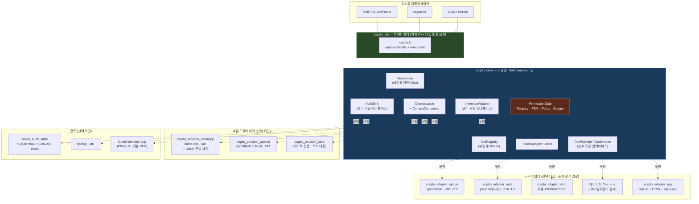
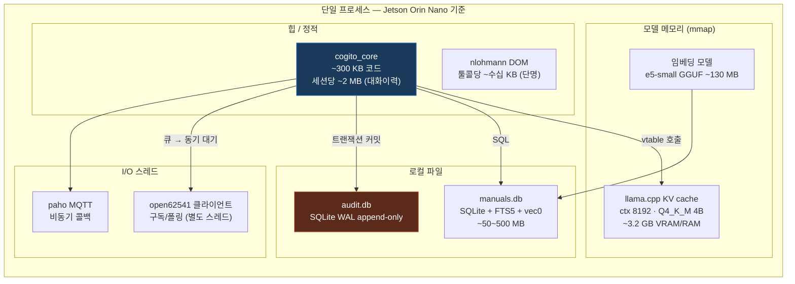
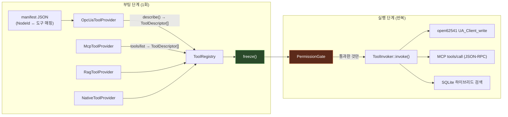
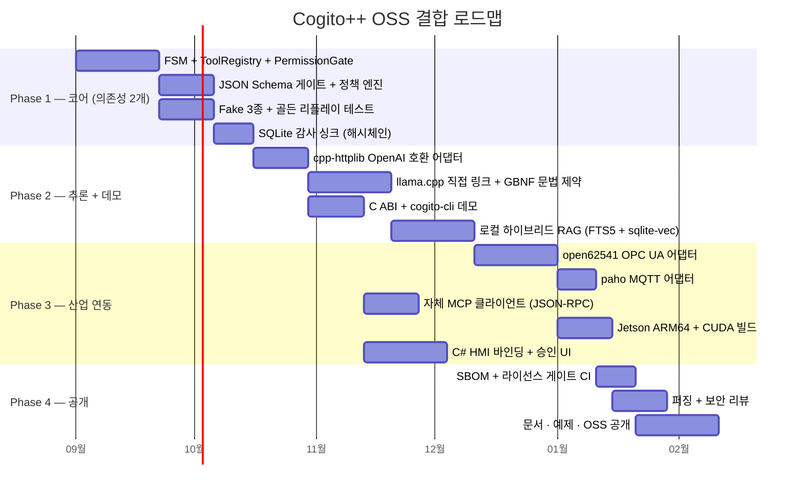

# Cogito++ 오픈소스 기술 스택 및 아키텍처 연동 설계서

**부제** — 제조·엣지 환경용 C++ AI 에이전트 실행 코어의 OSS 결합 청사진
**대상 문서** — `Cogito++_기획안.md` (코디세이 AI 올인원 2기 Term-Project)
**작성일** — 2026-08-20
**문서 성격** — 기술 조사 + 아키텍처 설계 + 구현 스켈레톤 (문서 2 담당자 입력용)

---

## 0. 요약 (Executive Summary)

Cogito++의 가치는 "새로운 알고리즘"이 아니라 **검증된 부품들을 안전한 순서로 배선(wiring)하는 방식**에 있다. 따라서 OSS 전략의 원칙은 하나다.

> **Core는 의존성이 거의 없어야 하고, 무거운 것은 전부 선택적 플러그인으로 밀어낸다.**

이 원칙에서 다음 세 가지 설계 결정이 나온다.

| # | 결정 | 근거 |
| --- | --- | --- |
| **D1** | `cogito_core`는 **nlohmann/json 단 하나**에만 의존한다. HTTP·LLM·OPC UA·SQLite는 전부 별도 타깃 | 폐쇄망/ESP32 프로파일에서 코어만 떼어 쓸 수 있어야 함. 코어에 libcurl이 박히는 순간 이식성이 죽는다 |
| **D2** | 스키마 검증을 **두 겹**으로 건다 — ① llama.cpp GBNF 문법 제약 디코딩(생성 단계에서 위반 자체를 불가능하게) ② JSON Schema 런타임 검증(원격 API 대비) | "게이트가 잘못된 JSON을 거부한다"보다 "잘못된 JSON이 구조적으로 생성될 수 없다"가 훨씬 강한 보증 |
| **D3** | **감사 로그(Audit)와 운영 로그(Ops)를 물리적으로 분리**한다. 감사 로그는 spdlog가 아니라 SQLite 해시체인 테이블 | 로그 로테이션이 증거를 지우는 사고를 원천 차단. 기획안 3-4의 6번 구성요소가 요구하는 "사후 추적 가능성"의 실체 |

핵심 스택 한 줄 요약:

```
nlohmann/json + json-schema-validator + cpp-httplib + llama.cpp
  + 자체 테이블 기반 FSM + SQLite(FTS5) + sqlite-vec + spdlog
  + open62541 / paho.mqtt.cpp / 자체 MCP 클라이언트  (전부 선택적 플러그인)
```

---

## 1. 오픈소스 기술 스택 추천 요약표

### 1-1. 코어 계층 (필수 · 전 플랫폼)

| 모듈 | 추천 OSS | 대체 후보 | 라이선스 | 추천 이유 / 경량성 평가 |
| --- | --- | --- | --- | --- |
| **JSON DOM** | **nlohmann/json** | RapidJSON, simdjson, yyjson | MIT | 헤더 온리, 도구 스키마를 코드에서 **선언적으로 쓰기** 좋음. 툴콜 페이로드는 보통 1~4 KB — 파싱 속도가 병목이 될 여지가 없다. 바이너리 +250 KB 수준 |
| **스키마 검증** | **pboettch/json-schema-validator** | valijson, RapidJSON schema | MIT | nlohmann 위에 직접 얹힘(변환 비용 0), Draft-7 지원, 헤더+cpp 소수 파일. 실패 시 **어느 필드가 왜 틀렸는지** 메시지를 주는 게 핵심 — 그대로 LLM에 재프롬프트 |
| **FSM** | **자체 테이블 기반 FSM (~200 LOC)** | Boost.SML, TinyFSM, HFSM2 | (자체 / Apache-2.0) | §3에서 상술. 상태 7개·전이 20개 규모에서 라이브러리 도입 이득보다 **전이 이력 직렬화·리플레이 용이성**이 훨씬 중요 |
| **정책 엔진** | **자체 규칙 매처 (JSON 정책 파일)** | 없음 (C++ 경량 룰엔진 부재) | (자체) | Drools 계열은 전부 JVM. `tool_pattern × mode × risk → decision` 3축 매칭이면 충분하며, 규칙 파일 자체를 json-schema-validator로 검증 |
| **오류 전파** | **자체 `Result<T>`** | tl::expected, Boost.Outcome | (자체 / CC0) | 엣지 프로파일에서 `-fno-exceptions` 빌드 가능해야 함. C++17이므로 `std::expected` 없음 |
| **해시(감사체인)** | **picosha2** | OpenSSL, mbedTLS | MIT | 헤더 온리 단일 파일. 감사 체인 하나 때문에 OpenSSL을 코어에 끌어들일 이유가 없다 |

### 1-2. 추론 어댑터 계층 (선택)

| 모듈 | 추천 OSS | 대체 후보 | 라이선스 | 추천 이유 |
| --- | --- | --- | --- | --- |
| **로컬 LLM** | **llama.cpp (`libllama` 직접 링크)** | llama-server 프로세스 + HTTP | MIT | **GBNF 문법 제약 디코딩**이 결정적. `json_schema_to_grammar()`로 도구 스키마를 문법으로 컴파일 → 스키마 위반 토큰이 샘플링 단계에서 제거됨. Jetson CUDA·ARM NEON 백엔드 내장 |
| **HTTP 클라이언트** | **cpp-httplib** | libcurl, Boost.Beast | MIT | 헤더 온리, OpenSSL만 있으면 TLS. `ContentReceiver`로 SSE 스트리밍 파싱 가능. Beast는 Boost 전체를 끌고 오고 asio 학습비용이 큼 |
| **HTTP 대체 백엔드** | **libcurl** | — | curl(MIT류) | ⚠️ **사내망 현실 대응용으로 필수 옵션.** 기업 프록시(NTLM/Kerberos), 클라이언트 인증서(mTLS), 사설 CA 체인은 cpp-httplib로 감당이 안 되는 경우가 많다. `HttpClient` 인터페이스 뒤에 두 백엔드 |
| **토크나이저(원격용)** | **llama.cpp vocab 재사용** 또는 근사 추정 | tiktoken-cpp | MIT | 원격 API는 응답의 `usage`를 신뢰. 사전 예산 체크는 `chars/3.2` 근사로 충분 (기획안 7번 TokenBudget) |

### 1-3. 도구·프로토콜 계층 (선택 플러그인)

| 모듈 | 추천 OSS | 대체 후보 | 라이선스 | 추천 이유 / 주의 |
| --- | --- | --- | --- | --- |
| **OPC UA** | **open62541** (+ `open62541pp` C++ 래퍼) | Open62541 상용판, FreeOpcUa | **MPL-2.0** | C99 단일 파일 amalgamation 빌드 지원 → Jetson·임베디드에 최적. OPC Foundation 인증 이력 보유. MPL-2.0은 **파일 단위 카피레프트**라 독점 SW와 링크·배포 가능 (§4 참조) |
| **MQTT** | **paho.mqtt.cpp** (+ paho.mqtt.c) | libmosquitto, MQTT-C(ESP32용) | **EPL-2.0 / EDL-1.0 듀얼** | ⚠️ **EDL-1.0(=BSD-3-Clause) 쪽을 선택**해서 EPL 약한 카피레프트를 회피할 것. ESP32 프로파일은 MQTT-C(MIT) 권장 |
| **Modbus** | **nanomodbus** | libmodbus | MIT | 🚨 **libmodbus는 LGPL-2.1+.** 정적 링크 시 재링크 의무 발생 → 제조사 납품 시 분쟁 소지. nanomodbus(MIT)나 자체 구현 권장 |
| **MCP** | **자체 MCP 클라이언트** (JSON-RPC 2.0 over stdio/HTTP) | GopherSecurity/gopher-mcp | (자체) / Apache-2.0 | **공식 C++ SDK는 존재하지 않음**(2026-08 확인). Tier-1 SDK는 Python/TS/Java/Kotlin/C#뿐. MCP 코어는 JSON-RPC라 nlohmann+httplib 위에 ~600 LOC로 구현 가능하고, 스펙 변화(2026-07-28 stateless core 도입)에 직접 대응하는 편이 안전 |
| **직렬 / GPIO** | 플랫폼 API 직접 | libserialport(LGPL) | — | ⚠️ libserialport도 LGPL-3.0. 얇은 자체 래퍼가 낫다 |

### 1-4. 로컬 RAG 계층 (선택)

| 모듈 | 추천 OSS | 대체 후보 | 라이선스 | 추천 이유 |
| --- | --- | --- | --- | --- |
| **저장소** | **SQLite3** | DuckDB | Public Domain | 파일 하나 = 배포 단위. 폐쇄망에 USB로 매뉴얼 DB를 옮기는 시나리오에 완벽 부합 |
| **키워드 검색** | **SQLite FTS5** (SQLite 내장) | — | Public Domain | 🔑 **에러코드 검색에는 벡터보다 BM25가 정확하다.** `E-2041` 같은 토큰은 임베딩이 못 잡는다. 하이브리드 필수 |
| **벡터 검색** | **sqlite-vec** | usearch, Faiss | Apache-2.0 / MIT 듀얼 | 순수 C, 무의존, SQLite 확장. ⚠️ **현재 v0.1.10-alpha 수준(pre-v1)이고 ANN 미지원 — 전수 KNN만 가능.** 청크 수만 개 × 384~768차원까지는 수 ms라 매뉴얼 RAG에 문제없음. 스토리지 포맷 breaking change 가능성은 감안할 것 |
| **대용량 대안** | **usearch** | Faiss | Apache-2.0 | 청크 10만 개 초과 / HNSW 필요 시 전환. 헤더 온리 C++, 양자화 지원 |
| **임베딩 생성** | **llama.cpp embedding 모드** | ONNX Runtime | MIT | 추론기와 동일 바이너리 재사용. `bge-m3`, `multilingual-e5-small` 등 GGUF 사용 |

**기각 대상**: Faiss(BLAS/OpenMP 의존, 바이너리 비대), DuckDB(30 MB+, 분석용으로는 훌륭하나 엣지 RAG엔 과잉), Chroma/Qdrant/Pinecone(별도 서버 프로세스 — 폐쇄망 단일 바이너리 요구와 정면 충돌).

### 1-5. 관측·감사 계층

| 모듈 | 추천 OSS | 대체 후보 | 라이선스 | 추천 이유 |
| --- | --- | --- | --- | --- |
| **감사 추적** | **SQLite (WAL) + 해시체인 테이블** | 파일 JSONL | Public Domain | 🔑 **spdlog로 감사 로그를 남기면 안 된다.** 로테이션·비동기 드롭이 증거를 지운다. 트랜잭션 커밋 = 기록 확정 |
| **운영 로그** | **spdlog** | glog, Boost.Log | MIT | 비동기 큐, 회전 싱크, `fmt` 내장. 디버깅 전용 |
| **분산 트레이싱** | **(Phase 3) OpenTelemetry-cpp** | 자체 JSONL span | Apache-2.0 | ⚠️ protobuf/gRPC 의존으로 무겁다. **엣지 기본값 OFF.** Phase 1~2는 자체 span JSONL로 충분하고, 필요 시 OTLP/HTTP 익스포터만 켠다 |

### 1-6. 빌드·테스트·배포

| 모듈 | 추천 OSS | 대체 후보 | 라이선스 | 추천 이유 |
| --- | --- | --- | --- | --- |
| **빌드** | **CMake ≥ 3.21** | Meson, Bazel | BSD-3 | `FetchContent` + `find_package` 하이브리드 |
| **패키지** | **vcpkg 매니페스트** | Conan 2.0, FetchContent 단독 | MIT | 필요한 포트가 대부분 존재하고, **`X_VCPKG_ASSET_SOURCES` + `VCPKG_BINARY_SOURCES`로 폐쇄망 미러 구성이 가능**한 점이 결정적 |
| **테스트** | **Catch2 v3** | GoogleTest, doctest | BSL-1.0 | 헤더+lib, `SECTION` 기반 시나리오 테스트가 FSM 전이 검증과 궁합이 좋음 |
| **퍼징** | **libFuzzer / AFL++** | — | (툴체인) | LLM 출력 파서는 **적대적 입력 표면**이다. 툴콜 파서 퍼징은 선택이 아니라 필수 |
| **SBOM** | **CycloneDX-cpp / syft** | SPDX tools | Apache-2.0 | §4-5 참조 (EU CRA 대응) |

---

## 2. 통합 아키텍처 및 데이터 흐름

### 2-1. 레이어 구조 — 무엇이 코어이고 무엇이 플러그인인가



**읽는 법**: 점선(`-.구현.->`)은 전부 런타임 다형성이다. 코어는 llama.cpp도, open62541도, SQLite도 **컴파일 타임에 알지 못한다.** 이것이 기획안 3-9의 "제외 범위"와 4-2의 "모델 계층과 장비 계층 분리"를 코드 수준에서 강제하는 방식이다.

### 2-2. 데이터 흐름 — "최근 불량 원인을 확인해 줘" (기획안 3-6 시나리오)

```mermaid
sequenceDiagram
    autonumber
    participant U as 작업자 (HMI)
    participant L as AgentLoop (FSM)
    participant I as InferenceAdapter<br/>(llama.cpp + GBNF)
    participant R as ToolRegistry<br/>(+ JSON Schema)
    participant G as PermissionGate
    participant B as TokenBudget
    participant T as ToolInvoker<br/>(RAG / OPC UA)
    participant A as AuditSink (SQLite)

    U->>L: "최근 불량 원인을 확인해 줘"
    L->>A: turn_begin(session, mode=Default)
    L->>B: reserve(prompt_est)
    B-->>L: OK (잔여 예산 내)

    rect rgb(26,58,92)
    note right of L: State: Infer
    L->>R: 활성 도구 스키마 목록 조회
    R-->>L: [search_inspection_history, analyze_defect_image, set_threshold]
    L->>I: Complete(messages, tools, grammar=schema→GBNF)
    I-->>L: ActionRequest{search_inspection_history, {line:"A", hours:24}}
    L->>A: inference_result(usage, finish_reason, raw 원문 보존)
    end

    rect rgb(92,42,26)
    note right of G: State: Gate — 4단 순차 검증
    L->>G: evaluate(action)
    G->>R: ① 등록 여부 + JSON Schema 검증
    R-->>G: valid (risk=Read)
    G->>L: ② 현재 FSM 상태에서 호출 가능한가 → OK
    G->>G: ③ Policy(mode=Default, risk=Read) → Allow
    G->>B: ④ tool_call 횟수 한도 확인 → OK
    G-->>L: Verdict{Allow, rule="read-auto-allow"}
    end

    L->>A: verdict(Allow, rule_id, latency)
    L->>T: invoke(search_inspection_history, args)
    T-->>L: ToolResult{rows:[...]} (SQLite FTS5 + sqlite-vec 하이브리드)
    L->>A: tool_result(status=ok, bytes, elapsed)

    note over L,I: 2회차: analyze_defect_image → 동일 경로로 Allow

    rect rgb(92,42,26)
    note right of G: 3회차: 위험 도구 제안
    L->>I: Complete(...관측 결과 포함...)
    I-->>L: ActionRequest{set_threshold, {station:"V2", value:0.82}}
    L->>G: evaluate(action)
    G->>R: 스키마 검증 (value: minimum 0.70, maximum 0.95)
    R-->>G: valid (risk=Write/High)
    G->>G: Policy(mode=Default, risk=High) → **Ask**
    G-->>L: Verdict{Ask, reason:"검사 임계값 변경은 승인 필요"}
    end

    L->>A: verdict(Ask, rule="write-requires-approval")
    L->>U: 승인 요청 카드 (도구/인자/사유/영향 범위)
    note over L: State: AwaitApproval — **실행 안 됨**
    U-->>L: (미승인 / 타임아웃)
    L->>A: approval_timeout → **controlled hold**, not failure
    L->>U: 최종 요약 + "왜 실행되지 않았는지"
    L->>A: turn_end(state=Done, transitions[...], chain_hash)
```



### 2-3. 메모리·프로세스 관점 배치도



> **스레드 규약**: `AgentLoop`는 **단일 스레드**로 동작한다. 프로토콜 어댑터의 콜백(open62541 구독, MQTT 수신)은 큐에 넣고 루프가 자기 스텝에서 꺼낸다. 이렇게 해야 "동일 입력 → 동일 실행 경로"(기획안 3-8 검증 방식)가 성립한다. 멀티스레드 에이전트 루프는 재현성을 파괴한다.

---

## 3. 모듈별 심층 분석

### 3-1. 추론 어댑터 — llama.cpp 직접 링크 vs 서버 모드

| 항목 | `libllama` 직접 링크 | `llama-server` + HTTP |
| --- | --- | --- |
| 지연시간 | 프로세스 내 호출, 복사 없음 | 로컬 소켓 + JSON 왕복 (수 ms 오버헤드) |
| **문법 제약 디코딩** | ✅ `llama_sampler_init_grammar()` 직접 제어 | ⚠️ 서버 `json_schema` 파라미터 의존 (버전별 상이) |
| KV 캐시 제어 | ✅ 세션 저장/복원, 프리픽스 재사용 직접 관리 | 제한적 (`slot save/restore`) |
| 배포 | 단일 바이너리 ✅ (폐쇄망 요구 부합) | 프로세스 2개 관리, 부팅 순서 문제 |
| 크래시 격리 | ❌ OOM 시 호스트 동반 사망 | ✅ 프로세스 분리 |
| 빌드 복잡도 | CUDA/Metal/Vulkan 백엔드 플래그 관리 필요 | 낮음 |
| API 안정성 | ⚠️ C API가 릴리스마다 변경됨 → **태그 핀 고정 필수** | HTTP는 상대적으로 안정 |

**권고: 둘 다 만들되 기본값은 직접 링크.** 동일 `InferenceAdapter` 인터페이스 뒤에 두면 전환 비용이 0이다. HMI 임베드처럼 크래시 격리가 중요한 배포는 서버 모드로 스위치.

**GBNF 문법 제약이 왜 결정적인가** — 기획안의 "① 등록된 도구인가" 검증은 사후 거부다. 문법 제약은 사전 봉쇄다.

```
[사후 검증] LLM: {"tool":"delete_all_recipes"} → Registry 조회 실패 → 거부 + 재프롬프트 (토큰 낭비, 루프 위험)
[사전 봉쇄] 문법이 tool 필드를 열거형 "search_inspection_history"|"analyze_defect_image"|"set_threshold" 로 제한
           → 미등록 도구 이름의 토큰이 샘플링 후보에서 아예 제거됨
```

즉 **로컬 모델에서는 "미등록 도구 호출"이라는 실패 모드 자체가 사라진다.** 이건 Cogito++가 Python 프레임워크 대비 내세울 수 있는 가장 강한 기술적 주장이다. 다만 원격 OpenAI 호환 API에서는 불가능하므로 JSON Schema 사후 검증을 항상 유지한다 (이중 방어).

**HTTP 클라이언트 선택 근거**

| | cpp-httplib | libcurl | Boost.Beast |
| --- | --- | --- | --- |
| 통합 방식 | 헤더 온리 1파일 | C 라이브러리 링크 | Boost 헤더 다수 |
| 코드 증가 | ~200 KB | ~500 KB (+OpenSSL) | ~1 MB+, 컴파일 시간 급증 |
| SSE 스트리밍 | `ContentReceiver` 콜백 | `WRITEFUNCTION` 콜백 | 수동 구현 |
| **기업 프록시(NTLM/Negotiate)** | ❌ | ✅ | ❌ |
| **mTLS / 사설 CA** | 부분적 | ✅ | ✅ |
| HTTP/2 | ❌ | ✅ | ❌ |

→ **`HttpClient` 인터페이스 + 두 백엔드.** 기본 cpp-httplib, `COGITO_HTTP_BACKEND=curl`로 전환. 사내망 LLM 서버가 사설 CA를 쓰는 경우가 실제로 매우 흔하다.

---

### 3-2. FSM — 왜 라이브러리를 쓰지 않는가

| | Boost.SML | TinyFSM | HFSM2 | **자체 테이블 FSM** |
| --- | --- | --- | --- | --- |
| 라이선스 | BSL-1.0 | MIT | MIT | — |
| 런타임 오버헤드 | 거의 0 (컴파일타임) | 거의 0 | 작음 | 거의 0 |
| 코드 크기 | 작음 | 매우 작음 | 중간 | 매우 작음 |
| **전이 테이블 런타임 순회** | ❌ 불가 | ❌ 불가 | ❌ 불가 | ✅ **가능** |
| **전이 이력 직렬화** | 수동 훅 | 수동 훅 | 수동 훅 | ✅ 내장 |
| 컴파일 시간 | 무거움 (템플릿 폭발) | 가벼움 | 중간 | 가벼움 |
| 에러 메시지 가독성 | ❌ 악명 높음 | 양호 | 보통 | 양호 |
| 계층적 상태 | ✅ | 제한적 | ✅ 강력 | 불필요 |

**핵심 논거**: Cogito++ FSM의 목적은 "우아한 상태 표현"이 아니라 **감사와 리플레이**다. 필요한 기능은 셋이다.

1. 부팅 시 `--dump-transitions`로 전이표를 JSON으로 출력 → 문서/검증 자료로 그대로 사용
2. 모든 전이를 `(from, event, to, timestamp, cause)` 레코드로 감사 DB에 기록
3. 기록된 전이 시퀀스를 재입력해 **골든 리플레이 테스트** 수행

Boost.SML의 전이표는 템플릿 타입에 인코딩되어 있어 1·3번이 사실상 불가능하다. 200 LOC짜리 `constexpr` 배열이 이 요구를 전부 만족시키고, 부수적으로 **엣지에서 예외/RTTI 없이 빌드**된다.

```cpp
// 전이표는 데이터다 — 코드가 아니라. 그래서 덤프·검증·리플레이가 가능하다.
static constexpr Transition kTable[] = {
    {State::Idle,          Event::UserInput,        State::Infer},
    {State::Infer,         Event::InferOk,          State::Propose},
    {State::Infer,         Event::InferError,       State::Failed},
    {State::Propose,       Event::ActionProposed,   State::Gate},
    {State::Propose,       Event::NoAction,         State::Done},
    {State::Gate,          Event::GateAllow,        State::Execute},
    {State::Gate,          Event::GateAsk,          State::AwaitApproval},
    {State::Gate,          Event::GateDeny,         State::Observe},   // 거부도 '관측'된다
    {State::AwaitApproval, Event::Approved,         State::Execute},
    {State::AwaitApproval, Event::Rejected,         State::Observe},
    {State::AwaitApproval, Event::ApprovalTimeout,  State::Observe},
    {State::Execute,       Event::ExecOk,           State::Observe},
    {State::Execute,       Event::ExecError,        State::Observe},   // 오류도 관측 후 재추론
    {State::Observe,       Event::ContinueLoop,     State::Infer},
    {State::Observe,       Event::BudgetExhausted,  State::Done},
    {State::Observe,       Event::MaxTurnsReached,  State::Done},
    {State::Observe,       Event::TaskComplete,     State::Done},
};
```

> **설계 포인트** — `GateDeny`가 `Failed`가 아니라 `Observe`로 간다. 기획안 3-6의 "실패가 아니라 **통제된 보류**"를 상태 그래프가 그대로 표현한다. 거부 사유는 관측 결과로 LLM에 되먹여져 대안을 제안하게 만든다.

**정책 엔진** — C++ 생태계에 쓸 만한 경량 룰엔진이 없다(Drools/Easy Rules는 JVM, Open Policy Agent는 Go 데몬). 대신 3축 매칭으로 충분하다.

```json
{
  "version": 1,
  "default": "deny",
  "rules": [
    { "id": "read-auto-allow",          "tool": "*",              "risk_max": "read",  "modes": ["default","plan","edit","readonly"], "decision": "allow" },
    { "id": "plan-mode-no-side-effect", "tool": "*",              "risk_min": "write", "modes": ["plan","readonly"],                   "decision": "deny",  "reason": "Plan/ReadOnly 모드에서는 부수효과 도구를 실행하지 않습니다." },
    { "id": "threshold-requires-approval","tool": "opcua.write.*","risk_min": "write", "modes": ["default","edit"],                    "decision": "ask",   "reason": "설비 설정 변경은 작업자 승인이 필요합니다." },
    { "id": "safety-chain-forbidden",   "tool": "opcua.write.safety.*", "modes": ["*"],                                                "decision": "deny",  "reason": "안전 계통은 Cogito++ 범위 밖입니다(기획안 3-9)." }
  ]
}
```

첫 매치 우선 + **기본값 deny**. 정책 파일 자체를 `policy.schema.json`으로 검증해 오타로 인한 무단 허용을 막는다.

---

### 3-3. ToolRegistry — 스키마가 곧 물리적 안전 한계

기획안이 "미등록 기능은 호출 불가"라고만 쓴 부분을 한 단계 더 밀어붙일 수 있다. **JSON Schema의 `minimum`/`maximum`/`enum`을 설비의 물리적 허용 범위와 일치시키면, 스키마 검증기가 안전 리미터 역할을 한다.**

```json
{
  "name": "opcua.write.inspection_threshold",
  "description": "비전 검사 스테이션의 판정 임계값을 변경합니다.",
  "risk": "write",
  "input_schema": {
    "type": "object",
    "properties": {
      "station": { "type": "string", "enum": ["V1", "V2", "V3"] },
      "value":   { "type": "number", "minimum": 0.70, "maximum": 0.95 }
    },
    "required": ["station", "value"],
    "additionalProperties": false
  }
}
```

LLM이 `value: 0.05`를 제안하면 게이트 1단계(스키마)에서 **정책 판정에 도달하기도 전에** 차단된다. `additionalProperties: false`는 프롬프트 인젝션으로 삽입된 잉여 필드를 제거한다. 이 스키마 파일은 설비 엔지니어가 리뷰할 수 있는 형태이므로 **AI를 모르는 사람이 안전 경계를 검수할 수 있다** — 산업 도입에서 이 성질이 매우 크다.

**레지스트리 동결(freeze)** — 부팅 시 모든 `ToolProvider`가 등록을 마치면 레지스트리를 불변으로 잠근다. 런타임 도구 주입 경로가 존재하지 않으면 "동적으로 도구를 추가하는" 공격 표면이 사라진다.

---

### 3-4. 프로토콜 통합 — ToolProvider / ToolInvoker 분리 패턴



**핵심 불변식**: MCP 서버가 제공하는 도구든, OPC UA 노드든, 네이티브 C++ 함수든 **똑같은 게이트를 통과한다. 우회 경로가 없다.** MCP를 붙였다고 해서 외부 서버가 정의한 도구가 정책을 건너뛰는 일이 발생하면 Cogito++의 전제 자체가 무너진다.

**MCP 관련 실무 판단** (2026-08 기준 확인 사항)

- 공식 C++ SDK는 **없다.** Tier-1 SDK는 Python / TypeScript / Java / Kotlin / C#.
- 커뮤니티 구현으로 `GopherSecurity/gopher-mcp`(Apache-2.0, C++14, libevent 의존, C ABI 제공, stdio·HTTP+SSE·Streamable HTTP·WebSocket·TCP 지원)가 있다.
- 최신 스펙은 **2026-07-28** — stateless 프로토콜 코어, Multi Round-Trip Requests, 헤더 기반 라우팅, 캐시 가능한 list 결과, 인가 강화, 확장 프레임워크가 도입됐다.

→ **Phase 2 권고: 자체 최소 클라이언트.** `initialize` / `tools/list` / `tools/call` 세 메서드만 구현하면 실용적으로 충분하고, 이는 nlohmann + stdio 파이프 위에서 600 LOC 수준이다. libevent 의존을 코어 근처에 들이지 않아도 되고, 스펙이 계속 움직이는 상황에서 서드파티 SDK 버전에 묶이지 않는다. gopher-mcp는 전 트랜스포트가 필요해질 때(Phase 3) 재평가한다.

---

### 3-5. 로컬 RAG — 하이브리드가 아니면 현장에서 안 통한다

제조 문서 검색의 실제 질의는 두 종류다.

| 질의 유형 | 예시 | 효과적인 검색 |
| --- | --- | --- |
| 개념적 | "이 설비 예열이 오래 걸리는 이유" | 밀집 벡터 (임베딩) |
| **식별자** | "E-2041", "부품번호 SKF-6205-2RS", "Rev.C 도면" | **BM25 / FTS5** |

임베딩 모델은 `E-2041`과 `E-2401`을 거의 같은 벡터로 만든다. 에러코드 매뉴얼 RAG에서 이건 치명적이다. 따라서 **FTS5(BM25) + sqlite-vec(코사인)을 RRF로 융합**한다.

```sql
-- 하이브리드 검색: Reciprocal Rank Fusion (k=60)
WITH kw AS (
  SELECT chunk_id, ROW_NUMBER() OVER (ORDER BY bm25(chunks_fts)) AS rk
  FROM chunks_fts WHERE chunks_fts MATCH :query LIMIT 50
),
vec AS (
  SELECT chunk_id, ROW_NUMBER() OVER (ORDER BY distance) AS rk
  FROM chunks_vec WHERE embedding MATCH :qvec AND k = 50
)
SELECT c.id, c.doc_id, c.page, c.text,
       COALESCE(1.0/(60+kw.rk), 0) + COALESCE(1.0/(60+vec.rk), 0) AS score
FROM chunks c
LEFT JOIN kw  ON kw.chunk_id  = c.id
LEFT JOIN vec ON vec.chunk_id = c.id
WHERE kw.chunk_id IS NOT NULL OR vec.chunk_id IS NOT NULL
ORDER BY score DESC
LIMIT 8;
```

**sqlite-vec 채택 시 리스크 명시** — 현재 pre-v1(0.1.10-alpha 계열)이며 SQL API와 저장 포맷의 breaking change 가능성이 공식적으로 고지되어 있다. ANN(DiskANN) 미지원으로 전수 KNN만 수행한다. 완화책:

1. 인덱스 빌드를 **재생성 가능한 파이프라인**으로 유지 (원본 문서 → 청크 → 임베딩 → DB). 포맷이 깨지면 재빌드하면 끝.
2. `VectorIndex` 인터페이스로 한 겹 감싸 `usearch` 백엔드로 갈아탈 수 있게 한다.
3. 성능 기준선: 청크 20,000개 × 768차원 전수 스캔 ≈ 15 M 부동소수 연산 → Jetson Orin에서 수 ms. **매뉴얼 규모에서는 ANN이 필요 없다.**

**RAG도 도구다** — `rag.search_manual`을 `risk: read`로 등록하면 검색 자체가 감사 로그에 남는다. "AI가 어떤 문서를 근거로 그렇게 답했는가"가 추적된다.

---

### 3-6. 감사 로그 — 해시체인 스키마

```sql
CREATE TABLE audit_event (
  seq         INTEGER PRIMARY KEY AUTOINCREMENT,
  session_id  TEXT    NOT NULL,
  turn        INTEGER NOT NULL,
  ts_utc      TEXT    NOT NULL,          -- ISO-8601, 단조 증가 보장
  kind        TEXT    NOT NULL,          -- turn_begin|inference|verdict|tool_call|tool_result|transition|turn_end
  actor       TEXT    NOT NULL,          -- user|llm|gate|tool|system
  payload     TEXT    NOT NULL,          -- JSON (도구명/인자/사유/규칙ID/토큰사용량)
  prev_hash   TEXT    NOT NULL,
  hash        TEXT    NOT NULL           -- sha256(prev_hash || seq || ts || kind || payload)
);
CREATE INDEX idx_audit_session ON audit_event(session_id, turn, seq);
```

- **PRAGMA journal_mode=WAL, synchronous=FULL** — 정전 시에도 커밋된 판정은 남는다.
- `verdict` 이벤트는 반드시 도구 실행 **이전에** 커밋한다. "허용했는데 기록이 없다"가 발생할 수 없게 순서를 고정.
- 해시체인은 강력한 암호학적 보증은 아니지만(로컬 파일이므로 전체 재계산 가능), **의도치 않은 훼손·부분 삭제 탐지**에는 충분하고 비용이 사실상 0이다. 강한 보증이 필요하면 주기적으로 체인 헤드 해시를 상위 MES/서버로 앵커링한다.
- LLM 원문(raw completion)을 payload에 보존한다. 사고 조사 시 "모델이 실제로 뭐라고 했는가"가 없으면 분석이 불가능하다. 단, **개인정보·영업비밀 마스킹 훅**을 AuditSink에 둘 것.

---

## 4. 라이선스 및 배포 전략

### 4-1. Cogito++ 본체 라이선스 — Apache-2.0 권장

| | MIT | **Apache-2.0** | MPL-2.0 |
| --- | --- | --- | --- |
| 특허 명시 허여 | ❌ | ✅ | ✅ |
| 특허 보복 조항 | ❌ | ✅ | ✅ |
| 기여자 라이선스 명확성 | 약함 | ✅ 강함 (§5) | 보통 |
| 상표 조항 | ❌ | ✅ | 부분 |
| 기업 법무 검토 통과율 | 높음 | **높음** | 보통 |

**Apache-2.0을 택하는 이유**: 산업 SI·제조 대기업 법무팀은 특허 조항이 없는 MIT 프로젝트를 "특허 리스크 미해소"로 분류하는 경우가 있다. Cogito++는 SI 기업이 고객사 납품물에 넣는 것이 목표이므로(기획안 4-4 사업화 모델), 명시적 특허 허여가 채택 마찰을 줄인다. 기여자에게는 DCO(`Signed-off-by`)를 요구한다 — CLA는 커뮤니티 진입장벽이 높다.

### 4-2. 의존성 3-티어 정책

```mermaid
graph TB
    subgraph A["Tier A — 정적 링크 허용 (코어 편입 가능)"]
        A1["MIT: nlohmann/json, json-schema-validator,<br/>cpp-httplib, spdlog, llama.cpp, picosha2, nanomodbus"]
        A2["Apache-2.0: sqlite-vec, usearch, OpenTelemetry-cpp"]
        A3["BSL-1.0: Catch2 / BSD-3: CMake"]
        A4["Public Domain: SQLite"]
    end
    subgraph B["Tier B — 별도 공유 라이브러리로 격리 (약한 카피레프트)"]
        B1["MPL-2.0: open62541<br/>→ cogito_adapter_opcua.so/.dll"]
        B2["EPL-2.0: paho (EDL-1.0 선택 시 Tier A로 강등 가능)"]
        B3["LGPL-2.1/3.0: libmodbus, libserialport<br/>→ 가급적 회피, 불가피하면 동적 링크 + 재링크 가능 배포"]
    end
    subgraph C["Tier C — 금지"]
        C1["GPL-2.0/3.0, AGPL-3.0<br/>(코어·공식 어댑터 모두)"]
        C2["SSPL, BUSL, Commons Clause<br/>(OSI 비승인)"]
    end

    A -->|"cogito_core 정적 링크"| OUT["납품 바이너리"]
    B -->|"dlopen / LoadLibrary"| OUT
    C -.->|"차단 (CI 라이선스 스캐너)"| X["빌드 실패"]

    style A fill:#1a4a2a,stroke:#5aa85a,color:#fff
    style B fill:#4a4a1a,stroke:#c8c84a,color:#fff
    style C fill:#5c1a1a,stroke:#d94a4a,color:#fff
```



**MPL-2.0(open62541) 정확한 해석** — MPL-2.0은 **파일 단위** 카피레프트다. open62541을 그대로 링크해 독점 소프트웨어와 함께 배포하는 것은 허용되며, open62541 **소스 파일 자체를 수정한 경우에만** 그 파일들을 MPL-2.0으로 공개하면 된다. 실무 지침:

1. open62541을 **포크·패치하지 않는다.** 필요한 확장은 전부 Cogito++ 쪽 어댑터 파일에 작성.
2. amalgamation 빌드를 쓰더라도 원본 소스 tarball과 버전 태그를 배포물에 동봉.
3. `cogito_adapter_opcua`를 **별도 공유 라이브러리**로 빌드해 경계를 물리적으로 명확히 한다. 법적으로는 정적 링크도 가능하지만, 고객사 법무 검토를 통과시키는 데는 분리가 압도적으로 유리하다.

**paho MQTT 듀얼 라이선스 처리** — Eclipse Paho는 EPL-2.0과 EDL-1.0(=BSD-3-Clause) 중 선택 가능하다. **EDL-1.0을 명시적으로 선택**하고 그 사실을 `NOTICE`와 SBOM에 기록하면 EPL의 약한 카피레프트 조항이 적용되지 않는다. 이 한 줄 결정으로 Tier B → Tier A 강등이 가능하다.

**libmodbus 함정** — Modbus TCP/RTU는 제조 현장에서 가장 흔한 프로토콜인데, 가장 유명한 구현체 `libmodbus`가 **LGPL-2.1+**이다. 정적 링크 시 사용자가 라이브러리를 교체·재링크할 수 있게 오브젝트 파일을 제공해야 하는 의무가 발생한다 — 임베디드 펌웨어 납품에서 사실상 불가능한 조건이다. **`nanomodbus`(MIT) 사용 또는 Modbus RTU 자체 구현(프레이밍+CRC16이 전부, ~300 LOC)을 권고**한다.

### 4-3. 🚨 가장 자주 놓치는 함정 — 모델 가중치 라이선스

**코드 라이선스와 모델 가중치 라이선스는 완전히 별개다.** llama.cpp가 MIT라고 해서 그 위에서 돌리는 모델을 자유롭게 재배포할 수 있는 게 아니다.

| 모델 계열 | 가중치 라이선스 | 상업 재배포 |
| --- | --- | --- |
| Llama 계열 | Llama Community License (**OSI 비승인**) | 조건부 — MAU 임계값, 명명 규칙("Llama" 접두사), 사용정책 준수 의무 |
| Gemma 계열 | Gemma Terms of Use (**OSI 비승인**) | 조건부 — 사용 제한 조항 하위 전파 의무 |
| Qwen / Mistral 일부 | Apache-2.0 | ✅ 자유 |
| 임베딩(bge-m3, e5) | MIT / Apache-2.0 (모델별 확인) | 대체로 자유 |

→ **Cogito++ 배포물에 모델 가중치를 절대 동봉하지 않는다.** 대신 `models.json` 매니페스트(URL + SHA-256 + 라이선스 SPDX ID)만 제공하고 사용자가 내려받게 한다. 데모/문서에서 기본 예시로 드는 모델은 **Apache-2.0 계열(Qwen 등)로 통일**해 예제를 그대로 따라 한 SI 기업이 라이선스를 위반하는 상황을 막는다.

### 4-4. OPC UA 사양 관련 주의

open62541은 MPL-2.0이지만, **"OPC UA 인증 제품"을 표방하려면 OPC Foundation 회원 자격과 CTT(Compliance Test Tool) 통과가 필요**하다. Companion Specification(예: 반도체 SEMI, 로보틱스) 일부는 회원 전용 배포다. Cogito++ 문서에는 "OPC UA 클라이언트 연동 지원"이라고 쓰고 "OPC UA 인증"이라는 표현은 인증 취득 전까지 쓰지 않는다.

### 4-5. SBOM과 EU CRA 대응

제조 장비가 EU로 수출되는 경우(국내 검사장비 업계에서 매우 흔함) **Cyber Resilience Act**가 적용된다. 요구사항의 핵심은 SBOM 제공과 취약점 대응 프로세스다. 오픈소스 프로젝트 단계에서 미리 갖춰두면 SI 고객에게 강력한 차별점이 된다.

```yaml
# .github/workflows/compliance.yml (요지)
- name: Generate SBOM (CycloneDX)
  run: cyclonedx-cmake --input build/ --output cogito-sbom.cdx.json
- name: License gate — Tier C 차단
  run: |
    python tools/license_gate.py cogito-sbom.cdx.json \
      --deny "GPL-2.0-only,GPL-3.0-only,AGPL-3.0-only,SSPL-1.0,BUSL-1.1"
- name: Vulnerability scan
  run: grype sbom:cogito-sbom.cdx.json --fail-on high
```

릴리스마다 `SBOM.cdx.json`, `NOTICE`(모든 의존성 저작권 고지), `THIRD_PARTY_LICENSES.md`를 첨부한다.

---

## 5. 핵심 모듈 간 연동 코드 설계 (C++17 스켈레톤)

### 5-1. 공통 타입 — `include/cogito/types.hpp`

```cpp
#pragma once
#include <nlohmann/json.hpp>
#include <string>
#include <vector>
#include <optional>
#include <cstdint>

namespace cogito {

using Json = nlohmann::json;

// ── 예외 없이 오류를 전파한다 (엣지에서 -fno-exceptions 빌드 가능하게) ──
enum class Errc : int {
  Ok = 0, InvalidArgument, NotRegistered, SchemaViolation, PolicyDenied,
  ApprovalRequired, BudgetExhausted, ProviderError, ToolError,
  Timeout, Cancelled, Internal
};

struct Error {
  Errc        code   = Errc::Ok;
  std::string message;
  std::string detail;             // 스키마 검증기 원문 메시지 등
  explicit operator bool() const noexcept { return code != Errc::Ok; }
};

template <typename T>
class Result {
 public:
  Result(T v) : value_(std::move(v)) {}                     // NOLINT
  Result(Error e) : error_(std::move(e)) {}                 // NOLINT
  bool ok() const noexcept { return error_.code == Errc::Ok; }
  explicit operator bool() const noexcept { return ok(); }
  const T&    value() const { return *value_; }
  T&&         take()        { return std::move(*value_); }
  const Error& error() const noexcept { return error_; }
 private:
  std::optional<T> value_;
  Error            error_{};
};

// ── 위험도: ToolRegistry와 PermissionPolicy가 공유하는 유일한 축 ──
enum class Risk : std::uint8_t { Read = 0, Write = 1, Destructive = 2 };

// ── 기획안 3-4 #4 ExecutionMode ──
enum class ExecutionMode : std::uint8_t { Default, Plan, Edit, ReadOnly };

// ── 기획안 1-3: LLM 출력은 '명령'이 아니라 '요청'이다 ──
struct ActionRequest {
  std::string id;             // 프로바이더가 준 tool_call_id (없으면 자체 생성)
  std::string tool_name;
  Json        arguments;
  std::string raw;            // 🔑 원문 보존 — 사고 조사 시 필수
  int         turn = 0;
};

// ── 기획안 3-4 #3 PermissionPolicy 판정 결과 ──
enum class Decision : std::uint8_t { Allow, Ask, Deny };

struct Verdict {
  Decision    decision = Decision::Deny;   // 🔑 기본값은 항상 Deny
  std::string reason;                      // 사용자에게 그대로 보여줄 사유
  std::string rule_id;                     // 어떤 규칙이 적용됐는가 (감사용)
  Errc        gate_error = Errc::Ok;       // 어느 단계에서 걸렸는가
};

struct ToolResult {
  bool        ok = false;
  Json        content;
  std::string error_message;
  std::int64_t elapsed_us = 0;
};

}  // namespace cogito
```

### 5-2. `InferenceAdapter` — 모델 종속성 제거 지점

```cpp
#pragma once
#include "cogito/types.hpp"

namespace cogito {

enum class Role : std::uint8_t { System, User, Assistant, Tool };

struct Message {
  Role        role;
  std::string content;
  std::string tool_call_id;   // Role::Tool 일 때
  std::vector<ActionRequest> actions;  // Role::Assistant 일 때
};

struct ToolSchema {           // ToolRegistry가 생성해 프로바이더로 전달
  std::string name;
  std::string description;
  Json        input_schema;   // JSON Schema Draft-7
};

struct Usage { int prompt_tokens = 0; int completion_tokens = 0; };

enum class FinishReason : std::uint8_t { Stop, ToolCalls, Length, Error };

struct InferenceRequest {
  const std::vector<Message>*    messages = nullptr;
  const std::vector<ToolSchema>* tools    = nullptr;
  int    max_tokens  = 1024;
  float  temperature = 0.2f;   // 산업용 기본값은 낮게
  // 🔑 로컬 프로바이더는 이 스키마를 GBNF 문법으로 컴파일해
  //    스키마 위반 토큰을 샘플링 단계에서 제거한다.
  bool   constrain_to_tool_schema = true;
};

struct InferenceResponse {
  std::string                text;
  std::vector<ActionRequest> actions;
  Usage                      usage;
  FinishReason               finish = FinishReason::Error;
  std::string                raw;    // 원문
};

class InferenceAdapter {
 public:
  virtual ~InferenceAdapter() = default;
  virtual Result<InferenceResponse> Complete(const InferenceRequest& req) = 0;
  virtual int  EstimateTokens(const std::string& text) const = 0;
  virtual const char* provider_id() const noexcept = 0;
  virtual bool supports_grammar_constraint() const noexcept { return false; }
};

// 구현체는 전부 별도 타깃:
//   cogito_provider_llamacpp : LlamaCppAdapter   (libllama 직접 링크, GBNF)
//   cogito_provider_openai   : OpenAiHttpAdapter (cpp-httplib / libcurl, SSE)
//   (코어 내장, 테스트 전용)  : FakeAdapter      — 기획안 3-8 "Fake Provider"
}  // namespace cogito
```

### 5-3. `ToolRegistry` — 등록·검증·동결

```cpp
#pragma once
#include "cogito/types.hpp"
#include <functional>
#include <unordered_map>
#include <memory>

namespace cogito {

using ToolHandler = std::function<ToolResult(const Json& args)>;

struct ToolDescriptor {
  std::string  name;
  std::string  description;
  Json         input_schema;
  Risk         risk = Risk::Destructive;   // 🔑 기본값은 가장 위험하게
  std::string  provider;                   // "native" | "opcua" | "mcp:inspection" | "rag"
  ToolHandler  handler;
};

// 부팅 시 도구를 공급하는 플러그인 인터페이스
class ToolProvider {
 public:
  virtual ~ToolProvider() = default;
  virtual const char* provider_id() const noexcept = 0;
  virtual Result<std::vector<ToolDescriptor>> Describe() = 0;
};

class SchemaValidator;   // pimpl — json-schema-validator를 헤더에서 숨긴다

class ToolRegistry {
 public:
  ToolRegistry();
  ~ToolRegistry();

  Error Register(ToolDescriptor d);
  Error RegisterFrom(ToolProvider& provider);

  // 🔑 부팅 완료 후 동결. 이후 Register()는 Errc::Internal 반환.
  //    런타임 도구 주입 경로를 없애 공격 표면을 제거한다.
  void  Freeze() noexcept { frozen_ = true; }
  bool  frozen() const noexcept { return frozen_; }

  const ToolDescriptor* Find(const std::string& name) const noexcept;

  // 게이트 1단계: 등록 여부 + JSON Schema 검증
  // 실패 메시지는 그대로 LLM에 되먹여 자가수정을 유도한다.
  Error Validate(const ActionRequest& a) const;

  // 현재 모드에서 노출할 도구 스키마 (Plan 모드면 read 도구만 노출 등)
  std::vector<ToolSchema> ExportSchemas(ExecutionMode mode) const;

 private:
  std::unordered_map<std::string, ToolDescriptor>              tools_;
  std::unordered_map<std::string, std::unique_ptr<SchemaValidator>> validators_;
  bool frozen_ = false;
};

}  // namespace cogito
```

```cpp
// src/tool_registry.cpp — 검증 구현부 (핵심만)
#include <nlohmann/json-schema.hpp>

namespace cogito {

class SchemaValidator {
 public:
  explicit SchemaValidator(const Json& schema) { v_.set_root_schema(schema); }
  std::string Check(const Json& doc) const {           // "" 이면 통과
    class Collector : public nlohmann::json_schema::error_handler {
     public:
      void error(const nlohmann::json_pointer<nlohmann::basic_json<>>& ptr,
                 const Json&, const std::string& msg) override {
        if (!out.empty()) out += "; ";
        out += ptr.to_string() + ": " + msg;
      }
      std::string out;
    } c;
    v_.validate(doc, c);
    return c.out;
  }
 private:
  nlohmann::json_schema::json_validator v_;
};

Error ToolRegistry::Validate(const ActionRequest& a) const {
  // ① 등록된 도구인가 — 기획안 3-3 검증게이트 1단
  auto it = tools_.find(a.tool_name);
  if (it == tools_.end())
    return {Errc::NotRegistered,
            "등록되지 않은 도구입니다: " + a.tool_name,
            "허용된 도구만 호출할 수 있습니다."};

  // ② 인자가 스키마에 부합하는가 (minimum/maximum = 물리적 안전 한계)
  const auto& vd = validators_.at(a.tool_name);
  const std::string err = vd->Check(a.arguments);
  if (!err.empty())
    return {Errc::SchemaViolation,
            "도구 인자가 스키마를 위반했습니다.", err};

  return {};
}

}  // namespace cogito
```

### 5-4. `PermissionGate` — 4단 순차 검증 (기획안 3-3의 코드화)

```cpp
#pragma once
#include "cogito/types.hpp"
#include "cogito/tool_registry.hpp"
#include "cogito/policy.hpp"
#include "cogito/budget.hpp"
#include "cogito/fsm.hpp"

namespace cogito {

class PermissionGate {
 public:
  PermissionGate(const ToolRegistry& reg, const PolicyEngine& pol, TokenBudget& bud)
      : reg_(reg), pol_(pol), bud_(bud) {}

  // 🔑 순서가 계약이다. 1→2→3→4, 하나라도 실패하면 즉시 반환.
  //    이 함수가 Allow를 반환하지 않으면 도구는 절대 실행되지 않는다.
  Verdict Evaluate(const ActionRequest& a, State fsm_state, ExecutionMode mode) const {
    // ── ① 등록 + 스키마 ─────────────────────────────
    if (Error e = reg_.Validate(a))
      return {Decision::Deny, e.message + " (" + e.detail + ")", "gate.registry", e.code};

    const ToolDescriptor* td = reg_.Find(a.tool_name);   // Validate 통과 → non-null 보장

    // ── ② FSM 상태 ─────────────────────────────────
    if (fsm_state != State::Gate)
      return {Decision::Deny, "현재 상태에서는 도구를 호출할 수 없습니다.",
              "gate.fsm", Errc::Internal};

    // ── ③ 실행 모드 + 정책 ──────────────────────────
    Verdict v = pol_.Decide(td->name, td->risk, mode);
    if (v.decision == Decision::Deny) { v.gate_error = Errc::PolicyDenied; return v; }

    // ── ④ 예산 / 반복 한도 ──────────────────────────
    if (Error e = bud_.CheckToolCall(a.tool_name))
      return {Decision::Deny, e.message, "gate.budget", Errc::BudgetExhausted};

    return v;   // Allow 또는 Ask
  }

 private:
  const ToolRegistry& reg_;
  const PolicyEngine& pol_;
  TokenBudget&        bud_;
};

}  // namespace cogito
```

### 5-5. `AgentLoop` — FSM 본체 (기획안 3-4 #1)

```cpp
#pragma once
#include "cogito/types.hpp"
#include <array>

namespace cogito {

enum class State : std::uint8_t {
  Idle, Infer, Propose, Gate, AwaitApproval, Execute, Observe, Done, Failed
};
enum class Event : std::uint8_t {
  UserInput, InferOk, InferError, ActionProposed, NoAction,
  GateAllow, GateAsk, GateDeny, Approved, Rejected, ApprovalTimeout,
  ExecOk, ExecError, ContinueLoop, BudgetExhausted, MaxTurnsReached, TaskComplete
};

struct Transition { State from; Event ev; State to; };

// 🔑 전이표는 '데이터'다. 덤프·검증·리플레이가 전부 가능하다.
inline constexpr std::array<Transition, 17> kTransitions{{
  {State::Idle,          Event::UserInput,       State::Infer},
  {State::Infer,         Event::InferOk,         State::Propose},
  {State::Infer,         Event::InferError,      State::Failed},
  {State::Propose,       Event::ActionProposed,  State::Gate},
  {State::Propose,       Event::NoAction,        State::Done},
  {State::Gate,          Event::GateAllow,       State::Execute},
  {State::Gate,          Event::GateAsk,         State::AwaitApproval},
  {State::Gate,          Event::GateDeny,        State::Observe},   // 실패가 아니라 관측
  {State::AwaitApproval, Event::Approved,        State::Execute},
  {State::AwaitApproval, Event::Rejected,        State::Observe},
  {State::AwaitApproval, Event::ApprovalTimeout, State::Observe},   // 통제된 보류
  {State::Execute,       Event::ExecOk,          State::Observe},
  {State::Execute,       Event::ExecError,       State::Observe},
  {State::Observe,       Event::ContinueLoop,    State::Infer},
  {State::Observe,       Event::BudgetExhausted, State::Done},
  {State::Observe,       Event::MaxTurnsReached, State::Done},
  {State::Observe,       Event::TaskComplete,    State::Done},
}};

class Fsm {
 public:
  State current() const noexcept { return s_; }

  // 정의되지 않은 전이는 '조용히 무시'가 아니라 '오류'다.
  Error Fire(Event e) noexcept {
    for (const auto& t : kTransitions) {
      if (t.from == s_ && t.ev == e) { prev_ = s_; s_ = t.to; last_ = e; return {}; }
    }
    return {Errc::Internal, "정의되지 않은 상태 전이입니다."};
  }

  static Json DumpTable();   // --dump-transitions 용

 private:
  State s_ = State::Idle, prev_ = State::Idle;
  Event last_{};
};

}  // namespace cogito
```

```cpp
// src/agent_loop.cpp — 전체 파이프라인이 한눈에 보이는 지점
namespace cogito {

Result<TurnOutcome> AgentLoop::Run(const std::string& user_input) {
  audit_.TurnBegin(session_id_, mode_);
  conv_.Append({Role::User, user_input});
  fsm_.Fire(Event::UserInput);

  for (int turn = 0; turn < limits_.max_turns; ++turn) {

    // ─────────── Infer ───────────
    auto tools = registry_.ExportSchemas(mode_);   // 모드별로 노출 도구가 다르다
    InferenceRequest req{&conv_.messages(), &tools};
    req.constrain_to_tool_schema = provider_->supports_grammar_constraint();

    if (Error e = budget_.ReserveInference(conv_.EstimateTokens(*provider_))) {
      audit_.Note("budget", e.message);
      fsm_.Fire(Event::BudgetExhausted);
      break;
    }

    auto resp = provider_->Complete(req);
    if (!resp) {
      audit_.InferenceError(turn, resp.error());
      fsm_.Fire(Event::InferError);
      return resp.error();
    }
    budget_.Consume(resp.value().usage);
    audit_.Inference(turn, resp.value());          // raw 원문까지 기록
    fsm_.Fire(Event::InferOk);

    conv_.Append({Role::Assistant, resp.value().text, "", resp.value().actions});

    // ─────────── Propose ───────────
    if (resp.value().actions.empty()) {
      fsm_.Fire(Event::NoAction);                  // 순수 답변 턴 → 종료
      break;
    }
    fsm_.Fire(Event::ActionProposed);

    // ─────────── Gate → Execute → Observe ───────────
    for (const auto& action : resp.value().actions) {
      const Verdict v = gate_.Evaluate(action, fsm_.current(), mode_);
      audit_.VerdictRecorded(turn, action, v);     // 🔑 실행 '이전에' 커밋

      if (v.decision == Decision::Deny) {
        fsm_.Fire(Event::GateDeny);
        // 거부 사유를 관측 결과로 되먹인다 → LLM이 대안을 찾게 한다
        conv_.Append({Role::Tool,
                      Json{{"status","denied"},{"reason",v.reason},
                           {"rule",v.rule_id}}.dump(), action.id});
        continue;
      }

      if (v.decision == Decision::Ask) {
        fsm_.Fire(Event::GateAsk);
        const auto ap = approver_->Request(action, v, limits_.approval_timeout);
        audit_.Approval(turn, action, ap);
        if (ap != ApprovalResult::Approved) {
          fsm_.Fire(ap == ApprovalResult::Timeout ? Event::ApprovalTimeout
                                                  : Event::Rejected);
          conv_.Append({Role::Tool,
                        Json{{"status","not_approved"},
                             {"reason",v.reason}}.dump(), action.id});
          continue;                                 // 통제된 보류 — 실패 아님
        }
        fsm_.Fire(Event::Approved);
      } else {
        fsm_.Fire(Event::GateAllow);
      }

      // ─── 여기 도달했다는 것은 4단 게이트를 모두 통과했다는 뜻이다 ───
      const ToolDescriptor* td = registry_.Find(action.tool_name);
      const ToolResult tr = td->handler(action.arguments);
      audit_.ToolResultRecorded(turn, action, tr);
      budget_.CountToolCall(action.tool_name);

      fsm_.Fire(tr.ok ? Event::ExecOk : Event::ExecError);
      conv_.Append({Role::Tool, tr.ok ? tr.content.dump()
                                      : Json{{"status","error"},
                                             {"message",tr.error_message}}.dump(),
                    action.id});
    }

    // ─────────── Observe ───────────
    if (budget_.Exhausted())      { fsm_.Fire(Event::BudgetExhausted); break; }
    if (turn + 1 >= limits_.max_turns) { fsm_.Fire(Event::MaxTurnsReached); break; }
    conv_.CompactIfNeeded(limits_.context_soft_limit);   // ContextCompactor
    fsm_.Fire(Event::ContinueLoop);
  }

  audit_.TurnEnd(session_id_, fsm_.current());
  return TurnOutcome{conv_.LastAssistantText(), fsm_.current(), budget_.Snapshot()};
}

}  // namespace cogito
```

### 5-6. C ABI — `include/cogito/cogito.h`

```c
#ifndef COGITO_H
#define COGITO_H
#include <stdint.h>
#include <stddef.h>

#ifdef __cplusplus
extern "C" {
#endif

#if defined(_WIN32)
#  ifdef COGITO_BUILD_SHARED
#    define COGITO_API __declspec(dllexport)
#  else
#    define COGITO_API __declspec(dllimport)
#  endif
#else
#  define COGITO_API __attribute__((visibility("default")))
#endif

/* ── ABI 규칙 ────────────────────────────────────────────────
 * 1. 불투명 핸들만 노출한다. C++ 타입은 경계를 넘지 않는다.
 * 2. 예외는 절대 경계를 넘지 않는다 (구현부 전체가 try/catch(...)).
 * 3. 모든 out 문자열은 cogito_string_free() 로 해제한다.
 * 4. 구조체 첫 필드는 struct_size — 전방 호환 확장용.
 * ────────────────────────────────────────────────────────── */

typedef struct cogito_agent_s*   cogito_agent_t;
typedef struct cogito_result_s*  cogito_result_t;

typedef enum {
  COGITO_OK = 0, COGITO_ERR_INVALID_ARG = 1, COGITO_ERR_NOT_REGISTERED = 2,
  COGITO_ERR_SCHEMA = 3, COGITO_ERR_POLICY_DENIED = 4, COGITO_ERR_APPROVAL = 5,
  COGITO_ERR_BUDGET = 6, COGITO_ERR_PROVIDER = 7, COGITO_ERR_TOOL = 8,
  COGITO_ERR_TIMEOUT = 9, COGITO_ERR_INTERNAL = 99
} cogito_status_t;

typedef enum { COGITO_MODE_DEFAULT=0, COGITO_MODE_PLAN=1,
               COGITO_MODE_EDIT=2,    COGITO_MODE_READONLY=3 } cogito_mode_t;
typedef enum { COGITO_RISK_READ=0, COGITO_RISK_WRITE=1,
               COGITO_RISK_DESTRUCTIVE=2 } cogito_risk_t;

/* 호스트(C#/Python/Unity)가 제공하는 도구 실행 콜백.
 * args_json / out_json 은 UTF-8 널 종료 문자열. */
typedef cogito_status_t (*cogito_tool_fn)(const char* args_json,
                                          char** out_json, void* user_data);
/* Ask 판정 시 호출되는 승인 콜백. 1=승인, 0=거부. */
typedef int (*cogito_approve_fn)(const char* action_json,
                                 const char* reason, void* user_data);

typedef struct {
  size_t        struct_size;      /* = sizeof(cogito_config_t) */
  const char*   provider_uri;     /* "llamacpp:///models/qwen3-4b-q4_k_m.gguf"
                                     "openai+https://llm.corp.local/v1"
                                     "fake://scripted"                     */
  const char*   policy_path;      /* policy.json */
  const char*   audit_db_path;    /* audit.db (NULL 이면 감사 비활성 — 비권장) */
  cogito_mode_t mode;
  int32_t       max_turns;
  int32_t       max_tokens_total;
  int32_t       approval_timeout_ms;
} cogito_config_t;

COGITO_API uint32_t        cogito_abi_version(void);   /* (major<<16)|minor */
COGITO_API const char*     cogito_version_string(void);

COGITO_API cogito_status_t cogito_agent_create(const cogito_config_t* cfg,
                                               cogito_agent_t* out);
COGITO_API void            cogito_agent_destroy(cogito_agent_t a);

/* 도구 등록 — freeze 이전에만 성공한다 */
COGITO_API cogito_status_t cogito_register_tool(cogito_agent_t a,
                                                const char* name,
                                                const char* description,
                                                const char* input_schema_json,
                                                cogito_risk_t risk,
                                                cogito_tool_fn fn,
                                                void* user_data);
COGITO_API cogito_status_t cogito_freeze_tools(cogito_agent_t a);
COGITO_API cogito_status_t cogito_set_approver(cogito_agent_t a,
                                               cogito_approve_fn fn, void* ud);

/* 한 턴 실행. out_json 에 {text, state, transitions[], verdicts[], usage} */
COGITO_API cogito_status_t cogito_run_turn(cogito_agent_t a,
                                           const char* user_input,
                                           char** out_json);

COGITO_API void            cogito_string_free(char* s);
COGITO_API const char*     cogito_last_error(cogito_agent_t a); /* 스레드 로컬 */

#ifdef __cplusplus
}  /* extern "C" */
#endif
#endif /* COGITO_H */
```

```cpp
// src/abi/cogito_abi.cpp — 예외 차단 래퍼
#define COGITO_GUARD_BEGIN try {
#define COGITO_GUARD_END(handle)                                       \
  } catch (const std::exception& e) {                                  \
      SetLastError(handle, e.what());  return COGITO_ERR_INTERNAL;     \
  } catch (...) {                                                      \
      SetLastError(handle, "unknown");  return COGITO_ERR_INTERNAL;    \
  }

COGITO_API cogito_status_t cogito_run_turn(cogito_agent_t a,
                                           const char* input, char** out) {
  if (!a || !input || !out) return COGITO_ERR_INVALID_ARG;
  COGITO_GUARD_BEGIN
    auto* impl = reinterpret_cast<AgentImpl*>(a);
    auto r = impl->loop.Run(input);
    *out = DupCString(SerializeOutcome(r));   // 호출자가 cogito_string_free
    return r ? COGITO_OK : MapErrc(r.error().code);
  COGITO_GUARD_END(a)
}
```

---

## 6. `CMakeLists.txt` 예시

### 6-1. 최상위 `CMakeLists.txt`

```cmake
cmake_minimum_required(VERSION 3.21)

# vcpkg 툴체인은 project() 이전에 설정되어야 한다.
if(DEFINED ENV{VCPKG_ROOT} AND NOT DEFINED CMAKE_TOOLCHAIN_FILE)
  set(CMAKE_TOOLCHAIN_FILE "$ENV{VCPKG_ROOT}/scripts/buildsystems/vcpkg.cmake"
      CACHE STRING "vcpkg toolchain")
endif()

project(cogitopp
        VERSION 0.1.0
        DESCRIPTION "Deterministic execution gateway for LLM agents in manufacturing"
        LANGUAGES C CXX)

set(CMAKE_CXX_STANDARD 17)
set(CMAKE_CXX_STANDARD_REQUIRED ON)
set(CMAKE_CXX_EXTENSIONS OFF)
set(CMAKE_POSITION_INDEPENDENT_CODE ON)
set(CMAKE_C_VISIBILITY_PRESET hidden)
set(CMAKE_CXX_VISIBILITY_PRESET hidden)
set(CMAKE_VISIBILITY_INLINES_HIDDEN ON)

# ─────────────────────────── 옵션 ───────────────────────────
option(COGITO_BUILD_SHARED     "Build shared library + C ABI"  ON)
option(COGITO_BUILD_TESTS      "Build Catch2 tests"            ON)
option(COGITO_BUILD_CLI        "Build cogito-cli demo"         ON)

option(COGITO_WITH_HTTP        "OpenAI-compatible HTTP provider" ON)
option(COGITO_WITH_LLAMACPP    "Local llama.cpp provider"        OFF)
option(COGITO_HTTP_USE_CURL    "Use libcurl instead of cpp-httplib" OFF)

option(COGITO_WITH_RAG         "SQLite + FTS5 + sqlite-vec RAG"  OFF)
option(COGITO_WITH_AUDIT_SQLITE "SQLite audit sink"              ON)
option(COGITO_WITH_OPCUA       "open62541 OPC UA adapter (MPL-2.0)" OFF)
option(COGITO_WITH_MQTT        "Eclipse Paho MQTT adapter (EDL-1.0)" OFF)
option(COGITO_WITH_MCP         "Built-in MCP client (JSON-RPC 2.0)"  OFF)
option(COGITO_WITH_OTEL        "OpenTelemetry-cpp exporter"          OFF)

option(COGITO_NO_EXCEPTIONS    "Edge profile: build without exceptions" OFF)

include(GNUInstallDirs)
include(CMakePackageConfigHelpers)
include(FetchContent)

# ═══════════════════ 1. cogito_core ═══════════════════
#  의존성: nlohmann/json + json-schema-validator 뿐.
#  HTTP / LLM / SQLite / OPC UA 는 여기 들어오지 않는다.
find_package(nlohmann_json 3.11 REQUIRED)
find_package(nlohmann_json_schema_validator CONFIG QUIET)
if(NOT nlohmann_json_schema_validator_FOUND)
  FetchContent_Declare(json_schema_validator
    GIT_REPOSITORY https://github.com/pboettch/json-schema-validator.git
    GIT_TAG        2.3.0)
  set(JSON_VALIDATOR_BUILD_TESTS   OFF CACHE BOOL "" FORCE)
  set(JSON_VALIDATOR_BUILD_EXAMPLES OFF CACHE BOOL "" FORCE)
  FetchContent_MakeAvailable(json_schema_validator)
endif()

add_library(cogito_core STATIC
  src/types.cpp
  src/fsm.cpp
  src/policy.cpp
  src/budget.cpp
  src/conversation.cpp
  src/context_compactor.cpp
  src/tool_registry.cpp
  src/permission_gate.cpp
  src/agent_loop.cpp
  src/audit_sink.cpp
  src/providers/fake_adapter.cpp      # 기획안 3-8 Fake Provider — 코어 내장
  src/util/fake_clock.cpp             # 기획안 3-8 Fake Clock
)
add_library(cogito::core ALIAS cogito_core)

target_include_directories(cogito_core
  PUBLIC  $<BUILD_INTERFACE:${CMAKE_CURRENT_SOURCE_DIR}/include>
          $<INSTALL_INTERFACE:${CMAKE_INSTALL_INCLUDEDIR}>
  PRIVATE ${CMAKE_CURRENT_SOURCE_DIR}/src)

target_link_libraries(cogito_core
  PUBLIC  nlohmann_json::nlohmann_json
  PRIVATE nlohmann_json_schema_validator)

target_compile_definitions(cogito_core PUBLIC
  COGITO_VERSION_MAJOR=${PROJECT_VERSION_MAJOR}
  COGITO_VERSION_MINOR=${PROJECT_VERSION_MINOR})

if(COGITO_NO_EXCEPTIONS)
  target_compile_definitions(cogito_core PUBLIC JSON_NOEXCEPTION)
  if(MSVC)
    target_compile_options(cogito_core PUBLIC /EHs-c- /GR-)
  else()
    target_compile_options(cogito_core PUBLIC -fno-exceptions -fno-rtti)
  endif()
endif()

if(MSVC)
  target_compile_options(cogito_core PRIVATE /W4 /permissive- /utf-8)
else()
  target_compile_options(cogito_core PRIVATE
    -Wall -Wextra -Wpedantic -Wshadow -Wconversion -Wnon-virtual-dtor)
endif()

# ═══════════════════ 2. 추론 프로바이더 ═══════════════════
if(COGITO_WITH_HTTP)
  add_library(cogito_provider_openai STATIC
    src/providers/openai_http_adapter.cpp
    src/net/http_client_factory.cpp)
  target_link_libraries(cogito_provider_openai PUBLIC cogito_core)

  if(COGITO_HTTP_USE_CURL)
    find_package(CURL REQUIRED)
    target_sources(cogito_provider_openai PRIVATE src/net/http_client_curl.cpp)
    target_link_libraries(cogito_provider_openai PRIVATE CURL::libcurl)
    target_compile_definitions(cogito_provider_openai PRIVATE COGITO_HTTP_CURL=1)
  else()
    find_package(httplib CONFIG REQUIRED)
    find_package(OpenSSL REQUIRED)
    target_sources(cogito_provider_openai PRIVATE src/net/http_client_httplib.cpp)
    target_link_libraries(cogito_provider_openai
      PRIVATE httplib::httplib OpenSSL::SSL OpenSSL::Crypto)
    target_compile_definitions(cogito_provider_openai
      PRIVATE CPPHTTPLIB_OPENSSL_SUPPORT COGITO_HTTP_HTTPLIB=1)
  endif()
endif()

if(COGITO_WITH_LLAMACPP)
  # vcpkg 포트가 상류를 따라가지 못하는 경우가 많아 태그 핀 고정이 안전하다.
  # llama.cpp 의 C API 는 릴리스마다 변한다 — 반드시 특정 태그에 고정할 것.
  FetchContent_Declare(llama_cpp
    GIT_REPOSITORY https://github.com/ggml-org/llama.cpp.git
    GIT_TAG        b7200          # ← CI 로 검증한 태그로 교체
    GIT_SHALLOW    TRUE)
  set(LLAMA_BUILD_TESTS    OFF CACHE BOOL "" FORCE)
  set(LLAMA_BUILD_EXAMPLES OFF CACHE BOOL "" FORCE)
  set(LLAMA_BUILD_SERVER   OFF CACHE BOOL "" FORCE)
  set(LLAMA_CURL           OFF CACHE BOOL "" FORCE)
  FetchContent_MakeAvailable(llama_cpp)

  add_library(cogito_provider_llamacpp STATIC
    src/providers/llamacpp_adapter.cpp
    src/providers/gbnf_from_schema.cpp)   # JSON Schema → GBNF 문법 컴파일
  target_link_libraries(cogito_provider_llamacpp PUBLIC cogito_core PRIVATE llama)
  target_compile_definitions(cogito_provider_llamacpp PRIVATE COGITO_GRAMMAR_CONSTRAINT=1)
endif()

# ═══════════════════ 3. 관측 / 감사 ═══════════════════
if(COGITO_WITH_AUDIT_SQLITE)
  find_package(unofficial-sqlite3 CONFIG QUIET)
  if(NOT unofficial-sqlite3_FOUND)
    find_package(SQLite3 REQUIRED)
    set(_SQLITE_TGT SQLite::SQLite3)
  else()
    set(_SQLITE_TGT unofficial::sqlite3::sqlite3)
  endif()
  find_package(spdlog CONFIG REQUIRED)

  add_library(cogito_audit_sqlite STATIC
    src/audit/sqlite_audit_sink.cpp
    src/audit/hash_chain.cpp)             # picosha2 헤더 온리
  target_link_libraries(cogito_audit_sqlite
    PUBLIC cogito_core PRIVATE ${_SQLITE_TGT} spdlog::spdlog)
endif()

# ═══════════════════ 4. 도구 어댑터 (플러그인) ═══════════════════
if(COGITO_WITH_OPCUA)
  # ⚠️ open62541 은 MPL-2.0. 공유 라이브러리로 분리해 경계를 물리적으로 명확히 한다.
  find_package(open62541 CONFIG REQUIRED)
  add_library(cogito_adapter_opcua SHARED
    src/adapters/opcua/opcua_tool_provider.cpp
    src/adapters/opcua/opcua_client.cpp
    src/adapters/opcua/manifest_loader.cpp)
  target_link_libraries(cogito_adapter_opcua PUBLIC cogito_core PRIVATE open62541::open62541)
  set_target_properties(cogito_adapter_opcua PROPERTIES
    C_VISIBILITY_PRESET default CXX_VISIBILITY_PRESET default)
  # 라이선스 고지를 배포물에 강제 동봉
  install(FILES third_party/licenses/open62541-MPL-2.0.txt
          DESTINATION ${CMAKE_INSTALL_DOCDIR}/licenses)
endif()

if(COGITO_WITH_MQTT)
  # ⚠️ Eclipse Paho: EPL-2.0 / EDL-1.0 듀얼 → EDL-1.0(BSD-3-Clause) 선택을 문서화할 것.
  find_package(PahoMqttCpp CONFIG REQUIRED)
  add_library(cogito_adapter_mqtt SHARED
    src/adapters/mqtt/mqtt_tool_provider.cpp)
  target_link_libraries(cogito_adapter_mqtt PUBLIC cogito_core PRIVATE PahoMqttCpp::paho-mqttpp3)
  install(FILES third_party/licenses/paho-EDL-1.0.txt
          DESTINATION ${CMAKE_INSTALL_DOCDIR}/licenses)
endif()

if(COGITO_WITH_MCP)
  # 자체 MCP 클라이언트 — initialize / tools/list / tools/call 만 구현.
  # 외부 SDK 의존 없음 (nlohmann + 트랜스포트만 사용).
  add_library(cogito_adapter_mcp STATIC
    src/adapters/mcp/jsonrpc.cpp
    src/adapters/mcp/stdio_transport.cpp
    src/adapters/mcp/mcp_tool_provider.cpp)
  target_link_libraries(cogito_adapter_mcp PUBLIC cogito_core)
  if(COGITO_WITH_HTTP)
    target_sources(cogito_adapter_mcp PRIVATE src/adapters/mcp/http_transport.cpp)
    target_link_libraries(cogito_adapter_mcp PRIVATE cogito_provider_openai)
  endif()
endif()

if(COGITO_WITH_RAG)
  find_package(SQLite3 REQUIRED)
  # sqlite-vec 은 vcpkg 포트가 없다 → 소스 편입 (순수 C 단일 파일)
  FetchContent_Declare(sqlite_vec
    GIT_REPOSITORY https://github.com/asg017/sqlite-vec.git
    GIT_TAG        v0.1.9)              # ⚠️ pre-v1: 포맷 breaking change 가능
  FetchContent_MakeAvailable(sqlite_vec)

  add_library(cogito_adapter_rag STATIC
    src/adapters/rag/hybrid_retriever.cpp   # FTS5(BM25) + vec0(cosine) RRF 융합
    src/adapters/rag/chunker.cpp
    src/adapters/rag/rag_tool_provider.cpp
    ${sqlite_vec_SOURCE_DIR}/sqlite-vec.c)
  target_include_directories(cogito_adapter_rag PRIVATE ${sqlite_vec_SOURCE_DIR})
  target_link_libraries(cogito_adapter_rag PUBLIC cogito_core PRIVATE SQLite::SQLite3)
  if(COGITO_WITH_LLAMACPP)
    target_link_libraries(cogito_adapter_rag PRIVATE cogito_provider_llamacpp)
    target_compile_definitions(cogito_adapter_rag PRIVATE COGITO_LOCAL_EMBEDDING=1)
  endif()
endif()

# ═══════════════════ 5. C ABI 공유 라이브러리 ═══════════════════
if(COGITO_BUILD_SHARED)
  add_library(cogito SHARED src/abi/cogito_abi.cpp src/abi/provider_uri.cpp)
  target_link_libraries(cogito PRIVATE cogito_core)
  foreach(opt_target cogito_provider_openai cogito_provider_llamacpp
                     cogito_audit_sqlite    cogito_adapter_mcp
                     cogito_adapter_rag)
    if(TARGET ${opt_target})
      target_link_libraries(cogito PRIVATE ${opt_target})
    endif()
  endforeach()
  target_compile_definitions(cogito PRIVATE COGITO_BUILD_SHARED)
  set_target_properties(cogito PROPERTIES
    VERSION ${PROJECT_VERSION} SOVERSION ${PROJECT_VERSION_MAJOR}
    C_VISIBILITY_PRESET default)      # ABI 심볼은 노출되어야 한다
  # ABI 심볼 최소 노출 (선택)
  if(UNIX AND NOT APPLE)
    target_link_options(cogito PRIVATE
      "-Wl,--version-script=${CMAKE_CURRENT_SOURCE_DIR}/src/abi/cogito.map")
  endif()
endif()

# ═══════════════════ 6. CLI 데모 ═══════════════════
if(COGITO_BUILD_CLI)
  add_executable(cogito-cli tools/cli/main.cpp tools/cli/console_approver.cpp)
  target_link_libraries(cogito-cli PRIVATE cogito_core)
  foreach(opt_target cogito_provider_openai cogito_provider_llamacpp
                     cogito_audit_sqlite cogito_adapter_rag)
    if(TARGET ${opt_target})
      target_link_libraries(cogito-cli PRIVATE ${opt_target})
    endif()
  endforeach()
endif()

# ═══════════════════ 7. 테스트 ═══════════════════
if(COGITO_BUILD_TESTS)
  enable_testing()
  find_package(Catch2 3 CONFIG REQUIRED)
  add_executable(cogito_tests
    tests/test_fsm_transitions.cpp        # 전이표 완전성 + 불법 전이 거부
    tests/test_schema_gate.cpp            # minimum/maximum 안전 한계 강제
    tests/test_policy_engine.cpp          # allow/ask/deny × 4 모드 매트릭스
    tests/test_budget_limits.cpp          # 무한 루프·토큰 폭주 차단
    tests/test_gate_ordering.cpp          # 🔑 4단 검증 순서가 뒤집히지 않는가
    tests/test_golden_replay.cpp          # 동일 입력 → 동일 실행 경로
    tests/test_abi_boundary.cpp)          # 예외가 C ABI 를 넘지 않는가
  target_link_libraries(cogito_tests PRIVATE cogito_core Catch2::Catch2WithMain)
  include(Catch)
  catch_discover_tests(cogito_tests)
endif()

# ═══════════════════ 8. 설치 / 패키지 ═══════════════════
install(TARGETS cogito_core EXPORT cogitoTargets
        ARCHIVE DESTINATION ${CMAKE_INSTALL_LIBDIR})
if(TARGET cogito)
  install(TARGETS cogito EXPORT cogitoTargets
          RUNTIME DESTINATION ${CMAKE_INSTALL_BINDIR}
          LIBRARY DESTINATION ${CMAKE_INSTALL_LIBDIR}
          ARCHIVE DESTINATION ${CMAKE_INSTALL_LIBDIR})
endif()
install(DIRECTORY include/ DESTINATION ${CMAKE_INSTALL_INCLUDEDIR})
install(FILES LICENSE NOTICE THIRD_PARTY_LICENSES.md
        DESTINATION ${CMAKE_INSTALL_DOCDIR})
install(EXPORT cogitoTargets NAMESPACE cogito::
        DESTINATION ${CMAKE_INSTALL_LIBDIR}/cmake/cogito)
write_basic_package_version_file(
  "${CMAKE_CURRENT_BINARY_DIR}/cogitoConfigVersion.cmake"
  VERSION ${PROJECT_VERSION} COMPATIBILITY SameMajorVersion)
```

### 6-2. `CMakePresets.json` — 플랫폼별 프로파일

```json
{
  "version": 3,
  "configurePresets": [
    {
      "name": "base", "hidden": true, "binaryDir": "${sourceDir}/build/${presetName}",
      "cacheVariables": { "CMAKE_BUILD_TYPE": "Release" }
    },
    {
      "name": "dev-fake", "inherits": "base",
      "displayName": "Phase 1 — Fake 전용 (의존성 최소, 어디서나 빌드)",
      "cacheVariables": {
        "COGITO_WITH_HTTP": "OFF", "COGITO_WITH_AUDIT_SQLITE": "ON",
        "COGITO_BUILD_TESTS": "ON"
      }
    },
    {
      "name": "desktop", "inherits": "base",
      "displayName": "Phase 2 — x86-64 데스크톱 (HTTP + 로컬 LLM + RAG)",
      "cacheVariables": {
        "COGITO_WITH_HTTP": "ON", "COGITO_WITH_LLAMACPP": "ON",
        "COGITO_WITH_RAG": "ON",  "COGITO_WITH_MCP": "ON",
        "VCPKG_MANIFEST_FEATURES": "http;rag;mcp;audit;tests"
      }
    },
    {
      "name": "jetson", "inherits": "base",
      "displayName": "Phase 3 — Jetson ARM64 (CUDA + OPC UA + MQTT)",
      "cacheVariables": {
        "VCPKG_TARGET_TRIPLET": "arm64-linux",
        "COGITO_WITH_LLAMACPP": "ON", "GGML_CUDA": "ON",
        "COGITO_WITH_OPCUA": "ON", "COGITO_WITH_MQTT": "ON",
        "COGITO_WITH_RAG": "ON",
        "VCPKG_MANIFEST_FEATURES": "http;rag;opcua;mqtt;audit"
      }
    },
    {
      "name": "edge-min", "inherits": "base",
      "displayName": "Phase 4 — 초경량 (예외/RTTI 없음, 코어만)",
      "cacheVariables": {
        "COGITO_NO_EXCEPTIONS": "ON", "COGITO_WITH_HTTP": "OFF",
        "COGITO_WITH_AUDIT_SQLITE": "OFF", "COGITO_BUILD_SHARED": "OFF",
        "COGITO_BUILD_CLI": "OFF",
        "CMAKE_CXX_FLAGS_RELEASE": "-Os -ffunction-sections -fdata-sections"
      }
    }
  ]
}
```

---

## 7. `vcpkg.json` 매니페스트 예시

```json
{
  "$schema": "https://raw.githubusercontent.com/microsoft/vcpkg-tool/main/docs/vcpkg.schema.json",
  "name": "cogitopp",
  "version-semver": "0.1.0",
  "description": "Deterministic execution gateway for LLM agents in manufacturing and edge environments",
  "homepage": "https://github.com/<org>/cogitopp",
  "license": "Apache-2.0",
  "supports": "!uwp & !android",

  "dependencies": [
    { "name": "vcpkg-cmake",        "host": true },
    { "name": "vcpkg-cmake-config", "host": true },
    "nlohmann-json",
    "nlohmann-json-schema-validator"
  ],

  "default-features": ["http", "audit"],

  "features": {
    "http": {
      "description": "OpenAI-compatible HTTP/SSE inference provider (cpp-httplib + OpenSSL)",
      "dependencies": [
        { "name": "cpp-httplib", "features": ["openssl"] },
        "openssl"
      ]
    },
    "http-curl": {
      "description": "libcurl HTTP backend — corporate proxy (NTLM/Negotiate), mTLS, private CA",
      "dependencies": [
        { "name": "curl", "features": ["ssl", "http2"] }
      ]
    },
    "audit": {
      "description": "SQLite audit sink (WAL + SHA-256 hash chain) and spdlog ops logging",
      "dependencies": ["sqlite3", "spdlog"]
    },
    "rag": {
      "description": "Local hybrid RAG — SQLite FTS5 + sqlite-vec (sqlite-vec is vendored via FetchContent)",
      "dependencies": [
        { "name": "sqlite3", "features": ["fts5", "json1"] }
      ]
    },
    "rag-usearch": {
      "description": "HNSW ANN backend for corpora over ~100k chunks",
      "dependencies": ["usearch"]
    },
    "opcua": {
      "description": "OPC UA client adapter via open62541 (MPL-2.0 — built as a separate shared library)",
      "dependencies": [
        { "name": "open62541", "features": ["encryption-openssl"] }
      ]
    },
    "mqtt": {
      "description": "MQTT adapter via Eclipse Paho (EDL-1.0 dual-license option selected)",
      "dependencies": ["paho-mqttpp3"]
    },
    "mcp": {
      "description": "Built-in Model Context Protocol client (JSON-RPC 2.0 over stdio/HTTP) — no third-party SDK",
      "dependencies": []
    },
    "otel": {
      "description": "OpenTelemetry-cpp OTLP/HTTP exporter (Phase 3, off by default at the edge)",
      "dependencies": [
        { "name": "opentelemetry-cpp", "features": ["otlp-http"] }
      ]
    },
    "tests": {
      "description": "Catch2 v3 unit and scenario tests",
      "dependencies": ["catch2"]
    }
  },

  "builtin-baseline": "<vcpkg 커밋 SHA — vcpkg x-update-baseline 로 채울 것>",

  "overrides": [
    { "name": "nlohmann-json", "version": "3.11.3" },
    { "name": "sqlite3",       "version": "3.46.0" }
  ]
}
```

**주의 사항**

1. `builtin-baseline`은 반드시 고정한다. `vcpkg x-update-baseline --add-initial-baseline`으로 생성. 미고정 시 빌드 재현성이 사라진다.
2. **포트 존재 여부는 반드시 실측 확인**할 것: `vcpkg search open62541`, `vcpkg search paho-mqttpp3`, `vcpkg search usearch`. 포트명은 시점에 따라 달라진다.
3. `sqlite-vec`, `llama.cpp`는 vcpkg 포트에 의존하지 않고 `FetchContent`로 태그 고정하는 편이 안전하다 (전자는 pre-v1, 후자는 릴리스 주기가 매우 빠름).
4. **폐쇄망 빌드 설정** (제조 고객사 온프레미스 환경의 핵심):

```bash
# 1) 인터넷 되는 준비 머신에서 캐시 채우기
export X_VCPKG_ASSET_SOURCES="x-azurl,file:///mnt/mirror/assets,,readwrite"
export VCPKG_BINARY_SOURCES="clear;files,/mnt/mirror/binaries,readwrite"
cmake --preset desktop && cmake --build build/desktop

# 2) /mnt/mirror 전체를 물리 매체로 반입

# 3) 폐쇄망 빌드 머신 — 네트워크 접근 0회
export X_VCPKG_ASSET_SOURCES="x-azurl,file:///mnt/mirror/assets,,read;x-block-origin"
export VCPKG_BINARY_SOURCES="clear;files,/mnt/mirror/binaries,read"
cmake --preset desktop && cmake --build build/desktop
```

`x-block-origin`이 핵심이다. 이 플래그가 있으면 캐시 미스 시 상류로 나가지 않고 **빌드가 실패**한다 — 폐쇄망에서 조용히 외부로 나가는 사고를 막는다.

---

## 8. OPC UA(open62541) ↔ ToolRegistry 어댑터 패턴

### 8-1. 설계 원칙


핵심은 **NodeId를 코드에 하드코딩하지 않는 것**이다. 매니페스트 파일로 분리하면:

- 설비가 바뀌어도 **재컴파일이 필요 없다** (제조 SI의 현실적 요구)
- **설비 엔지니어가 안전 한계를 직접 리뷰**할 수 있다 — C++를 몰라도 JSON은 읽는다
- 매니페스트 자체를 스키마 검증 + 코드 리뷰 대상으로 삼아 변경 이력이 남는다

### 8-2. 매니페스트 — `config/opcua_tools.json`

```json
{
  "$schema": "./opcua_manifest.schema.json",
  "endpoint": "opc.tcp://192.168.10.21:4840",
  "security": {
    "mode": "SignAndEncrypt",
    "policy": "Basic256Sha256",
    "client_cert": "certs/cogito-client.der",
    "client_key":  "certs/cogito-client.key",
    "trust_list":  "certs/trusted/"
  },
  "session": { "timeout_ms": 30000, "call_timeout_ms": 3000 },

  "nodes": [
    {
      "tool": "opcua.read.line_a_status",
      "description": "A라인 설비의 현재 운전 상태를 읽습니다. (0=정지,1=운전,2=경보)",
      "node_id": "ns=2;s=Line.A.Status",
      "access": "read",
      "datatype": "int32",
      "risk": "read"
    },
    {
      "tool": "opcua.read.oven_temperature",
      "description": "리플로우 오븐 존별 실측 온도(℃)를 읽습니다.",
      "node_id": "ns=2;s=Oven.Zone{zone}.TempPV",
      "access": "read",
      "datatype": "double",
      "risk": "read",
      "parameters": {
        "zone": { "type": "integer", "minimum": 1, "maximum": 8,
                  "description": "오븐 존 번호" }
      }
    },
    {
      "tool": "opcua.write.inspection_threshold",
      "description": "비전 검사 스테이션의 판정 임계값을 변경합니다. 변경 시 검사 기준이 즉시 바뀝니다.",
      "node_id": "ns=2;s=Vision.{station}.Threshold",
      "access": "write",
      "datatype": "double",
      "risk": "write",
      "parameters": {
        "station": { "type": "string", "enum": ["V1", "V2", "V3"] }
      },
      "value_constraint": {
        "type": "number",
        "minimum": 0.70,
        "maximum": 0.95,
        "description": "품질보증팀 승인 범위(SOP-QA-114). 이 범위를 벗어나는 값은 게이트에서 차단됩니다."
      },
      "requires_approval": true,
      "approval_hint": "임계값을 낮추면 불량 유출 위험이, 높이면 과검 위험이 있습니다."
    },
    {
      "tool": "opcua.write.safety.estop_reset",
      "node_id": "ns=2;s=Safety.EStop.Reset",
      "access": "write",
      "datatype": "boolean",
      "risk": "destructive",
      "forbidden": true,
      "forbidden_reason": "안전 계통은 Cogito++ 범위 밖입니다 (기획안 3-9 Out of Scope). 기존 인증 안전 체계가 담당합니다."
    }
  ]
}
```

> **`forbidden: true` 항목을 굳이 매니페스트에 남기는 이유** — "실수로 등록되지 않았다"와 "의도적으로 금지했다"는 완전히 다른 상태다. 명시적 금지 목록은 감사 시 "이 노드는 검토했고 금지했다"를 증명한다. 프로바이더는 이 항목을 **레지스트리에 등록하지 않고**, 대신 정책 엔진에 deny 규칙으로 주입한다.

### 8-3. RAII 래퍼 — open62541 C API 봉인

```cpp
// src/adapters/opcua/opcua_client.hpp
#pragma once
#include "cogito/types.hpp"
#include <open62541/client.h>
#include <open62541/client_config_default.h>
#include <open62541/client_highlevel.h>
#include <memory>
#include <mutex>

namespace cogito::opcua {

// ── open62541 의 수동 해제 자원을 전부 RAII 로 감싼다.
//    이 파일 밖으로 UA_* 타입이 새어나가지 않는 것이 규칙이다. ──
struct VariantDeleter { void operator()(UA_Variant* v) const noexcept { UA_Variant_delete(v); } };
using VariantPtr = std::unique_ptr<UA_Variant, VariantDeleter>;

class ScopedString {
 public:
  explicit ScopedString(const std::string& s) : s_(UA_String_fromChars(s.c_str())) {}
  ~ScopedString() { UA_String_clear(&s_); }
  ScopedString(const ScopedString&) = delete;
  ScopedString& operator=(const ScopedString&) = delete;
  const UA_String& get() const noexcept { return s_; }
 private:
  UA_String s_;
};

class Ua63Client {
 public:
  Ua63Client() : c_(UA_Client_new()) { UA_ClientConfig_setDefault(UA_Client_getConfig(c_)); }
  ~Ua63Client() { if (c_) { UA_Client_disconnect(c_); UA_Client_delete(c_); } }
  Ua63Client(const Ua63Client&) = delete;
  Ua63Client& operator=(const Ua63Client&) = delete;

  Error Connect(const SecurityConfig& sec, const std::string& endpoint);
  Error EnsureConnected();                        // 세션 끊김 시 1회 재연결

  Result<Json>  ReadValue(const std::string& node_id, DataType dt);
  Error         WriteValue(const std::string& node_id, DataType dt, const Json& value);

 private:
  static UA_NodeId ParseNodeId(const std::string& s);   // "ns=2;s=Line.A.Status"

  UA_Client* c_ = nullptr;
  std::mutex mu_;         // AgentLoop 는 단일 스레드지만, 하트비트 스레드와 공유될 수 있다
  std::string endpoint_;
  SecurityConfig sec_;
};

}  // namespace cogito::opcua
```

```cpp
// src/adapters/opcua/opcua_client.cpp
namespace cogito::opcua {

Result<Json> Ua63Client::ReadValue(const std::string& node_id, DataType dt) {
  std::lock_guard<std::mutex> lk(mu_);
  if (Error e = EnsureConnected()) return e;

  VariantPtr var{UA_Variant_new()};
  const UA_NodeId nid = ParseNodeId(node_id);
  const UA_StatusCode sc = UA_Client_readValueAttribute(c_, nid, var.get());

  if (sc != UA_STATUSCODE_GOOD) {
    return Error{Errc::ToolError,
                 "OPC UA 읽기 실패: " + node_id,
                 UA_StatusCode_name(sc)};
  }
  if (!UA_Variant_isScalar(var.get())) {
    return Error{Errc::ToolError, "스칼라 값이 아닙니다: " + node_id, ""};
  }

  switch (dt) {
    case DataType::Boolean:
      if (var->type != &UA_TYPES[UA_TYPES_BOOLEAN]) break;
      return Json(*static_cast<UA_Boolean*>(var->data) != 0);
    case DataType::Int32:
      if (var->type != &UA_TYPES[UA_TYPES_INT32]) break;
      return Json(*static_cast<UA_Int32*>(var->data));
    case DataType::Double:
      if (var->type != &UA_TYPES[UA_TYPES_DOUBLE]) break;
      return Json(*static_cast<UA_Double*>(var->data));
    case DataType::String: {
      if (var->type != &UA_TYPES[UA_TYPES_STRING]) break;
      const auto* s = static_cast<UA_String*>(var->data);
      return Json(std::string(reinterpret_cast<char*>(s->data), s->length));
    }
  }
  // 🔑 매니페스트 선언과 서버 실제 타입이 다르면 조용히 캐스팅하지 않고 오류를 낸다.
  //    타입 혼동은 산업 현장에서 실제 사고로 이어진다.
  return Error{Errc::ToolError,
               "매니페스트 타입 선언과 서버 타입이 일치하지 않습니다: " + node_id,
               std::string("server type = ") + var->type->typeName};
}

Error Ua63Client::WriteValue(const std::string& node_id, DataType dt, const Json& v) {
  std::lock_guard<std::mutex> lk(mu_);
  if (Error e = EnsureConnected()) return e;

  UA_Variant var;
  UA_Variant_init(&var);
  const UA_NodeId nid = ParseNodeId(node_id);
  UA_StatusCode sc = UA_STATUSCODE_BADTYPEMISMATCH;

  switch (dt) {
    case DataType::Boolean: { UA_Boolean b = v.get<bool>();
      UA_Variant_setScalar(&var, &b, &UA_TYPES[UA_TYPES_BOOLEAN]);
      sc = UA_Client_writeValueAttribute(c_, nid, &var); break; }
    case DataType::Int32:   { UA_Int32 i = v.get<int32_t>();
      UA_Variant_setScalar(&var, &i, &UA_TYPES[UA_TYPES_INT32]);
      sc = UA_Client_writeValueAttribute(c_, nid, &var); break; }
    case DataType::Double:  { UA_Double d = v.get<double>();
      UA_Variant_setScalar(&var, &d, &UA_TYPES[UA_TYPES_DOUBLE]);
      sc = UA_Client_writeValueAttribute(c_, nid, &var); break; }
    case DataType::String:  { ScopedString s(v.get<std::string>());
      UA_Variant_setScalar(&var, const_cast<UA_String*>(&s.get()),
                           &UA_TYPES[UA_TYPES_STRING]);
      sc = UA_Client_writeValueAttribute(c_, nid, &var); break; }
  }
  // setScalar 는 소유권을 가져가지 않으므로 clear 불필요 (스택 변수)

  if (sc != UA_STATUSCODE_GOOD)
    return Error{Errc::ToolError, "OPC UA 쓰기 실패: " + node_id,
                 UA_StatusCode_name(sc)};
  return {};
}

}  // namespace cogito::opcua
```

### 8-4. `OpcUaToolProvider` — 매니페스트를 ToolDescriptor로 변환

```cpp
// src/adapters/opcua/opcua_tool_provider.hpp
#pragma once
#include "cogito/tool_registry.hpp"
#include "opcua_client.hpp"

namespace cogito::opcua {

class OpcUaToolProvider final : public ToolProvider {
 public:
  static Result<std::unique_ptr<OpcUaToolProvider>> FromManifest(const std::string& path);

  const char* provider_id() const noexcept override { return "opcua"; }

  // 부팅 시 1회 호출 — 매니페스트를 도구 목록으로 변환한다.
  Result<std::vector<ToolDescriptor>> Describe() override;

  // 금지 노드를 정책 엔진에 deny 규칙으로 주입 (레지스트리에는 등록하지 않는다)
  std::vector<PolicyRule> ForbiddenRules() const;

 private:
  ToolDescriptor BuildReadTool(const NodeSpec& n);
  ToolDescriptor BuildWriteTool(const NodeSpec& n);
  static Json    BuildInputSchema(const NodeSpec& n);
  static std::string ResolveNodeId(const std::string& tmpl, const Json& args);

  std::vector<NodeSpec>       nodes_;
  std::shared_ptr<Ua63Client> client_;    // 도구 핸들러들이 공유
};

}  // namespace cogito::opcua
```

```cpp
// src/adapters/opcua/opcua_tool_provider.cpp
namespace cogito::opcua {

// ── 🔑 이 함수가 어댑터 패턴의 심장이다.
//    매니페스트의 물리적 안전 한계(value_constraint)가 JSON Schema 로 옮겨지고,
//    그 순간부터 ToolRegistry::Validate() 가 안전 리미터로 동작한다. ──
Json OpcUaToolProvider::BuildInputSchema(const NodeSpec& n) {
  Json props = Json::object();
  Json required = Json::array();

  // ① NodeId 템플릿의 치환 파라미터 ({zone}, {station} …)
  for (auto it = n.parameters.begin(); it != n.parameters.end(); ++it) {
    props[it.key()] = it.value();
    required.push_back(it.key());
  }

  // ② 쓰기 도구는 value 필드를 추가하고 물리 한계를 그대로 박아 넣는다
  if (n.access == Access::Write) {
    props["value"] = n.value_constraint.is_null()
        ? Json{{"type", JsonTypeOf(n.datatype)}}
        : n.value_constraint;
    required.push_back("value");
  }

  return Json{
    {"type", "object"},
    {"properties", props},
    {"required", required},
    {"additionalProperties", false}   // 🔑 프롬프트 인젝션으로 삽입된 잉여 필드 차단
  };
}

ToolDescriptor OpcUaToolProvider::BuildReadTool(const NodeSpec& n) {
  ToolDescriptor d;
  d.name         = n.tool;
  d.description  = n.description;
  d.input_schema = BuildInputSchema(n);
  d.risk         = Risk::Read;
  d.provider     = "opcua";

  auto client = client_;       // shared_ptr 캡처 — 핸들러 수명 동안 클라이언트 유지
  const std::string tmpl = n.node_id;
  const DataType    dt   = n.datatype;

  d.handler = [client, tmpl, dt](const Json& args) -> ToolResult {
    const auto t0 = std::chrono::steady_clock::now();
    // 이 시점에서 args 는 이미 스키마 검증을 통과했다 — 재검증 불필요.
    const std::string node_id = ResolveNodeId(tmpl, args);
    auto v = client->ReadValue(node_id, dt);
    const auto us = std::chrono::duration_cast<std::chrono::microseconds>(
                        std::chrono::steady_clock::now() - t0).count();
    if (!v) return {false, {}, v.error().message + " / " + v.error().detail, us};
    return {true,
            Json{{"node_id", node_id}, {"value", v.value()},
                 {"quality", "Good"}, {"read_at", NowIso8601()}},
            "", us};
  };
  return d;
}

ToolDescriptor OpcUaToolProvider::BuildWriteTool(const NodeSpec& n) {
  ToolDescriptor d;
  d.name         = n.tool;
  d.description  = n.description +
      (n.approval_hint.empty() ? "" : "\n[영향] " + n.approval_hint);
  d.input_schema = BuildInputSchema(n);
  d.risk         = Risk::Write;              // → 정책 엔진이 Ask/Deny 로 처리
  d.provider     = "opcua";

  auto client = client_;
  const std::string tmpl = n.node_id;
  const DataType    dt   = n.datatype;

  d.handler = [client, tmpl, dt](const Json& args) -> ToolResult {
    const auto t0 = std::chrono::steady_clock::now();
    const std::string node_id = ResolveNodeId(tmpl, args);

    // 🔑 쓰기 전 현재값을 읽어 감사 로그에 남긴다 (before/after 추적).
    //    "무엇이 어떻게 바뀌었는가"가 사고 조사의 첫 질문이다.
    Json before;
    if (auto b = client->ReadValue(node_id, dt)) before = b.value();

    if (Error e = client->WriteValue(node_id, dt, args.at("value"))) {
      const auto us = ElapsedUs(t0);
      return {false, Json{{"node_id", node_id}, {"before", before}},
              e.message + " / " + e.detail, us};
    }

    // 쓰기 후 검증 읽기 — PLC 가 클램핑했을 수 있다
    Json after;
    if (auto a2 = client->ReadValue(node_id, dt)) after = a2.value();

    return {true,
            Json{{"node_id", node_id}, {"before", before},
                 {"requested", args.at("value")}, {"after", after},
                 {"written_at", NowIso8601()}},
            "", ElapsedUs(t0)};
  };
  return d;
}

Result<std::vector<ToolDescriptor>> OpcUaToolProvider::Describe() {
  std::vector<ToolDescriptor> out;
  out.reserve(nodes_.size());
  for (const auto& n : nodes_) {
    if (n.forbidden) continue;               // 금지 노드는 등록조차 하지 않는다
    out.push_back(n.access == Access::Read ? BuildReadTool(n) : BuildWriteTool(n));
  }
  return out;
}

std::vector<PolicyRule> OpcUaToolProvider::ForbiddenRules() const {
  std::vector<PolicyRule> rules;
  for (const auto& n : nodes_) {
    if (!n.forbidden) continue;
    rules.push_back(PolicyRule{
        /*id*/       "opcua.forbidden." + n.tool,
        /*pattern*/  n.tool,
        /*modes*/    kAllModes,
        /*decision*/ Decision::Deny,
        /*reason*/   n.forbidden_reason});
  }
  return rules;
}

}  // namespace cogito::opcua
```

### 8-5. 조립 — `tools/cli/main.cpp`

```cpp
int main(int argc, char** argv) {
  using namespace cogito;

  // ── 1. 감사 싱크를 가장 먼저 연다. 이후 모든 것이 기록된다. ──
  auto audit = SqliteAuditSink::Open("audit.db");     // WAL + 해시체인

  // ── 2. 정책 로드 ──
  auto policy = PolicyEngine::LoadFile("config/policy.json");

  // ── 3. 도구 등록 (부팅 단계) ──
  ToolRegistry registry;

  //   3-a. 네이티브 도구 (HMI/검사장비 C++ 함수)
  NativeToolProvider native;
  native.Add("hmi.get_current_recipe", "현재 로드된 레시피 정보", Risk::Read,
             SchemaOf<EmptyArgs>(), [](const Json&) { return HmiGetRecipe(); });
  registry.RegisterFrom(native);

  //   3-b. OPC UA — 매니페스트 기반
  auto opc = opcua::OpcUaToolProvider::FromManifest("config/opcua_tools.json");
  if (!opc) { fprintf(stderr, "OPC UA 매니페스트 오류: %s\n",
                      opc.error().message.c_str()); return 1; }
  registry.RegisterFrom(**opc);
  policy.AddRules((*opc)->ForbiddenRules());     // 금지 노드를 deny 규칙으로

  //   3-c. 로컬 RAG
  auto rag = rag::RagToolProvider::Open("manuals.db");
  registry.RegisterFrom(*rag);

  //   3-d. 🔑 동결 — 이후 도구 추가 경로가 존재하지 않는다
  registry.Freeze();

  // ── 4. 추론 프로바이더 ──
  auto provider = MakeProvider("llamacpp:///models/qwen3-4b-instruct-q4_k_m.gguf");

  // ── 5. 조립 ──
  TokenBudget    budget{ Limits{ .max_turns = 8, .max_tokens_total = 32000,
                                 .max_tool_calls = 20, .max_same_tool_repeat = 3 } };
  PermissionGate gate{ registry, policy, budget };
  ConsoleApprover approver;
  AgentLoop loop{ *provider, registry, gate, budget, approver, *audit,
                  ExecutionMode::Default };

  // ── 6. 대화 ──
  std::string line;
  while (std::getline(std::cin, line)) {
    if (line == "/quit") break;
    auto r = loop.Run(line);
    if (r) std::cout << r.value().text << "\n";
    else   std::cout << "[오류] " << r.error().message << "\n";
  }
  return 0;
}
```

---

## 9. 검증 전략 — "동일 입력 → 동일 실행 경로"를 어떻게 테스트하는가

기획안 3-8의 검증 기준을 실제 테스트 코드로 옮기면 다음과 같다.

```cpp
// tests/test_golden_replay.cpp
TEST_CASE("불량 원인 확인 시나리오 — 실행 경로가 골든 파일과 일치한다", "[replay]") {
  FakeProvider provider{LoadScript("fixtures/defect_analysis.jsonl")};  // 결정론적 응답
  FakeClock    clock{"2026-08-20T09:00:00Z"};                           // 시간 고정
  FakeTools    tools{LoadFixture("fixtures/tools_v1.json")};            // 설비 없이 실행
  RecordingAuditSink audit;

  auto loop = BuildLoop(provider, tools, clock, audit, ExecutionMode::Default);
  loop.Run("최근 불량 원인을 확인해 줘");

  // ① FSM 전이 시퀀스가 정확히 일치하는가
  REQUIRE(audit.TransitionPath() == LoadGolden("golden/defect_analysis.path"));

  // ② 4단 게이트 판정이 일치하는가
  const auto v = audit.Verdicts();
  REQUIRE(v.size() == 3);
  CHECK(v[0].decision == Decision::Allow);  CHECK(v[0].rule_id == "read-auto-allow");
  CHECK(v[1].decision == Decision::Allow);
  CHECK(v[2].decision == Decision::Ask);
  CHECK(v[2].rule_id  == "threshold-requires-approval");

  // ③ 미승인 시 실제 쓰기가 발생하지 않았는가 — 가장 중요한 단언
  CHECK(tools.WriteCallCount() == 0);

  // ④ 감사 체인이 무결한가
  CHECK(audit.VerifyHashChain());
}

TEST_CASE("게이트 순서는 뒤집힐 수 없다", "[gate][security]") {
  // 미등록 도구는 정책이 allow-all 이어도 통과하지 못한다
  auto reg  = EmptyRegistry();
  auto pol  = PolicyEngine::FromJson(R"({"default":"allow","rules":[]})"_json);
  TokenBudget bud{UnlimitedLimits()};
  PermissionGate gate{reg, pol, bud};

  const Verdict v = gate.Evaluate(MakeAction("unknown.tool", {}),
                                  State::Gate, ExecutionMode::Default);
  CHECK(v.decision   == Decision::Deny);
  CHECK(v.gate_error == Errc::NotRegistered);
  CHECK(v.rule_id    == "gate.registry");   // 정책이 아니라 레지스트리에서 걸렸다
}

TEST_CASE("스키마의 물리 한계가 강제된다", "[gate][safety]") {
  auto reg = RegistryWithOpcUaManifest("fixtures/opcua_tools.json");
  auto gate = MakeGate(reg, AllowAllPolicy());

  // SOP-QA-114 허용 범위(0.70~0.95)를 벗어난 값
  const Verdict v = gate.Evaluate(
      MakeAction("opcua.write.inspection_threshold",
                 {{"station","V2"},{"value",0.05}}),
      State::Gate, ExecutionMode::Default);

  CHECK(v.decision   == Decision::Deny);
  CHECK(v.gate_error == Errc::SchemaViolation);
  CHECK_THAT(v.reason, Catch::Matchers::ContainsSubstring("value"));
}

TEST_CASE("Plan 모드는 부수효과 도구를 노출조차 하지 않는다", "[mode]") {
  auto reg    = RegistryWithMixedRisks();
  auto shown  = reg.ExportSchemas(ExecutionMode::Plan);
  for (const auto& s : shown)
    CHECK(reg.Find(s.name)->risk == Risk::Read);
}
```

**퍼징 대상** — LLM 출력 파서는 적대적 입력 표면이다.

```cpp
// tests/fuzz/fuzz_toolcall_parser.cpp
extern "C" int LLVMFuzzerTestOneInput(const uint8_t* data, size_t size) {
  std::string s(reinterpret_cast<const char*>(data), size);
  auto actions = ParseToolCalls(s);        // 절대 크래시하거나 UB 를 일으키면 안 된다
  for (const auto& a : actions) {
    (void)g_registry->Validate(a);         // 검증기도 함께 퍼징
  }
  return 0;
}
```

---

## 10. 단계별 MVP 오픈소스 결합 로드맵

기획안 3-8의 5단계를 OSS 도입 순서로 재배열했다. **각 Phase는 그 자체로 동작하는 산출물을 낸다.**



### Phase 1 — "설비 없이도 증명한다" (약 6주)

| 항목 | 내용 |
| --- | --- |
| **도입 OSS** | nlohmann/json, json-schema-validator, Catch2, SQLite, picosha2 — **단 5개** |
| **산출물** | `libcogito_core.a`, 골든 리플레이 테스트 스위트, `audit.db` 스키마 |
| **완료 기준** | Fake Provider만으로 기획안 3-6 시나리오 4단계가 전부 재현되고, 미승인 시 `WriteCallCount()==0`이 단언된다 |
| **왜 이 순서인가** | **LLM도 설비도 없이 핵심 주장을 증명할 수 있다.** 발표에서 가장 강력한 데모는 "설비를 연결하지 않았는데도 안전성을 보여준다"이다. 의존성이 5개뿐이라 어느 심사위원 노트북에서도 5분 안에 빌드된다 |

### Phase 2 — "실제 모델을 붙인다" (약 8주)

| 항목 | 내용 |
| --- | --- |
| **도입 OSS** | cpp-httplib(+OpenSSL), llama.cpp, sqlite-vec, spdlog |
| **산출물** | `cogito-cli`, `libcogito.so/.dll` + `cogito.h`, `manuals.db` 빌더 |
| **완료 기준** | ① 로컬 GGUF 모델로 GBNF 제약 하에 툴콜 생성 → 미등록 도구 호출률 **0%** 측정 ② 하이브리드 RAG로 에러코드 질의 정확도가 벡터 단독 대비 개선됨을 수치로 제시 |
| **핵심 리스크** | llama.cpp C API 변경 → **CI에서 태그 고정 + 주 1회 상류 추종 잡** |

### Phase 3 — "현장에 넣는다" (약 10주)

| 항목 | 내용 |
| --- | --- |
| **도입 OSS** | open62541(MPL-2.0), paho.mqtt.cpp(EDL-1.0), (선택) usearch |
| **산출물** | `cogito_adapter_opcua.so`, `cogito_adapter_mqtt.so`, MCP 클라이언트, Jetson 빌드, C# 바인딩 |
| **완료 기준** | ① 실 PLC 또는 open62541 시뮬레이션 서버에 읽기/쓰기 왕복 ② Jetson Orin에서 종단 지연 측정 ③ C# HMI에서 승인 다이얼로그가 실제로 쓰기를 막는 것을 시연 |
| **핵심 리스크** | OPC UA 보안 정책(인증서 체인) 구성이 현장마다 다름 → 매니페스트에 보안 설정을 분리해 둔 이유 |

### Phase 4 — "공개한다" (약 6주)

| 항목 | 내용 |
| --- | --- |
| **도입 도구** | CycloneDX, grype, libFuzzer, (선택) OpenTelemetry-cpp |
| **산출물** | SBOM 자동 생성 CI, `NOTICE`/`THIRD_PARTY_LICENSES.md`, 보안 정책 문서(`SECURITY.md`), 예제 3종 |
| **완료 기준** | Tier C 라이선스가 하나라도 섞이면 CI가 실패한다 |

---

## 11. 의사결정 요약 — "왜 안 쓰기로 했는가"

리서치에서 검토했으나 채택하지 않은 것들과 그 이유. **기획서에 "검토했다"는 근거로 그대로 사용 가능하다.**

| 후보 | 기각 사유 |
| --- | --- |
| **Boost.SML** | 전이표가 템플릿 타입에 인코딩되어 런타임 덤프·직렬화·리플레이가 불가능. Cogito++의 감사 요구와 정면 충돌 |
| **Boost.Beast** | Boost 전체를 끌고 오며 컴파일 시간이 급증. asio 없이 못 씀. 우리는 HTTP 요청/응답 왕복과 SSE만 필요 |
| **simdjson (툴콜용)** | 툴콜 페이로드가 KB 단위라 파싱 속도가 무의미. 읽기 전용 on-demand API가 스키마 검증기와 궁합이 나쁨. 대용량 RAG 인제스트에는 고려 가능 |
| **Faiss** | BLAS/OpenMP 의존, 바이너리 비대, Jetson 크로스 빌드 번거로움. 매뉴얼 규모 코퍼스에 과잉 |
| **DuckDB** | 30 MB+ 바이너리. 분석 쿼리에는 훌륭하나 엣지 RAG에는 SQLite로 충분 |
| **Chroma / Qdrant / Milvus** | 별도 서버 프로세스 필요 — "단일 바이너리 + 폐쇄망" 요구와 충돌 |
| **libmodbus** | LGPL-2.1+ — 정적 링크 시 재링크 의무. 임베디드 펌웨어 납품에서 실행 불가 |
| **gopher-mcp (Phase 1~2)** | libevent 의존 + MCP 스펙이 급변(2026-07-28 stateless core) 중. 3개 메서드만 필요한 시점에 SDK 버전에 묶일 이유 없음. Phase 3에서 재평가 |
| **OpenTelemetry-cpp (Phase 1~2)** | protobuf/gRPC 의존으로 무겁고, 엣지 리소스 예산을 잠식. 자체 span JSONL로 시작 |
| **spdlog를 감사 로그로 사용** | 로테이션과 비동기 드롭이 증거를 지운다. 운영 로그 전용으로 한정 |
| **LangChain / LlamaIndex C++ 포팅** | 존재하지 않을뿐더러, 그 프레임워크들의 설계 전제(동적 도구 구성, Python 유연성)가 Cogito++의 결정론 요구와 반대 방향 |

---

## 12. 기획안 반영 제안

이 리서치 결과를 기획안에 반영할 때 수정을 권하는 부분:

| 기획안 위치 | 현재 | 수정 제안 |
| --- | --- | --- |
| **3-7 기술 스택** | "*(예정)*" | 본 문서 §1 요약표로 대체. **의존성이 코어 2개뿐**이라는 점을 강조 — 심사에서 "실현 가능성" 항목에 직결된다 |
| **3-4 #2 ToolRegistry** | "미등록 기능은 호출 불가" | "+ **스키마의 `minimum`/`maximum`이 설비의 물리적 안전 한계를 강제**하며, 설비 엔지니어가 JSON 파일로 직접 검수 가능" 추가 |
| **3-5 적용 AI 기술** | "LLM Tool/Function Calling" | "+ **GBNF 문법 제약 디코딩** — 로컬 모델에서는 미등록 도구 호출이 생성 단계에서 구조적으로 불가능" 추가. 이것이 Python 프레임워크 대비 가장 강한 기술적 차별점 |
| **3-4 #6 Telemetry** | "발생 순서대로 기록" | "**SQLite WAL + SHA-256 해시체인 기반 추가 전용(append-only) 감사 테이블**. 도구 실행 이전에 판정이 커밋된다" 구체화 |
| **3-8 로드맵 ①** | "Fake 기반 구현" | "**설비·LLM 없이도 핵심 안전성 주장을 재현 가능한 테스트로 증명**" — 데모 전략으로 격상 |
| **4-4 사업화 모델** | "오픈소스 Core" | 라이선스를 **Apache-2.0**으로 명시. MPL/EPL/LGPL 격리 정책(§4-2)을 부록으로 추가하면 SI 고객 대상 신뢰도가 크게 오른다 |
| **부록 시장 구조** | TAM/SAM/SOM 미기입 | 별도 조사 필요. 단, "**EU CRA 대응 SBOM 제공**"을 SOM 진입 차별점으로 삼는 각도를 검토할 만하다 |

---

## 부록 A. 저장소 디렉터리 구조 제안

```
cogitopp/
├── CMakeLists.txt
├── CMakePresets.json
├── vcpkg.json
├── LICENSE                      # Apache-2.0
├── NOTICE                       # 의존성 저작권 고지
├── THIRD_PARTY_LICENSES.md
├── SECURITY.md
├── include/cogito/
│   ├── cogito.h                 # C ABI (유일한 C 헤더)
│   ├── types.hpp  fsm.hpp  policy.hpp  budget.hpp
│   ├── tool_registry.hpp  permission_gate.hpp  agent_loop.hpp
│   ├── inference_adapter.hpp  audit_sink.hpp
├── src/
│   ├── (코어 구현)
│   ├── abi/          cogito_abi.cpp  cogito.map
│   ├── providers/    fake_adapter.cpp  openai_http_adapter.cpp
│   │                 llamacpp_adapter.cpp  gbnf_from_schema.cpp
│   ├── net/          http_client_httplib.cpp  http_client_curl.cpp
│   ├── audit/        sqlite_audit_sink.cpp  hash_chain.cpp
│   └── adapters/
│       ├── opcua/    opcua_client.cpp  opcua_tool_provider.cpp  manifest_loader.cpp
│       ├── mqtt/     mqtt_tool_provider.cpp
│       ├── mcp/      jsonrpc.cpp  stdio_transport.cpp  mcp_tool_provider.cpp
│       └── rag/      hybrid_retriever.cpp  chunker.cpp  rag_tool_provider.cpp
├── config/
│   ├── policy.json          policy.schema.json
│   ├── opcua_tools.json     opcua_manifest.schema.json
│   └── models.json          # URL + SHA-256 + 라이선스 SPDX (가중치는 미동봉)
├── tests/
│   ├── (단위·시나리오 테스트)
│   ├── fixtures/            # Fake 스크립트, 도구 정의
│   ├── golden/              # 골든 실행 경로
│   └── fuzz/
├── tools/cli/               # cogito-cli
├── bindings/
│   ├── csharp/              # HMI (P/Invoke)
│   ├── python/              # ctypes
│   └── rust/                # bindgen
└── docs/
    ├── architecture.md  gate-contract.md  audit-schema.md
    └── porting-jetson.md  airgap-build.md
```

## 부록 B. 라이선스 대조표 (배포 시 `THIRD_PARTY_LICENSES.md` 기초)

| 구성요소 | SPDX ID | 티어 | 링크 방식 | 고지 의무 |
| --- | --- | --- | --- | --- |
| nlohmann/json | MIT | A | 헤더 온리 | 저작권 고지 |
| json-schema-validator | MIT | A | 정적 | 저작권 고지 |
| cpp-httplib | MIT | A | 헤더 온리 | 저작권 고지 |
| libcurl (선택) | curl | A | 동적 권장 | 저작권 고지 |
| OpenSSL 3.x | Apache-2.0 | A | 동적 | 고지 + NOTICE |
| llama.cpp / ggml | MIT | A | 정적 | 저작권 고지 |
| SQLite | Public Domain | A | 정적 | 없음 |
| sqlite-vec | Apache-2.0 / MIT | A | 소스 편입 | 고지 + NOTICE |
| usearch (선택) | Apache-2.0 | A | 헤더 온리 | 고지 + NOTICE |
| spdlog / fmt | MIT | A | 정적 | 저작권 고지 |
| picosha2 | MIT | A | 헤더 온리 | 저작권 고지 |
| Catch2 | BSL-1.0 | A | 테스트 전용 | 배포물 미포함 |
| **open62541** | **MPL-2.0** | **B** | **별도 .so/.dll** | 원본 소스 제공 경로 명시 |
| **paho.mqtt.c/cpp** | **EDL-1.0 선택** | A(선택 후) | 별도 .so/.dll | EDL 선택 사실 명시 |
| OpenTelemetry-cpp (선택) | Apache-2.0 | A | 정적 | 고지 + NOTICE |
| **모델 가중치** | **모델별 상이** | **미동봉** | — | **재배포 금지, 매니페스트만 제공** |

---

## 참고 자료

- [Model Context Protocol — SDKs (2026-07-28 spec)](https://modelcontextprotocol.io/docs/2026-07-28/sdk)
- [The 2026-07-28 Specification — MCP Blog](https://blog.modelcontextprotocol.io/posts/2026-07-28/)
- [Is there a plan of mcp sdk for C/C++? — MCP Discussion #1271](https://github.com/modelcontextprotocol/modelcontextprotocol/discussions/1271)
- [GopherSecurity/gopher-mcp — C++ MCP SDK (Apache-2.0)](https://github.com/GopherSecurity/gopher-mcp)
- [open62541 — OPC UA (MPL-2.0)](https://github.com/open62541/open62541)
- [open62541 공식 사이트 — 라이선스 안내](https://open62541.org/)
- [open62541 — Fraunhofer IOSB 프로젝트 페이지](https://www.iosb.fraunhofer.de/en/projects-and-products/open62541.html)
- [asg017/sqlite-vec — 벡터 검색 SQLite 확장](https://github.com/asg017/sqlite-vec)
- [sqlite-vec Releases (pre-v1 상태 확인)](https://github.com/asg017/sqlite-vec/releases)

---

*본 문서는 `Cogito++_기획안.md`의 3-4(핵심 기능 8종), 3-6(현장 시나리오), 3-8(개발 로드맵), 3-9(제외 범위)를 기준으로 작성되었으며, 문서 2 담당자의 "시스템 구조·기능·기술 스택" 항목 및 문서 3 담당자의 교차 검증 자료로 사용하는 것을 전제로 한다.*
