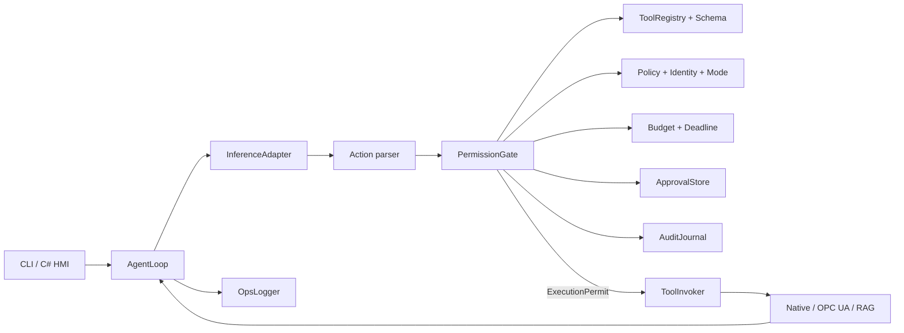

# Cogito++ 구현 요구사항

**문서 상태**: 검증 반영 구현 기준서 초안  
**기준일**: 2026-08-20  
**입력 문서**: `Cogito++_OSS_기술스택_아키텍처.md`, `Cogito++_기획안.md`

> 이 문서는 기술 조사 내용을 반복하지 않고, 구현에 필요한 범위·계약·불변식·완료 기준만 정의한다. 원문과 충돌할 경우 이 문서의 정정 사항을 우선 적용한다.

## 1. 검증 결론

전체 설계 방향은 구현 가능하다. 코어와 어댑터 분리, 기본 거부, 단일 검증 경로, Fake 기반 재현 테스트, 감사 로그 분리는 유지한다.

다만 현재 작업공간에는 구현 소스와 실제 CMake 프로젝트가 없다. 따라서 이번 검증은 문서 간 정합성, 코드 스켈레톤의 정적 검토, 공식 자료와의 교차 확인까지이며 실제 빌드·성능·장비 연동 성공을 증명한 것은 아니다.

### 1-1. 구현 기준으로 채택할 결정

| 항목 | 구현 결정 |
| --- | --- |
| 언어 | C++17. 내부 코어는 예외 사용을 허용하고 모든 공개 C ABI 경계에서 예외를 오류 코드로 변환한다. |
| 코어 의존성 | `nlohmann/json`과 `json-schema-validator` 두 개. “JSON 하나만 의존” 주장은 폐기한다. |
| 실행 통제 | 모든 Action은 동일한 Registry·Schema·FSM·Policy·Budget·Approval 경로를 통과한다. 우회 실행 API를 만들지 않는다. |
| 기본 정책 | `Deny`. 등록되지 않았거나, 해석할 수 없거나, 충돌하는 설정은 시작 실패 또는 실행 거부로 처리한다. |
| Action 수 | MVP에서는 추론 응답 한 건당 Action을 최대 1개만 허용한다. 여러 Action 응답은 실행하지 않고 프로바이더 오류로 반환한다. |
| 감사 | 운영 로그와 분리된 SQLite 감사 저널을 사용한다. 부수효과 도구는 사전 감사 커밋 실패 시 실행하지 않는다. |
| 결합 방식 | MVP 어댑터는 빌드 타임에 정적 결합하거나 단일 제품 DLL에 포함한다. 런타임 플러그인은 버전형 C 플러그인 ABI가 생기기 전까지 지원하지 않는다. |
| 대상 플랫폼 | MVP는 Windows/Linux x86-64, 다음 단계는 Linux ARM64/Jetson이다. ESP32에서 전체 코어 실행은 보류하고 MQTT/직렬 센서 노드로만 연동한다. |
| 기능안전 | PLC interlock, E-Stop, 실시간 모터 제어를 대체하지 않는다. Cogito++의 Schema와 Policy는 애플리케이션 수준 방어선이다. |

### 1-2. 원문에서 반드시 정정할 주장

| 원문 주장·예시 | 판정 | 구현 기준 |
| --- | --- | --- |
| GBNF가 스키마 위반을 구조적으로 불가능하게 함 | 과장 | llama.cpp가 지원하는 JSON Schema 부분집합만 생성 단계에서 제한한다. 모든 결과에 런타임 Schema 검증을 다시 수행한다. |
| `minimum`/`maximum`이 물리적 안전 한계 | 과장 | 정적 입력 범위일 뿐이다. 운전 상태, 단위, 변경률, PLC interlock, CAS/read-back을 별도로 확인한다. |
| `additionalProperties:false`가 잉여 필드를 제거 | 오류 | 입력 전체를 거부한다. 자동 제거하지 않는다. |
| 같은 입력이면 같은 실행 경로 | 조건 누락 | Fake 응답·시계·도구·정책·설정·이벤트 순서가 같을 때만 골든 경로가 같다. 실제 LLM과 외부 장비 응답의 결정론은 보장하지 않는다. |
| SQLite WAL 해시체인은 append-only | 오류 | WAL은 내구성 모드이지 append-only 제약이 아니다. UPDATE/DELETE 차단, 해시 검증, 외부 앵커와 접근통제가 별도로 필요하다. |
| `-fno-exceptions` 엣지 빌드 | 현재 불가 | `JSON_NOEXCEPTION`은 오류를 `Result`로 바꾸지 않고 일부 경로를 abort시킨다. 별도 비예외 검증기를 채택하기 전에는 지원하지 않는다. |
| MCP 최소 클라이언트는 `initialize/tools/list/tools/call` | 최신 규격과 충돌 | MCP 2026-07-28은 `initialize`를 제거했다. 최신 프로파일과 2025 호환 프로파일을 섞지 않는다. |
| OPC/MQTT가 동적 플러그인 | 구현 없음 | 현재 factory, loader, ABI 협상이 없다. MVP에서는 빌드 타임 결합으로 제한한다. |
| 검증되지 않은 메모리·지연·LOC 수치 | 근거 부족 | 대상 하드웨어의 p50/p95/p99 벤치마크가 생기기 전에는 요구치나 홍보 수치로 사용하지 않는다. |

### 1-3. 원문 코드에서 확인된 구현 차단 결함

다음 결함은 코드 작성 전에 설계로 해소해야 한다.

1. `Done` 또는 `Failed`에서 다음 사용자 턴을 시작하는 전이가 없어 같은 AgentLoop의 두 번째 호출이 깨진다.
2. 첫 Action 처리 후 FSM이 `Observe`인데 다음 Action을 다시 Gate에 넣어 다중 Action 처리가 깨진다.
3. `Infer` 상태에서 예산 초과 이벤트를 발화하지만 해당 전이가 없다.
4. `Fsm::Fire()`의 오류를 모든 호출부가 무시해 불법 전이가 조용히 진행된다.
5. 추론 오류의 조기 반환 경로에서 `turn_end`가 기록되지 않는다.
6. OPC 매니페스트의 `risk`와 `requires_approval`이 Builder에서 무시된다.
7. 금지 OPC 노드를 Registry에서 제거해 상세 금지 정책보다 `NotRegistered`가 먼저 반환된다.
8. C ABI 도구 콜백의 문자열 할당·해제 주체가 불명확하다.
9. C++17 프로젝트 예시에 C++20 지정 초기화자가 포함돼 있다.
10. 설치 가능한 CMake 패키지, 동적 플러그인 로더, 선택 어댑터 설치 규칙이 완결돼 있지 않다.

## 2. 구현 범위와 우선순위

### P0 — 안전한 코어

- AgentLoop와 턴 단위 FSM
- ToolRegistry와 금지 tombstone
- 제한된 Tool Schema와 런타임 검증
- PolicyEngine, ExecutionMode, 사용자 주체
- TokenBudget와 반복·크기·시간 제한
- ConversationStore와 ContextCompactor
- 비동기 승인 상태 모델
- AuditJournal 인터페이스와 SQLite 구현
- FakeProvider, FakeTool, FakeClock, RecordingAuditJournal
- 정책·도구·config 매니페스트 버전 및 digest 기록
- CLI와 단위·시나리오·퍼징 테스트

### P1 — 모델·호스트 연결

- OpenAI 호환 HTTP 프로바이더 한 개
- llama.cpp 로컬 프로바이더 한 개
- C ABI와 C# 바인딩 한 개
- 모델·프롬프트·provider 빌드 버전 및 digest 기록

### P2 — 현장 최소 연동

- open62541 기반 OPC UA read/write 어댑터
- C# 승인 UI
- 실제 또는 시뮬레이션 OPC UA 서버 통합 테스트
- Jetson ARM64 빌드와 현장 벤치마크

### 선택 기능

- SQLite FTS5 기반 RAG, 이후 필요 시 sqlite-vec
- MQTT
- MCP
- OpenTelemetry
- 추가 언어 바인딩

### 제외 범위

- 기능안전 PLC 로직, E-Stop, 로봇 실시간 제어
- 모델 학습·파인튜닝
- 임의 네이티브 명령 실행, 셸 도구, 런타임 코드 다운로드
- 버전형 C ABI 없이 C++ 객체나 `std::function`을 넘기는 동적 플러그인
- ESP32에서 전체 AgentLoop·JSON Schema·LLM 실행

## 3. 시스템 불변식

구현과 테스트는 다음 불변식을 항상 만족해야 한다.

1. **단일 실행 경로**: Tool handler는 Invoker만 호출할 수 있고, Invoker는 유효한 실행 허가 객체 없이는 호출할 수 없다.
2. **정확한 등록**: Registry의 정확한 이름과 일치하지 않는 도구는 실행하지 않는다.
3. **항상 재검증**: GBNF, 원격 function calling 성공 여부와 무관하게 Action 인자를 런타임 Schema로 검증한다.
4. **기본 거부**: 누락·오류·충돌·알 수 없는 값은 허용으로 승격하지 않는다.
5. **승인 결합**: 승인은 동일한 Action digest, 정책 버전, Registry 버전, 세션, 턴, 만료시간에만 유효하다.
6. **승인 후 재검증**: 승인 대기 중 정책·예산·설비 상태가 변할 수 있으므로 실행 직전에 Gate를 다시 평가한다.
7. **감사 선행**: 부수효과 도구는 `verdict`와 `tool_call_started` 영속화가 성공한 뒤에만 호출한다.
8. **감사 실패 시 차단**: 부수효과 도구는 감사 DB 잠금, 디스크 부족, 해시 실패 시 실행 횟수가 0이어야 한다.
9. **재시도 금지**: write/destructive Action은 자동 재시도하지 않는다. 결과가 불명확하면 `indeterminate`로 종료한다.
10. **외부 데이터 불신**: LLM, RAG, MCP, OPC UA, MQTT, Tool 결과는 크기·형식·민감정보·프롬프트 주입 관점에서 신뢰하지 않는다.
11. **단일 턴 소유권**: 동일 Agent 인스턴스에서 `runTurn`을 동시에 실행하지 않는다.
12. **종료 보장**: 성공·거부·오류·취소·시간초과의 모든 경로는 하나의 종료 처리에서 `turn_end` 기록을 정확히 한 번 시도한다. 기록 실패는 사용자에게 반환하고 다음 턴을 막는다.
13. **기능안전 비대체**: PLC와 인증 안전 계통의 최종 제한을 우회하거나 완화하지 않는다.

Tool 결과가 output Schema 또는 크기 제한을 위반하면 대화에 원문을 재주입하지 않고 구조화된 `invalid_tool_result`만 전달한다.

## 4. 논리 아키텍처



`AuditJournal`, `OpsLogger`, `Tracer`는 서로 다른 인터페이스다. 운영 로그 회전이나 드롭이 감사 기록에 영향을 주어서는 안 된다.

### 4-1. 빌드 타깃

| 타깃 | 역할 | 직접 의존성 |
| --- | --- | --- |
| `cogito_core` | FSM, Registry, Schema, Policy, Budget, AgentLoop, Fake | nlohmann/json, json-schema-validator |
| `cogito_audit_sqlite` | 감사 저널, SHA-256, 검증·복구 | SQLite, SHA-256 구현 |
| `cogito_provider_http` | OpenAI 호환 HTTP | HTTP/TLS 백엔드 한 개 |
| `cogito_provider_llamacpp` | 로컬 GGUF 추론 | 핀한 llama.cpp 커밋 |
| `cogito_adapter_opcua` | OPC UA 도구 | 핀한 open62541 |
| `cogito_cli` | 데모·진단 | 필요한 타깃을 빌드 타임 결합 |
| `cogito` | 공개 C ABI 공유 라이브러리 | 제품 프로파일에 포함된 정적 타깃 |

### 4-2. 컴포넌트 책임

| 컴포넌트 | 책임 | 하지 않아야 할 일 |
| --- | --- | --- |
| `AgentLoop` | 한 턴의 orchestration, 종료·취소·오류 수렴 | Policy 판정이나 장비 호출을 직접 구현 |
| `Fsm` | 유효 전이와 현재 상태 관리 | 전이 오류를 무시하거나 외부 I/O 수행 |
| `ConversationStore` | 메시지, action/result 연결, provenance 유지 | 민감정보를 무제한 보존 |
| `ContextCompactor` | token 한도 전 안전한 축약 | system policy, pending action/approval, 최신 Tool 결과를 제거 |
| `ToolRegistry` | 도구 등록, Schema 컴파일, 금지 tombstone, 정렬된 export, 동결 | 외부 provider의 risk를 그대로 신뢰 |
| `PermissionGate` | 고정 순서 검증과 Permit 발급 | Tool handler 호출 |
| `PolicyEngine` | 버전형 규칙과 context 판정 | 첫 매치 순서에 안전성을 의존 |
| `Budget` | 예약·정산·반복·deadline 관리 | 초과 후 사후 기록만 하고 계속 실행 |
| `ApprovalStore` | pending/승인/거절/만료와 digest 결합 | 단순 bool만 보관 |
| `AuditJournal` | 손실 없는 순서 기록, 체인, 검증·복구 | 운영 로그 회전 정책 공유 |
| `ToolInvoker` | Permit 검증 후 timeout/cancel을 적용해 로컬 호출 시도를 최대 한 번 수행 | Gate 밖의 공개 실행 진입점 제공 |
| `Clock` | UTC와 monotonic time 제공, Fake 교체 | wall clock을 단조 시각으로 간주 |

Registry의 Tool Schema export 순서는 이름 기준으로 고정하고 JSON은 canonical serialization을 사용한다. Context 축약 결과도 원본 범위와 compactor 버전을 감사한다.

## 5. 데이터 계약

모든 JSON 계약에는 `schema_version`을 둔다. 알 수 없는 major 버전은 거부한다.

### 5-1. ActionRequest

| 필드 | 형식 | 요구사항 |
| --- | --- | --- |
| `action_id` | UUID/128-bit 식별자 | 세션 내 유일, 프로바이더 ID를 그대로 믿지 않고 코어가 생성 가능 |
| `session_id` | 문자열 | 감사 세션과 결합 |
| `turn_id` | 증가 정수 | 세션 내 단조 증가 |
| `ordinal` | 정수 | MVP는 항상 0. 1 이상이면 다중 Action 오류 |
| `tool_name` | 문자열 | UTF-8, 길이 제한, Registry exact match |
| `arguments` | JSON object | 깊이·키 수·바이트 제한 후 검증 |
| `provider_id` | 문자열 | 프로바이더와 모델/endpoint 식별 |
| `response_id` | 문자열 | 원격/로컬 추론 결과와 연결 |
| `raw_digest` | SHA-256 | 원문 전체 대신 기본 저장. 원문 보관은 별도 보안 정책 적용 |
| `created_at_utc` | RFC 3339 | 표시·감사용 wall clock |

### 5-2. ToolDescriptor

| 필드 | 요구사항 |
| --- | --- |
| `name`, `description` | 이름은 고정 규칙을 통과해야 하며 중복은 시작 실패 |
| `input_schema` | Cogito Tool Schema v1 부분집합 |
| `output_schema` | 가능한 경우 정의. 미정의 시에도 최대 크기와 JSON 파싱 제한 적용 |
| `effect` | `none`, `write`, `destructive` 중 하나 |
| `risk` | `low`, `medium`, `high`, `critical` 중 하나. `effect`와 별도 축 |
| `approval_required` | true이면 어떤 Policy도 즉시 Allow로 낮출 수 없음 |
| `timeout_ms` | 0 금지, 전역 상한 이하 |
| `max_output_bytes` | Tool 결과 재주입 상한 |
| `provider_id`, `invoker_id` | 설명 공급자와 실행자를 명시적으로 연결 |
| `status` | `enabled` 또는 `forbidden`. forbidden은 사유와 함께 tombstone으로 유지 |
| `idempotency` | `safe`, `conditional`, `unsafe` 중 하나 |

`AlwaysAllow`는 런타임 판정값으로 두지 않는다. 반복 승인 면제는 별도 고우선 정책 규칙이며, `approval_required=true` 또는 destructive 도구를 우회할 수 없다.

### 5-3. Verdict와 ExecutionPermit

`Verdict`는 `Allow`, `Ask`, `Deny` 중 하나이며 다음을 포함한다.

- `gate_stage`, `reason_code`, 사용자 표시용 `reason`
- `rule_id`, `policy_digest`, `registry_digest`
- `action_digest`
- 평가 시각과 만료 시각

Invoker에는 Verdict 자체가 아니라 코어만 생성할 수 있는 단명 `ExecutionPermit`을 전달한다. Permit은 한 번 사용하면 폐기하며 Action digest가 다르면 거부한다.

Digest 입력은 단순 문자열 연결을 금지하고 length-prefix binary encoding을 사용한다.

```text
action_digest = SHA-256("cogito-action-v1", session_id, turn_id,
                       action_id, tool_name, canonical_arguments)
permit_scope_digest = SHA-256("cogito-permit-v1", action_digest,
                             subject_id, execution_mode,
                             policy_digest, registry_digest)
```

### 5-4. ApprovalRecord

- `approval_id`, `action_digest`, `permit_scope_digest`, `session_id`, `turn_id`
- 승인자 `subject_id`, `role`, 인증 방식
- `Approved`, `Rejected`, `Expired`, `Cancelled`
- 생성·응답·만료 시각, nonce
- 승인 당시 `policy_digest`, `registry_digest`

단순 bool 콜백은 사용하지 않는다. 코어가 pending Action을 노출하고 HMI가 별도 `approve/reject` API로 응답하는 비동기 방식으로 구현한다.

### 5-5. ToolResult

- `status`: `ok`, `error`, `timeout`, `cancelled`, `indeterminate`
- `content`, `error_code`, `error_message`
- `started_at`, `finished_at`, `elapsed_us`, `attempt_count`
- write 도구는 `before`, `requested`, `after`, `verification_status`
- 출력 바이트 수, 잘림 여부, 민감정보 마스킹 결과

## 6. Tool Schema 계약

코어의 첫 구현은 JSON Schema Draft-7의 제한된 부분집합만 지원한다.

지원 키워드:

- `type`: object, array, string, integer, number, boolean
- `properties`, `required`, `additionalProperties:false`
- `enum`, `const`
- `minimum`, `maximum`, `exclusiveMinimum`, `exclusiveMaximum`
- `minLength`, `maxLength`, `minItems`, `maxItems`
- 제한된 `pattern`

초기 금지 키워드:

- 원격 또는 재귀 `$ref`
- `$dynamicRef`, `unevaluatedProperties`
- 검증 시간 상한을 예측하기 어려운 복잡한 `oneOf`/`anyOf` 중첩
- 외부 네트워크에서 Schema를 가져오는 loader

부팅 시 Schema 자체를 컴파일하고 실패하면 해당 도구만 조용히 제외하지 않고 프로세스 시작을 실패시킨다.

MCP 2026-07-28의 기본 방언은 JSON Schema 2020-12이므로 MCP 도구를 그대로 코어에 넣지 않는다. MCP 어댑터가 위 부분집합으로 안전하게 변환할 수 있는 도구만 등록하고, 나머지는 명시적 `unsupported_schema_dialect`로 거부한다.

## 7. FSM과 AgentLoop

### 7-1. 상태

`Idle`, `Infer`, `Propose`, `Gate`, `AwaitApproval`, `Execute`, `Observe`, `Done`, `Failed`, `Cancelled`

### 7-2. 필수 전이

| From | Event | To |
| --- | --- | --- |
| Idle | UserInput | Infer |
| Infer | InferOk | Propose |
| Infer | ProviderError | Failed |
| Infer | BudgetExhausted | Done |
| Infer | Cancel | Cancelled |
| Propose | NoAction | Done |
| Propose | OneAction | Gate |
| Propose | MultipleActions | Failed |
| Gate | Deny | Observe |
| Gate | Ask | AwaitApproval |
| Gate | Allow | Execute |
| Gate | AuditError | Failed |
| AwaitApproval | Approved | Gate |
| AwaitApproval | RejectedOrExpired | Observe |
| AwaitApproval | Cancel | Cancelled |
| AwaitApproval | AuditError | Failed |
| Execute | ExecOk | Observe |
| Execute | ExecErrorOrIndeterminate | Observe |
| Execute | AuditError | Failed |
| Observe | Continue | Infer |
| Observe | CompleteOrLimit | Done |
| Done/Failed/Cancelled | StartNextTurn | Idle |

`StartNextTurn`은 직전 `turn_end`가 성공한 뒤에만 허용한다. 다음 사용자 입력 전에 FSM을 명시적으로 Idle로 되돌린다.

### 7-3. 전이 처리 규칙

- 모든 전이는 하나의 `Dispatch(event, cause, action_id)` 함수로만 수행한다.
- 정의되지 않은 전이는 즉시 `Failed`로 전환하고 오류를 반환한다.
- `Dispatch` 반환값을 무시할 수 없도록 `[[nodiscard]]`를 사용한다.
- 전이마다 from, event, to, cause, turn/action ID, UTC, monotonic time을 감사한다.
- `finish_reason=Length/Error`이거나 부분 JSON이면 Action을 실행하지 않는다.
- 외부 콜백은 bounded FIFO queue에 넣고 AgentLoop 스레드가 정해진 순서로 처리한다.
- 추론·도구·승인에는 deadline과 cancellation token을 전달한다.
- 모든 종료는 공통 finalize 블록을 통과한다.

## 8. PermissionGate

### 8-1. 고정 검증 순서

1. 요청 크기, JSON 깊이, UTF-8, 필수 필드 확인
2. Registry 등록/명시적 금지 여부 확인
3. Tool Schema 검증
4. 현재 FSM 상태 확인
5. 사용자 주체·역할·ExecutionMode·Policy 확인
6. 토큰·추론·도구 호출·동일 Action 반복·deadline 확인
7. `approval_required`와 기존 ApprovalRecord 확인
8. 승인 후 2~7단계 재평가
9. 사전 감사 커밋
10. ExecutionPermit 발급

Tool 스키마를 모델에 노출하지 않는 것은 사용성 최적화일 뿐 보안 통제가 아니다. 숨겨진 도구도 Gate에서 동일하게 검사한다.

### 8-2. 정책 판정 규칙

- 정책 파일은 Schema를 검증하고 digest를 계산한다. 프로덕션 프로파일은 서명된 매니페스트 또는 동등한 OS 파일 무결성·권한 통제를 추가한다.
- 규칙은 명시적 정수 `priority`를 갖는다.
- Tool pattern은 exact match 또는 점 구분 prefix glob(`opcua.read.*`)만 허용하고 임의 정규식은 사용하지 않는다.
- 최고 priority 규칙을 적용한다.
- 같은 priority가 충돌하면 `Deny > Ask > Allow` 순으로 제한적인 결정을 선택하고 충돌을 감사한다.
- 일치 규칙이 없으면 Deny다.
- `forbidden`, `approval_required`, 기능안전 제외 범위는 일반 Allow 규칙보다 강하다.
- 사용자 역할, 설비/라인, 현재 운전 상태, change ticket, 시간대 같은 context 조건을 확장 가능하게 둔다.

ExecutionMode는 권한 자체가 아니다. 호출자가 Edit 모드를 요청해도 인증된 역할과 Policy가 허용하지 않으면 Deny한다.

### 8-3. 예산과 제한

최소 설정 항목:

- 최대 추론 횟수, prompt/completion/total token
- 최대 전체 Tool 호출, 동일 action digest 반복 횟수
- 입력·출력·대화 context 바이트와 JSON 깊이
- 추론·도구·승인·전체 턴 timeout
- 이벤트 큐 길이

추론 전에는 prompt 예상량뿐 아니라 요청한 최대 completion까지 예약한다. 실제 usage를 정산하고 초과분을 다음 호출에서 회수하는 방식으로 상한을 넘기지 않는다.

## 9. 감사와 운영 로그

### 9-1. 감사 이벤트 최소 필드

```sql
CREATE TABLE audit_event (
  seq             INTEGER PRIMARY KEY AUTOINCREMENT,
  event_id        TEXT    NOT NULL UNIQUE,
  session_id      TEXT    NOT NULL,
  turn_id         INTEGER NOT NULL,
  action_id       TEXT,
  wall_time_utc   TEXT    NOT NULL,
  monotonic_ns    INTEGER NOT NULL,
  kind            TEXT    NOT NULL,
  actor_type      TEXT    NOT NULL,
  actor_id        TEXT,
  payload_json    TEXT    NOT NULL,
  schema_version  INTEGER NOT NULL,
  prev_hash       BLOB    NOT NULL,
  hash            BLOB    NOT NULL
);
```

필수 event kind:

- `turn_begin`, `inference_requested`, `inference_result`
- `transition`, `verdict`, `approval_requested`, `approval_result`
- `tool_call_started`, `tool_result`
- `turn_end`, `audit_recovery`

### 9-2. 해시 계약

- 해시에는 테이블의 모든 의미 필드를 포함한다.
- 문자열 연결 대신 버전이 있는 length-prefix binary encoding 또는 Canonical CBOR를 사용한다.
- 첫 이벤트의 `prev_hash`는 문서화된 32-byte zero 값이다.
- payload JSON은 canonical form과 Schema version을 사용한다.
- 시작 시와 종료 시 체인을 검증한다.
- 주기적으로 chain head를 별도 MES/서버 또는 서명된 파일에 앵커링한다.
- 단일 직렬 writer가 순서를 부여하며 감사 큐 포화 시 중요 이벤트를 드롭하지 않고 호출자에게 오류를 반환한다.

### 9-3. 쓰기 순서와 실패 정책

1. Verdict 기록과 커밋
2. `tool_call_started`와 idempotency key 기록 및 커밋
3. Tool 호출
4. 결과 또는 `indeterminate` 기록과 커밋

write/destructive는 1 또는 2가 실패하면 호출하지 않는다. read도 기본은 fail-closed이며, 제품 요구에 따라 명시적으로만 완화한다.

UPDATE/DELETE를 차단하는 SQLite trigger와 `sqlite3_set_authorizer`를 사용한다. 이는 로컬 관리자에 대한 변조 방지 수단은 아니므로 파일 권한, 암호화, 백업, 앵커링이 함께 필요하다.

### 9-4. 민감정보

- raw completion, Tool 인자·결과를 기본적으로 그대로 저장하지 않는다.
- 식별자·비밀·생산정보를 구조적으로 마스킹한 payload와 원문 digest를 저장한다.
- 원문이 필요한 배포는 별도 암호화 blob, 키 관리, 역할 기반 조회, 보존기간, 삭제 절차를 정의한다.
- DB, WAL, 백업을 동일한 보안·보존 정책으로 관리한다.

## 10. 어댑터 요구사항

### 10-1. InferenceAdapter 공통

- request/response 크기, deadline, cancel, provider/model ID를 지원한다.
- 응답을 완전히 파싱하기 전에는 Action을 반환하지 않는다.
- Tool name과 arguments만 정규화하고 임의 필드를 실행 의미로 승격하지 않는다.
- 실제 모델·프롬프트·chat template·Tool Schema·seed·provider 빌드의 digest를 감사한다.
- Tool Schema는 이름순으로 정렬하고, 재현성 프로파일은 지원되는 경우 temperature 0과 고정 seed를 사용한다. 그래도 실제 추론의 결정론을 보장한다고 표현하지 않는다.
- Tool/RAG 결과는 “신뢰할 수 없는 외부 데이터” 경계로 표시하고 길이를 제한한 뒤 재주입한다.

### 10-2. llama.cpp

- 검증한 commit SHA를 고정한다. 부동 태그나 master를 사용하지 않는다.
- JSON Schema→grammar 지원 부분집합을 테스트한다.
- grammar 생성 실패 시 비제약 생성으로 조용히 폴백하지 않는다.
- GBNF 결과도 동일한 런타임 Schema 검증을 통과해야 한다.
- 모델 가중치, tokenizer, chat template, quantization 파일의 SHA-256을 확인한다.

### 10-3. HTTP

- endpoint allowlist, TLS 인증서 검증, 사설 CA, mTLS, proxy 정책을 설정으로 분리한다.
- API key와 client key는 설정 JSON이나 감사 로그에 평문으로 두지 않는다.
- connect/read/overall timeout, 응답 최대 크기, SSE frame 상한을 둔다.
- redirect는 기본 금지하고 허용 시 host allowlist를 다시 검사한다.
- curl의 NTLM/Negotiate 지원은 빌드 기능과 런타임 capability를 확인한다.

### 10-4. OPC UA

- 매니페스트를 Schema 검증하고 파일 digest, 적용자, 적용 시각을 감사한다.
- endpoint, security policy/mode, client certificate, trust/revocation 설정을 실제 연결 코드에 반영한다.
- 익명 쓰기를 기본 금지한다.
- `access=write`인데 effect가 `none`이거나 위험도가 기준보다 낮으면 시작 실패한다.
- `requires_approval=true`는 Policy Allow보다 강한 최소 Ask 제약이다.
- forbidden 노드는 상세 사유를 가진 Registry tombstone으로 유지하고 모델에 노출하지 않는다.
- NodeId 템플릿 치환값을 allowlist/범위로 제한한다.
- 읽은 UA 타입과 매니페스트 타입이 다르면 캐스팅하지 않는다.
- write 전에 현재값과 운전 상태를 확인하고, 가능하면 expected version/value를 사용하는 CAS를 적용한다.
- write 후 허용오차 내 read-back을 확인한다. 확인 실패는 성공이 아니라 `indeterminate`다.
- write timeout/연결 끊김 후 자동 재시도하지 않는다.
- 안전 계통 Node는 어떠한 구성에서도 등록·실행하지 않는다.
- 정식 인증 전에는 제품을 “OPC UA Certified”라고 표시하지 않는다. CTT 실행과 공인 인증은 별개다.

### 10-5. RAG

- 첫 구현은 FTS5/BM25 기준선을 먼저 만든다.
- 식별자 검색과 자연어 검색 평가셋이 벡터 추가의 근거가 될 때 sqlite-vec을 도입한다.
- sqlite-vec 안정 버전/commit과 생성된 amalgamation의 SHA-256을 고정한다.
- FTS query escaping, embedding 모델·차원·정규화 버전을 저장한다.
- 원문→chunk→embedding→DB를 재생성 가능한 파이프라인으로 만든다.
- 검색 결과에 문서 ID, revision, page/chunk를 포함하고 최종 답변 근거와 연결한다.
- 문서 속 명령문은 데이터로 취급하고 시스템 지시로 해석하지 않는다.

### 10-6. MCP

MCP는 선택 기능이며 코어와 OPC UA가 검증된 뒤 구현한다.

- 기준 규격은 2026-07-28로 고정한다.
- 최신 프로파일에서는 제거된 `initialize/initialized`를 구현 흐름에 넣지 않는다.
- 각 요청의 protocol version, client identity/capability `_meta`와 전송 헤더를 규격대로 검증한다.
- 최소 범위는 `tools/list`, `tools/call`; capability 확인이 필요하면 `server/discover`를 사용한다.
- 2025-11-25 호환이 필요하면 별도 legacy profile과 테스트로 격리한다.
- 원격 Tool Schema, 이름, 설명, 위험도를 신뢰하지 않는다. 로컬 allowlist에 없는 도구는 등록하지 않고 위험도 기본값은 가장 제한적으로 둔다.
- 부팅 시 Tool catalog snapshot과 digest를 만들고 Registry를 동결한다.
- stdio subprocess는 실행파일 allowlist, 정리된 환경변수, 고정 working directory, 출력·CPU·메모리 제한을 적용한다.

### 10-7. MQTT

- topic publish/subscribe allowlist와 payload Schema를 둔다.
- TLS, broker identity, client credential, retained message 처리 정책을 정의한다.
- QoS 재전송 가능성을 고려해 write 명령에 idempotency key를 포함한다.
- 수신 콜백은 bounded queue로 넘기고 AgentLoop에서 순서대로 처리한다.

## 11. C ABI 계약

### 11-1. 필수 규칙

- opaque handle만 노출하고 C++ 타입·예외·STL allocator를 경계 밖으로 내보내지 않는다.
- 모든 구조체는 `struct_size`와 ABI version을 가진다.
- config 문자열은 `create` 시 코어가 복사한다.
- 동일 handle의 API 동시 호출 허용 여부를 함수별로 명시한다.
- callback의 호출 스레드, 재진입 가능 여부, 유효 수명을 명시한다.
- `Cancelled`를 포함한 내부 오류를 손실 없이 C status로 매핑한다.

### 11-2. 문자열 소유권

다음 중 하나로 통일한다.

- 코어가 반환한 버퍼는 코어의 `cogito_buffer_free()`로만 해제
- 호스트 Tool callback 결과는 caller-provided buffer의 크기 질의/채우기 2회 API 사용

호스트가 임의 CRT allocator로 만든 `char*`를 코어가 free하는 계약은 금지한다.

### 11-3. 비동기 승인

`run_turn`이 UI 승인 콜백에서 무기한 블로킹하지 않도록 다음 API 흐름을 제공한다.

1. 실행 중 `PENDING_APPROVAL`과 `pending_action_id` 반환
2. HMI가 상세와 Action digest 표시
3. 별도 `approve/reject` 호출
4. `resume_turn`에서 승인 재검증 후 계속

전체 턴 취소와 pending 승인 만료 API도 제공한다.

## 12. 빌드·의존성·배포

### 12-1. 의존성 기준

| 구성요소 | 단계 | 구현 메모 |
| --- | --- | --- |
| nlohmann/json | P0 | vcpkg baseline으로 고정 |
| json-schema-validator | P0 | 포트명 `json-schema-validator`, CMake target `nlohmann_json_schema_validator::validator` 확인 |
| Catch2 v3 | P0 | 테스트 전용 |
| SQLite | P0 | audit, FTS5는 선택 feature |
| SHA-256 구현 | P0 | 소스 확보·라이선스·핀을 명시 |
| HTTP/TLS | P1 | 제품 프로파일당 기본 backend 하나 |
| llama.cpp | P1 | commit SHA 고정 |
| open62541 | P2 | vcpkg feature는 현재 `openssl`; 실제 baseline에서 재확인 |
| sqlite-vec | 선택 | v0.1.9식 소스 tree 직접 빌드 대신 공식 release amalgamation+hash 사용 |
| Paho MQTT C/C++ | 선택 | 선택한 릴리스의 `EPL-2.0 OR BSD-3-Clause`와 고지 확인 |

### 12-2. 재현 가능한 빌드

- `vcpkg-configuration.json`의 registry commit과 `vcpkg.json` baseline을 실제 SHA로 고정한다.
- Git 의존성은 commit SHA 또는 immutable release archive+SHA-256으로 고정한다.
- 프로덕션 configure 단계에서 임의 인터넷 FetchContent를 허용하지 않는다.
- 폐쇄망 미러에는 vcpkg asset/binary cache뿐 아니라 llama.cpp, validator fallback, sqlite-vec 등 모든 소스 archive를 포함한다.
- asset source는 상속을 제거하는 `clear;...;x-block-origin` 구성을 사용한다.
- Windows MSVC, Linux GCC/Clang, Linux ARM64 프로파일을 CI에서 분리한다.
- sanitizer, warning-as-error, fuzz 빌드는 release 빌드와 별도 preset으로 둔다.

### 12-3. 설치 패키지

- 실제 `cogitoConfig.cmake`, version file, exported targets를 생성·설치한다.
- 공개 의존성은 `find_dependency`로 전달한다.
- 선택 어댑터의 빌드·설치 여부를 package component로 표현한다.
- C ABI DLL import/export/static 매크로를 각각 구분한다.
- 릴리스에는 LICENSE, NOTICE, third-party license, SBOM, source offer가 필요한 라이선스 자료를 포함한다.

### 12-4. 라이선스와 SBOM

- 모델 가중치는 제품 기본 배포물에 동봉하지 않는다.
- 모델 매니페스트에는 `LicenseRef-*` 가능 라이선스 ID, 원문 URL, 검토 버전, 기반 모델, 양자화 제작자, 재배포 허용 여부, 파일 hash를 기록한다.
- SPDX expression의 `AND`, `OR`, `-or-later`, `LicenseRef`, `NOASSERTION`을 해석하는 라이선스 게이트를 사용한다.
- SBOM은 설치 staging 결과를 Syft 등으로 스캔하고 vcpkg 의존 그래프와 대조한다.
- CRA는 SBOM만의 문제가 아니다. 보고 의무는 2026-09-11, 주요 의무는 2027-12-11부터 적용되므로 EU 시장 출시 여부를 별도 판단하고 취약점 처리, 보안 업데이트, 지원기간, 보고 프로세스를 함께 준비한다.
- 라이선스·CRA 해석은 최종 배포 전에 법무 검토한다.

## 13. 설정 산출물

P0 완료 시 다음 파일이 Schema와 함께 존재해야 한다.

```text
config/
├── cogito.json
├── policy.json
├── policy.schema.json
├── tools.json
├── tool-manifest.schema.json
└── models.json

docs/adr/
├── 0001-fsm-turn-and-action.md
├── 0002-build-time-adapters.md
├── 0003-approval-and-identity.md
├── 0004-audit-integrity-and-failure.md
├── 0005-timeout-retry-idempotency.md
├── 0006-schema-dialect.md
├── 0007-external-data-boundaries.md
└── 0008-packaging-and-airgap.md
```

모든 설정은 `schema_version`, 생성 도구 버전, digest를 가진다. 부팅 시 적용한 config/policy/registry/model digest를 `turn_begin`과 연결한다.

## 14. 테스트와 완료 기준

### 14-1. 코어 테스트

- 전이표 완전성, 중복 전이, 도달 불가 상태 검사
- 불법 전이 오류가 무시되지 않는지 검사
- 동일 AgentLoop에서 사용자 턴 두 번 이상 연속 실행
- Infer 상태 예산 초과, provider 오류, 취소, 승인 만료 종료 경로
- 모든 종료 경로의 정확히 한 번 `turn_end`
- 다중 Action 응답 실행 0회
- `finish_reason=Length/Error`의 Action 실행 0회

### 14-2. Gate와 승인 테스트

- 미등록·명시적 금지·Schema 오류·상태 오류·정책 오류·예산 오류 순서
- Default Deny와 policy conflict의 제한적 판정
- 4개 ExecutionMode×역할×effect/risk 행렬
- `approval_required`가 Allow 규칙으로 우회되지 않음
- 거절·만료·Action 변조·다른 세션 승인·재사용 승인 시 write 0회
- 승인 후 정책/Registry/인자 변경 시 재승인 요구
- 감사 DB 오류·디스크 부족·잠금 시 write 0회

### 14-3. 감사 테스트

- seq, session, actor, payload 등 각 필드 변조 탐지
- 중간 행 삭제·순서 변경·체인 head 변경 탐지
- UPDATE/DELETE authorizer와 trigger 동작
- `tool_call_started`만 존재하는 크래시 복구 시 `indeterminate` 생성
- WAL checkpoint, 백업, 복원, 보존기간 테스트
- UTC 역행에도 monotonic 순서 보존

### 14-4. 파서·보안 테스트

- 잘못된 UTF-8, 중복 키, 깊은 JSON, 큰 payload, 숫자 경계값
- Schema 중첩, pattern, `$ref`, 알 수 없는 dialect
- Tool output, RAG 문서, MCP 설명의 prompt injection fixture
- parser/schema/policy/manifest/URI fuzzing
- ASan/UBSan, Windows Application Verifier 또는 동등 검사

### 14-5. ABI·빌드 테스트

- 문자열 할당·해제, callback 수명, null, struct_size, ABI version
- C 경계로 예외가 누출되지 않음
- 승인 pending/resume/cancel/timeout
- Windows/Linux x86-64 build·test·install·consumer `find_package`
- Linux ARM64 build와 target 실행
- 네트워크를 차단한 완전 폐쇄망 clean build

### 14-6. Fake 골든 리플레이의 정확한 조건

골든 비교 키는 단순 사용자 문장이 아니라 다음 묶음이다.

```text
user input
+ FakeProvider script/version
+ FakeTool fixture/version
+ FakeClock event sequence
+ policy/config/registry digest
+ event queue order
= expected transition/verdict/tool-call/audit sequence
```

실제 LLM 성능은 별도 평가셋으로 측정한다. 골든 FSM 테스트가 모델 정확도나 기능안전을 증명한다고 표현하지 않는다.

## 15. 단계별 완료 조건

### Phase 0 — 계약 확정

- 8개 ADR 승인
- Action/Tool/Verdict/Approval/Audit Schema 확정
- 위협 모델과 신뢰 경계 작성
- CMake/vcpkg baseline과 지원 컴파일러 확정

### Phase 1 — 코어와 Fake

- P0 모듈 구현
- 두 번 이상의 연속 사용자 턴과 모든 종료 경로 통과
- 미승인·감사 실패 write 0회 테스트 통과
- 골든 리플레이와 퍼징 CI 동작
- 설치 가능한 core package 생성

### Phase 2 — 모델과 C ABI

- HTTP와 llama.cpp 프로바이더 각각 하나 통과
- GBNF+런타임 Schema 이중 검증 통과
- C ABI memory/async approval/cancel 테스트 통과
- 모델·프롬프트·config digest 기반 재현 기록 완료

### Phase 3 — OPC UA 현장 경로

- 인증서 기반 연결, 타입 불일치, timeout, reconnect 테스트
- 승인된 write의 before/requested/after와 read-back 기록
- 연결 단절 write 결과를 `indeterminate`로 처리
- C# HMI에서 승인 전 write 0회를 시연
- 대상 Jetson에서 실제 p50/p95/p99와 자원 사용량 측정

선택 기능은 각자 별도 ADR, 위협 모델, 통합 테스트, 완료 기준이 생긴 뒤 착수한다.

## 16. 구현 전 확정해야 할 외부 결정

다음 값은 문서만으로 정할 수 없으며 제품 책임자가 확정해야 한다.

- 첫 배포 OS, 컴파일러, CPU/GPU, RAM/저장공간 예산
- 사용할 모델, chat template, context 길이, 모델 라이선스
- 사용자 인증원, 역할 체계, 승인 분리 원칙
- OPC UA 서버 제품·Namespace·보안 정책·쓰기 대상·허용오차
- 감사 보존기간, 암호화 키, 외부 앵커 대상, 장애 시 read 허용 여부
- HTTP endpoint/proxy/private CA/credential 운영 방식
- RAG 평가 문서와 정확도 기준
- MCP 필요 여부와 2025 legacy 호환 여부
- EU 시장 출시와 CRA 적용 범위

## 17. 원문에서 구현 기준으로 사용하지 않을 내용

다음은 조사 자료 또는 ADR 근거로만 보관한다.

- 대체 OSS 후보의 긴 비교와 마케팅성 기각 문구
- 검증되지 않은 LOC, 바이너리 크기, 메모리, 지연 수치
- 전체 CMake·vcpkg·C++ 스켈레톤을 컴파일 가능한 예제로 보는 해석
- 고정 주 단위 일정
- “GBNF가 실패 모드를 제거”, “Schema가 물리 안전을 보장”, “WAL이 append-only” 같은 절대 표현
- RAG, MQTT, MCP, OpenTelemetry, ESP32를 코어 MVP의 필수 범위로 보는 해석

## 18. 검증에 사용한 공식 자료

- [llama.cpp GBNF 및 JSON Schema 부분집합](https://github.com/ggml-org/llama.cpp/blob/master/grammars/README.md)
- [json-schema-validator 공식 저장소](https://github.com/pboettch/json-schema-validator)
- [nlohmann/json JSON_NOEXCEPTION](https://json.nlohmann.me/api/macros/json_noexception/)
- [MCP 2026-07-28 사양](https://modelcontextprotocol.io/specification/2026-07-28)
- [MCP 2026-07-28 변경 사항](https://blog.modelcontextprotocol.io/posts/2026-07-28/)
- [open62541 라이선스·결합 안내](https://github.com/open62541/open62541)
- [OPC Foundation 인증 안내](https://opcfoundation.org/certification/overview-benefits/)
- [sqlite-vec 릴리스](https://github.com/asg017/sqlite-vec/releases)
- [vcpkg json-schema-validator 포트](https://raw.githubusercontent.com/microsoft/vcpkg/master/ports/json-schema-validator/vcpkg.json)
- [vcpkg open62541 포트](https://raw.githubusercontent.com/microsoft/vcpkg/master/ports/open62541/vcpkg.json)
- [vcpkg asset caching](https://learn.microsoft.com/en-us/vcpkg/consume/asset-caching)
- [Eclipse Paho C++ 라이선스 안내](https://github.com/eclipse-paho/paho.mqtt.cpp/blob/master/about.html)
- [EU Cyber Resilience Act 공식 안내](https://digital-strategy.ec.europa.eu/en/policies/cyber-resilience-act)
- [EU CRA 보고 의무 안내](https://digital-strategy.ec.europa.eu/en/policies/cra-reporting)
- [Syft SBOM 도구](https://github.com/anchore/syft)
