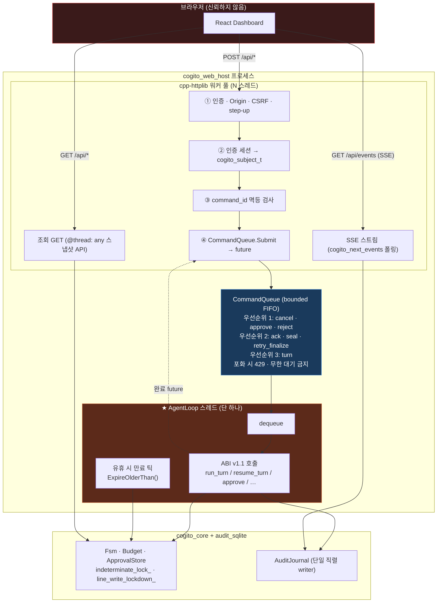

# Cogito++ 구현 명세서 v1.0

**상태** — 구현 착수 가능 (검증보고서 🔴5 / 🟠6 / 🟡6 전부 확정 반영)
**기준일** — 2026-08-20
**상위 문서** — `Cogito++_구현_요구사항.md` (범위·불변식), `Cogito++_구현_요구사항_검증보고서.md` (결함 17건)
**이 문서의 지위** — 위 두 문서와 충돌하면 **이 문서를 우선**한다. 위 문서가 "정의되지 않음"으로 남긴 값을 여기서 전부 확정한다.

> **읽는 법** — §1의 결정표만 보면 무엇이 바뀌었는지 알 수 있다. §4~§9는 그대로 파일로 옮기면 되는 계약이다. §11의 체크리스트 순서대로 구현하면 각 단계마다 테스트가 통과한다.

---

## 1. 확정 결정 — 검증보고서 17건 해소

| # | 미결 사항 | **확정 결정** | 반영 위치 |
| --- | --- | --- | --- |
| 🔴A | Schema ↔ GBNF 부분집합 불일치 | **Tier-G / Tier-V 2계층**으로 분리. 도구마다 `grammar_coverage ∈ {full, partial, none}` 산출·감사. `partial`/`none`은 비제약 생성으로 취급 | §3-2, §4-6 |
| 🔴B | 코어에 SHA-256 필요 | `picosha2`(MIT, 헤더 온리 1파일)를 **`cogito_core`에 벤더링**. 코어 의존성 = nlohmann/json + json-schema-validator + vendored picosha2 | §2, §9-1 |
| 🔴C | 승인 재평가 이중 정의 | **FSM 재진입을 규범으로 채택.** Gate는 항상 1~7단계를 처음부터 수행. verdict는 **전이 이전에** 커밋 | §5-2, §6-2 |
| 🔴D | `Cancel`/`AuditError` 전이 누락 | 명시 전이표 + **보편 규칙 R1/R2/R3**. `Execute`는 `Cancel` 이벤트를 받지 않고 `ToolResult` 분류로 흡수 | §5-1 |
| 🔴E | canonical serialization 미정의 | **CCJ v1**(Cogito Canonical JSON) 완전 정의 + `LP` digest 인코딩 확정 + 기동 시 골든 벡터 자가검사 | §3-1, §6-1 |
| 🟠F | 병렬 도구 호출 억제 요구 없음 | 프로바이더는 **요청 시점에 단일 Action을 강제**해야 함(`parallel_tool_calls=false` / 단일 tool_call 문법). 그럼에도 다중이면 `Failed` + 규격 위반 감사 | §4-11 |
| 🟠G | 승인 소비·재진입 가드 없음 | ApprovalRecord **단일 사용**(Permit 발급 시 `Consumed`). action당 **Gate 재진입 최대 1회**, 2회째 `Ask`는 `Deny`로 강등 | §4-8, §6-2 |
| 🟠H | `pattern` 제한 미정의 | **앵커(`^…$`) 필수 + 중첩 반복 금지 + 길이 상한 256 + 반복 상한 1024.** 기동 시 복잡도 검사 실패하면 프로세스 시작 실패 | §3-2 |
| 🟠I | `turn_end` 실패 후 영구 잠금 | `cogito_retry_finalize()` / `cogito_seal_session()` 추가. 봉인마저 실패하면 프로세스 중단 | §8-4, §6-3 |
| 🟠J | `indeterminate` 후속 절차 없음 | 4단계 절차 확정: 구조화 주입 → 동일 조합 세션 내 `Ask` 강등 → 운영자 확인 이벤트까지 해당 설비 write 전체 `Ask` → outcome에 표시 | §6-4 |
| 🟠K | `effect`↔`risk` 하한 미정의 | 하한표 확정. `write`→`risk ≥ medium`, `destructive`→`risk ≥ high` + `approval_required` 강제 | §3-3 |
| 🟡L | MCP `server/discover` 위상 | stdio 최초 프로브로 **필수**. `-32022` 재협상은 **부팅 시 1회만**, 런타임 재협상 금지 | §10-3 |
| 🟡M | 골든 키 3종 누락 | compactor 버전 · chat template digest · schema export 정렬 규칙 버전을 골든 키에 추가 | §10-1 |
| 🟡N | 비밀정보 보관 위치 | config는 **참조만** 담는다: `env:` / `file:` / `wincred:` / `keyring:`. `SecretString` 타입 + 파일 권한 검사 | §7-1, §4-13 |
| 🟡O | monotonic 경계 미정의 | `process_epoch_id` 컬럼 추가. 순서 권위 = `seq`, 프로세스 내 순서 = `(process_epoch_id, monotonic_ns)` | §7-4 |
| 🟡P | `idempotency_key` 도출 | `idempotency_key = lowercase_hex(action_digest)` | §6-1 |
| 🟡Q | 기획안 역전파 | §13에 기획안 수정 요청 3건 명시 | §13 |

**웹 대시보드(Web Host + React Dashboard)의 확정 결정은 §12에 별도로 둔다.** 웹 계층은 새로운 신뢰 경계를 만들므로 §12-1의 W1~W22를 먼저 읽고, ADR `0009-web-trust-boundary`를 승인한 뒤 착수한다.

### 1-1. 🔴E 관련 — RFC 8785에서 한 발 물러선 이유

검증보고서는 RFC 8785(JCS) 채택을 권고했다. 구현 단계에서 **숫자 직렬화 부분만 프로파일로 대체**한다.

RFC 8785의 숫자 규칙은 ECMAScript `Number::toString`을 요구하는데, 이를 표준 C++로 정확히 재현하려면 별도 dtoa 구현이 필요하다. `std::to_chars`의 부동소수 오버로드는 libc++ 등 일부 표준 라이브러리에서 가용성이 일정하지 않다.

따라서 **CCJ v1 = RFC 8785의 키 정렬·문자열 이스케이프 규칙 + Cogito 고유 숫자 규칙**으로 정의하고, 기동 시 골든 벡터 자가검사로 플랫폼 간 바이트 일치를 강제한다. digest는 코어가 만들고 코어가 검증하므로 외부 상호운용 요구가 없다. 외부 앵커링에서 8785 호환이 필요해지면 변환기를 추가한다. **"RFC 8785 준수"라고 표기하지 않는다.**

---

## 2. 저장소 레이아웃

```
cogitopp/
├── CMakeLists.txt
├── CMakePresets.json
├── vcpkg.json
├── vcpkg-configuration.json
├── LICENSE  NOTICE  THIRD_PARTY_LICENSES.md  SECURITY.md
│
├── cmake/
│   ├── cogitoConfig.cmake.in
│   └── CogitoWarnings.cmake
│
├── include/cogito/
│   ├── cogito.h                 ← C ABI (유일한 C 헤더)
│   ├── result.hpp               Errc, ReasonCode, Error, Result<T>
│   ├── ids.hpp                  SessionId, TurnId, ActionId, Digest, Uuid
│   ├── clock.hpp                Clock, SystemClock, FakeClock
│   ├── canonical_json.hpp       CCJ v1
│   ├── digest.hpp               Sha256, DigestBuilder, 도메인 태그
│   ├── tool_schema.hpp          SchemaCompiler, CompiledSchema, GrammarCoverage
│   ├── tool.hpp                 Effect, Risk, Idempotency, ToolDescriptor, ToolResult
│   ├── registry.hpp             ToolRegistry, ToolProvider
│   ├── identity.hpp             Subject, ExecutionMode
│   ├── policy.hpp               PolicyRule, PolicyEngine, Decision, Verdict
│   ├── budget.hpp               Limits, Budget, Deadline, CancelToken
│   ├── approval.hpp             ApprovalRecord, ApprovalStore
│   ├── permit.hpp               ExecutionPermit
│   ├── action.hpp               ActionRequest
│   ├── fsm.hpp                  State, Event, Fsm
│   ├── conversation.hpp         Message, ConversationStore, ContextCompactor
│   ├── audit.hpp                AuditEvent, AuditJournal
│   ├── inference.hpp            InferenceAdapter, InferenceRequest/Response
│   ├── invoker.hpp              ToolInvoker
│   ├── permission_gate.hpp      PermissionGate
│   ├── agent_loop.hpp           AgentLoop, TurnOutcome
│   ├── ops_log.hpp              OpsLogger
│   └── config.hpp               CogitoConfig, SecretRef, SecretString
│
├── src/
│   ├── canonical_json.cpp   digest.cpp   tool_schema.cpp
│   ├── registry.cpp   policy.cpp   budget.cpp   approval.cpp
│   ├── permit.cpp   fsm.cpp   conversation.cpp   context_compactor.cpp
│   ├── permission_gate.cpp   invoker.cpp   agent_loop.cpp
│   ├── config.cpp   secret.cpp   clock.cpp   ids.cpp
│   ├── fakes/  fake_provider.cpp  fake_tool.cpp  fake_clock.cpp
│   │           recording_audit_journal.cpp
│   ├── third_party/picosha2.h            ← 벤더링 (MIT)
│   ├── audit_sqlite/  sqlite_audit_journal.cpp  hash_chain.cpp  recovery.cpp
│   ├── providers/  http_openai.cpp  llamacpp.cpp  gbnf_from_schema.cpp
│   ├── net/  http_client.hpp  http_client_httplib.cpp  http_client_curl.cpp
│   ├── adapters/opcua/  opcua_client.cpp  opcua_tool_provider.cpp  manifest.cpp
│   └── abi/  cogito_abi.cpp  cogito.map
│
├── config/
│   ├── cogito.json          cogito.schema.json
│   ├── policy.json          policy.schema.json
│   ├── tools.json           tool-manifest.schema.json
│   ├── opcua_tools.json     opcua-manifest.schema.json
│   └── models.json          models.schema.json
│
├── tests/
│   ├── core/       fsm  gate  policy  budget  approval  registry  schema
│   ├── canonical/  ccj_golden  digest_vectors
│   ├── audit/      chain  tamper  recovery  authorizer
│   ├── replay/     golden/*.jsonl   fixtures/*.json
│   ├── abi/        ownership  async_approval  exception_boundary  thread_affinity
│   ├── web/        auth  csrf  single_command_path  sse_resume  approval_ui
│   └── fuzz/       fuzz_action_parser  fuzz_schema  fuzz_policy  fuzz_ccj
│
├── tools/
│   ├── cli/            main.cpp  console_host.cpp
│   ├── web_host/       ← §12 · C++ 임베디드 서버 (cpp-httplib, COGITO_WITH_WEB)
│   │   ├── main.cpp              서버 기동, 바인드 검증, 보안 헤더 발급
│   │   ├── command_queue.hpp     bounded FIFO + 우선순위 + 완료 future
│   │   ├── agent_thread.cpp      ★ 유일한 ABI 호출자 (§12-3)
│   │   ├── api_command.cpp       POST 경로 (인증·Origin·CSRF·멱등 제출)
│   │   ├── api_query.cpp         GET 경로 (읽기 전용, 역할 인가)
│   │   ├── sse_hub.cpp           단방향 이벤트 허브 (seq · resume_from_seq)
│   │   ├── auth.cpp              Subject 유도 · step-up · 승인 분리
│   │   └── assets_embedded.cpp   ← 빌드 시 생성. 파일시스템 서빙 금지 (§12-11)
│   └── web_dashboard/  ← §12 · React 프론트엔드
│       ├── package.json  package-lock.json  vite.config.ts
│       ├── eslint.config.js      rehype-raw / dangerouslySetInnerHTML 금지 규칙
│       └── src/
│           ├── api/         command.ts  query.ts  events.ts
│           ├── components/
│           │   ├── ApprovalPanel.tsx   ★ 권위 필드 고정 영역 (§12-8)
│           │   ├── UntrustedText.tsx   ★ 모델 유래 텍스트 전용 (평문)
│           │   ├── FsmGraph.tsx        /api/transitions 로만 생성
│           │   ├── AuditTable.tsx      서버 페이지네이션 (DB 직접 접근 금지)
│           │   ├── BudgetMetrics.tsx
│           │   └── SafetyBanner.tsx    sealed / finalize_pending / lockdown
│           └── App.tsx
├── bindings/csharp/
└── docs/
    ├── adr/            0001~0009
    └── web-threat-model.md   ← §12 착수 전 필수 산출물
```

---

## 3. 공통 규격

### 3-1. CCJ v1 — Cogito Canonical JSON

digest·감사 payload·골든 비교의 **유일한** 직렬화 형식이다. 다른 직렬화(`nlohmann::json::dump()`)를 digest 입력에 쓰는 것을 금지한다.

```
[CCJ-1] 공백 없음. 구분자는 , 와 : 만.
[CCJ-2] 객체 키는 UTF-16 code unit 오름차순 정렬. 중복 키는 파싱 단계에서 거부(Errc::DuplicateKey).
[CCJ-3] 배열 순서 보존.
[CCJ-4] 문자열: " \ 와 U+0000~U+001F 만 이스케이프.
        \b \f \n \r \t 는 짧은 형식, 나머지 제어문자는 소문자 \u00xx.
        그 외 모든 코드포인트는 UTF-8 원문 그대로. \u 확장 금지. 유니코드 정규화 금지.
[CCJ-5] 숫자:
        - NaN / Infinity 는 스키마 단계에서 거부되어 여기 도달하지 않는다.
        - 정수값이고 |v| <= 2^53 이면 십진 정수로 출력. -0.0 은 "0".
        - 그 외에는 C 로케일에서 %.15g -> %.16g -> %.17g 순으로 출력하고,
          strtod 왕복이 원값과 비트 동일한 첫 결과를 채택한다(shortest round-trip).
        - 지수 표기는 소문자 'e', 부호 필수, 지수 자릿수의 선행 0 제거. (예: 1.5e-7)
[CCJ-6] true / false / null 소문자.
[CCJ-7] 기동 시 §3-1-a 골든 벡터 24개를 자가검사한다. 하나라도 불일치하면 프로세스 시작 실패.
```

#### 3-1-a. 골든 벡터 (전부 `tests/canonical/ccj_golden.cpp`에 상수로 둔다)

| 입력 | CCJ v1 출력 |
| --- | --- |
| `{"b":1,"a":2}` | `{"a":2,"b":1}` |
| `{"a":{"z":1,"y":2}}` | `{"a":{"y":2,"z":1}}` |
| `{"A":1,"a":2}` | `{"A":1,"a":2}` |
| `0.0` | `0` |
| `-0.0` | `0` |
| `1.0` | `1` |
| `-7.0` | `-7` |
| `9007199254740992.0` (2^53) | `9007199254740992` |
| `9007199254740994.0` (2^53+2) | `9.007199254740994e+15` |
| `0.1` | `0.1` |
| `0.7` | `0.7` |
| `0.70000000000000007` | `0.7000000000000001` |
| `1e-7` | `1e-07` |
| `1.5e300` | `1.5e+300` |
| `"a\"b"` | `"a\"b"` |
| `"a\\b"` | `"a\\b"` |
| `"\u0000"` (U+0000 원시 제어문자) | `"\u0000"` |
| `"\u001F"` (U+001F 원시 제어문자) | `"\u001f"` (소문자 hex 고정) |
| `"\n"` | `"\n"` |
| `"한글"` | `"한글"` (UTF-8 원문) |
| `"😀"` (😀) | `"😀"` (UTF-8 4바이트) |
| `[]` | `[]` |
| `{}` | `{}` |
| `[1,{"b":[2,3],"a":null}]` | `[1,{"a":null,"b":[2,3]}]` |

> `1e-07` / `9.007199254740994e+15` 같은 지수 표기는 ECMAScript와 다르다. 이것이 §1-1에서 밝힌 프로파일 차이다. 표의 값이 규범이며, 구현이 이와 다르면 구현이 틀린 것이다.

### 3-2. Cogito Tool Schema v1 — Tier-G / Tier-V

`json-schema-validator`(Draft-7) 위에서 동작하되 **허용 키워드를 화이트리스트로 제한**한다. 목록에 없는 키워드가 하나라도 있으면 스키마 컴파일 실패 → 프로세스 시작 실패.

#### Tier-G — 검증기와 GBNF가 **모두** 강제

| 키워드 | 조건 |
| --- | --- |
| `type` | `object`, `array`, `string`, `integer`, `boolean` |
| `properties`, `required` | — |
| `additionalProperties` | **`false` 만** 허용 |
| `enum` | 스칼라 값만 |
| `minLength`, `maxLength` | — |
| `minimum`, `maximum` | **`type: integer` 일 때만 Tier-G** |
| `pattern` | §3-2-a 제약 충족 시 |

#### Tier-V — 검증기만 강제, GBNF는 표현 못 함

| 키워드 | 비고 |
| --- | --- |
| `type: number` | 실수형 자체가 Tier-V |
| `minimum`, `maximum` (`type: number`) | **GBNF 미적용** — llama.cpp 공식: *"Numeric bounds only work for `integer`, not `number`"* |
| `exclusiveMinimum`, `exclusiveMaximum` | GBNF 미적용 |
| `const` | GBNF 미적용 (`enum` 단일값으로 대체 가능) |
| `minItems`, `maxItems` | GBNF 미적용 |

#### 금지 — 컴파일 실패

`$ref`(모든 형태) · `$dynamicRef` · `$anchor` · `$defs` · `unevaluatedProperties` · `unevaluatedItems` · `patternProperties` · `prefixItems` · `propertyNames` · `dependentSchemas` · `dependentRequired` · `if`/`then`/`else` · `not` · `oneOf` · `anyOf` · `allOf` · `uniqueItems` · `contains`/`minContains`/`maxContains` · `format` · `multipleOf` · `default` · `$schema`가 Draft-7 이외를 가리키는 경우 · 외부 URI loader

#### `grammar_coverage` 산출

```
모든 키워드가 Tier-G          -> full
Tier-G + Tier-V 혼재          -> partial
제약 키워드가 하나도 없음      -> none   (type/properties/required만 있는 경우 포함)
```

`partial`·`none` 도구는 **문서·UI·감사 어디에서도 "생성 단계에서 제한됨"이라고 표기하지 않는다.** `grammar_coverage`는 `registry_digest`에 포함되고 `turn_begin` payload에 기록된다.

#### 3-2-a. `pattern` 제약 (🟠H 확정)

```
1. 반드시 ^ 로 시작하고 $ 로 끝난다.            (GBNF 요구와 동일)
2. 패턴 문자열 길이 <= 256 바이트.
3. 허용 요소: 리터럴 문자, 문자클래스 [...], . , 이스케이프 \d \w \s \. \\ 등,
             한정 반복 {n,m} (m <= 1024), ? , 그룹 (…) — 캡처 여부 무관.
4. 금지: 중첩 수량자 ( (…)+ )+ , (…)* 안의 * 또는 + ,
         역참조 \1 , 전방/후방 탐색 (?=…) (?!…) (?<=…) ,
         무한 수량자 * 와 + 는 문자클래스 또는 단일 문자 뒤에서만 허용.
5. 기동 시 복잡도 검사(중첩 수량자 탐지 + 길이 + 반복 상한)를 수행하고
   실패하면 프로세스 시작 실패(Errc::SchemaCompileFailed).
6. 런타임 정규식 매칭에 200ms 상한을 둔다. 초과 시 Deny(reason=pattern_timeout)로
   처리하고 OpsLogger에 ERROR를 남긴다.
```

### 3-3. `effect` × `risk` 하한 (🟠K 확정)

| `effect` | 최소 `risk` | `approval_required` | `idempotency` 기본 |
| --- | --- | --- | --- |
| `none` | `low` | 선택 (기본 `false`) | `safe` |
| `write` | **`medium`** | 기본 `true`. 명시적 정책으로만 `false`, 그 사실을 `turn_begin`에 감사 | `conditional` |
| `destructive` | **`high`** | **`true` 강제 — 어떤 설정으로도 `false` 불가** | `unsafe` |

부팅 시 하한 위반 ToolDescriptor가 있으면 **프로세스 시작 실패** (`Errc::ToolContractViolation`).

### 3-4. `reason_code` — 사용자 표시 문자열과 분리된 안정 식별자

`Verdict.reason_code`는 감사·테스트·HMI 다국어화의 키다. 문자열 `reason`은 바뀔 수 있으나 `reason_code`는 **major 버전 내에서 불변**이다.

| 게이트 단계 | `reason_code` |
| --- | --- |
| 1 입력 위생 | `input_too_large` `input_depth_exceeded` `input_not_utf8` `input_missing_field` `input_duplicate_key` |
| 2 등록 | `tool_not_registered` `tool_forbidden` |
| 3 스키마 | `schema_violation` `pattern_timeout` |
| 4 상태 | `invalid_fsm_state` |
| 5 정책 | `policy_denied` `mode_denied` `role_denied` `policy_conflict_denied` `no_matching_rule` |
| 6 예산 | `budget_tokens` `budget_tool_calls` `budget_repeat` `budget_deadline` |
| 7 승인 | `approval_required` `approval_rejected` `approval_expired` `approval_already_consumed` `approval_scope_mismatch` `approval_reentry_exceeded` `approval_self_approval`(§12 W12) `approval_nonce_mismatch` |
| 8 감사 | `audit_commit_failed` |
| — 강등 | `indeterminate_lockdown` |
| — 허용 | `allowed` |

---

## 4. 코어 헤더 (계약 전문)

### 4-1. `result.hpp`

```cpp
#pragma once
#include <string>
#include <optional>
#include <utility>
#include <cstdint>

namespace cogito {

enum class Errc : std::int32_t {
  Ok = 0,
  InvalidArgument, NotRegistered, Forbidden, SchemaViolation,
  SchemaCompileFailed, ToolContractViolation,
  PolicyDenied, ApprovalRequired, ApprovalInvalid,
  BudgetExhausted, DeadlineExceeded, Cancelled,
  ProviderError, ProviderContractViolation, ToolError, Indeterminate,
  AuditWriteFailed, AuditChainBroken,
  DuplicateKey, NotUtf8, TooLarge, DepthExceeded,
  ConfigError, SecretError, TurnSealed,
  Internal = 99
};

// reason_code 는 안정 식별자다. 문자열 상수로 두고 절대 재사용/재정의하지 않는다.
namespace reason {
inline constexpr const char* kAllowed                  = "allowed";
inline constexpr const char* kToolNotRegistered        = "tool_not_registered";
inline constexpr const char* kToolForbidden            = "tool_forbidden";
inline constexpr const char* kSchemaViolation          = "schema_violation";
inline constexpr const char* kPatternTimeout           = "pattern_timeout";
inline constexpr const char* kInvalidFsmState          = "invalid_fsm_state";
inline constexpr const char* kPolicyDenied             = "policy_denied";
inline constexpr const char* kModeDenied               = "mode_denied";
inline constexpr const char* kRoleDenied               = "role_denied";
inline constexpr const char* kPolicyConflictDenied     = "policy_conflict_denied";
inline constexpr const char* kNoMatchingRule           = "no_matching_rule";
inline constexpr const char* kBudgetTokens             = "budget_tokens";
inline constexpr const char* kBudgetToolCalls          = "budget_tool_calls";
inline constexpr const char* kBudgetRepeat             = "budget_repeat";
inline constexpr const char* kBudgetDeadline           = "budget_deadline";
inline constexpr const char* kApprovalRequired         = "approval_required";
inline constexpr const char* kApprovalRejected         = "approval_rejected";
inline constexpr const char* kApprovalExpired          = "approval_expired";
inline constexpr const char* kApprovalAlreadyConsumed  = "approval_already_consumed";
inline constexpr const char* kApprovalScopeMismatch    = "approval_scope_mismatch";
inline constexpr const char* kApprovalReentryExceeded  = "approval_reentry_exceeded";
inline constexpr const char* kAuditCommitFailed        = "audit_commit_failed";
inline constexpr const char* kIndeterminateLockdown    = "indeterminate_lockdown";
inline constexpr const char* kInputTooLarge            = "input_too_large";
inline constexpr const char* kInputDepthExceeded       = "input_depth_exceeded";
inline constexpr const char* kInputNotUtf8             = "input_not_utf8";
inline constexpr const char* kInputMissingField        = "input_missing_field";
inline constexpr const char* kInputDuplicateKey        = "input_duplicate_key";
}  // namespace reason

struct Error {
  Errc        code = Errc::Ok;
  std::string reason_code;   // reason:: 상수. 비게이트 오류는 빈 문자열 허용
  std::string message;       // 사용자 표시용 (한국어)
  std::string detail;        // 진단용 (검증기 원문 등). 감사 payload에는 마스킹 후 기록

  explicit operator bool() const noexcept { return code != Errc::Ok; }
  static Error Ok() noexcept { return Error{}; }
};

template <typename T>
class [[nodiscard]] Result {
 public:
  Result(T v) : value_(std::move(v)) {}          // NOLINT(google-explicit-constructor)
  Result(Error e) : error_(std::move(e)) {}      // NOLINT(google-explicit-constructor)

  bool ok() const noexcept { return error_.code == Errc::Ok; }
  explicit operator bool() const noexcept { return ok(); }

  const T& value() const& { return *value_; }
  T&&      take() && { return std::move(*value_); }
  T&&      take() &  { return std::move(*value_); }
  const Error& error() const noexcept { return error_; }

 private:
  std::optional<T> value_;
  Error            error_{};
};

}  // namespace cogito
```

### 4-2. `ids.hpp` · `clock.hpp`

```cpp
// ids.hpp
#pragma once
#include <array>
#include <string>
#include <cstdint>

namespace cogito {

// SHA-256 원시 32바이트. 문자열이 아니다.
struct Digest {
  std::array<std::uint8_t, 32> bytes{};
  bool operator==(const Digest& o) const noexcept { return bytes == o.bytes; }
  bool operator!=(const Digest& o) const noexcept { return !(*this == o); }
  std::string hex() const;                       // 소문자 64자
  static Digest Zero() noexcept { return Digest{}; }   // 체인 시작값
};

using SessionId = std::string;                   // UUIDv4 문자열
using ActionId  = std::string;                   // UUIDv4 문자열
using TurnId    = std::uint64_t;                 // 세션 내 1부터 단조 증가

std::string NewUuidV4();                         // 암호학적 난수원 사용
std::string NewProcessEpochId();                 // 프로세스 시작 시 1회 생성

}  // namespace cogito
```

```cpp
// clock.hpp
#pragma once
#include <cstdint>
#include <string>

namespace cogito {

class Clock {
 public:
  virtual ~Clock() = default;
  virtual std::string  NowUtcRfc3339() const = 0;   // 표시·상관관계 전용
  virtual std::int64_t MonotonicNs()   const = 0;   // 순서·경과시간 전용
};

class SystemClock final : public Clock {
 public:
  std::string  NowUtcRfc3339() const override;
  std::int64_t MonotonicNs()   const override;
};

// 기획안 3-8 "Fake Clock". 이벤트 시퀀스를 미리 주입한다.
class FakeClock final : public Clock {
 public:
  explicit FakeClock(std::string start_utc, std::int64_t start_ns = 0);
  std::string  NowUtcRfc3339() const override;
  std::int64_t MonotonicNs()   const override;
  void Advance(std::int64_t ns);
  void SetUtc(std::string utc);                     // UTC 역행 테스트용
 private:
  mutable std::string  utc_;
  mutable std::int64_t ns_;
};

}  // namespace cogito
```

### 4-3. `canonical_json.hpp` · `digest.hpp`

```cpp
// canonical_json.hpp
#pragma once
#include <nlohmann/json.hpp>
#include "cogito/result.hpp"

namespace cogito::ccj {

using Json = nlohmann::json;

// CCJ v1. §3-1 규격. digest 입력에는 반드시 이 함수만 사용한다.
Result<std::string> Serialize(const Json& j);

// 중복 키·비UTF8·깊이/크기 초과를 '거부'하는 파서. nlohmann 기본 파서는 중복 키를
// 조용히 덮어쓰므로 직접 사용하지 않는다.
struct ParseLimits {
  std::size_t max_bytes = 256 * 1024;
  int         max_depth = 32;
  std::size_t max_keys  = 512;
};
Result<Json> ParseStrict(std::string_view text, const ParseLimits& lim);

// 기동 시 1회 호출. §3-1-a 골든 벡터 24개 자가검사. 실패 시 프로세스 시작 실패.
Error SelfTest();

}  // namespace cogito::ccj
```

```cpp
// digest.hpp
#pragma once
#include <string_view>
#include <vector>
#include "cogito/ids.hpp"
#include "cogito/result.hpp"

namespace cogito {

namespace domain {
inline constexpr const char* kAction     = "cogito-action-v1";
inline constexpr const char* kPermit     = "cogito-permit-v1";
inline constexpr const char* kAudit      = "cogito-audit-v1";
inline constexpr const char* kPolicy     = "cogito-policy-v1";
inline constexpr const char* kRegistry   = "cogito-registry-v1";
inline constexpr const char* kToolSchema = "cogito-toolschema-v1";
inline constexpr const char* kConfig     = "cogito-config-v1";
inline constexpr const char* kModel      = "cogito-model-v1";
}  // namespace domain

// length-prefix 인코딩:  H = SHA-256( Σ [ u32le(len(fi)) || fi ] )
//   - 문자열/바이트: UTF-8 원문 바이트
//   - 정수:        u64le 고정 8바이트 (십진 문자열 금지)
//   - 첫 필드는 반드시 도메인 태그
class DigestBuilder {
 public:
  explicit DigestBuilder(std::string_view domain_tag);
  DigestBuilder& Str(std::string_view s);
  DigestBuilder& U64(std::uint64_t v);
  DigestBuilder& Raw(const std::uint8_t* p, std::size_t n);
  DigestBuilder& Dig(const Digest& d);            // Raw(d.bytes, 32) 와 동일
  Digest Finish();
 private:
  std::vector<std::uint8_t> buf_;
};

Digest Sha256(const std::uint8_t* p, std::size_t n);

// idempotency_key = lowercase_hex(action_digest)   (🟡P 확정)
inline std::string IdempotencyKey(const Digest& action_digest) {
  return action_digest.hex();
}

}  // namespace cogito
```

### 4-4. `tool.hpp`

```cpp
#pragma once
#include <string>
#include <functional>
#include <cstdint>
#include "cogito/canonical_json.hpp"
#include "cogito/tool_schema.hpp"

namespace cogito {

enum class Effect      : std::uint8_t { None = 0, Write = 1, Destructive = 2 };
enum class Risk        : std::uint8_t { Low = 0, Medium = 1, High = 2, Critical = 3 };
enum class Idempotency : std::uint8_t { Safe, Conditional, Unsafe };
enum class ToolStatus  : std::uint8_t { Enabled, Forbidden };

enum class ToolResultStatus : std::uint8_t {
  Ok, Error, Timeout, Cancelled, Indeterminate
};

struct ToolResult {
  ToolResultStatus status = ToolResultStatus::Error;
  ccj::Json    content;                 // status==Ok 일 때만 의미 있음
  std::string  error_code;
  std::string  error_message;
  std::int64_t started_ns = 0, finished_ns = 0, elapsed_us = 0;
  int          attempt_count = 1;       // 불변식 9: write/destructive 는 항상 1
  // write 계열 전용
  ccj::Json    before, requested, after;
  std::string  verification_status;     // "verified" | "mismatch" | "unavailable"
  // 공통
  std::size_t  output_bytes = 0;
  bool         truncated = false;
  bool         masked = false;
};

using ToolHandler =
    std::function<ToolResult(const ccj::Json& args, const class ToolCallContext&)>;

class ToolDescriptor {
 public:
  std::string      name;                // ^[a-z][a-z0-9_]*(\.[a-z][a-z0-9_]*){0,4}$
  std::string      description;
  ccj::Json        input_schema;
  ccj::Json        output_schema;       // null 허용 (그래도 크기·파싱 제한은 적용)
  Effect           effect      = Effect::Destructive;   // 기본값은 가장 위험하게
  Risk             risk        = Risk::Critical;
  Idempotency      idempotency = Idempotency::Unsafe;
  bool             approval_required = true;
  std::int32_t     timeout_ms        = 3000;            // 0 금지
  std::size_t      max_output_bytes  = 64 * 1024;
  std::string      provider_id;
  std::string      invoker_id;
  ToolStatus       status = ToolStatus::Enabled;
  std::string      forbidden_reason;    // status==Forbidden 일 때 필수
  GrammarCoverage  grammar_coverage = GrammarCoverage::None;   // 컴파일러가 채움

  // 불변식 1: handler 는 ToolInvoker 만 꺼낼 수 있다. 타입 수준에서 강제한다.
  void SetHandler(ToolHandler h) { handler_ = std::move(h); }
  bool has_handler() const noexcept { return static_cast<bool>(handler_); }

 private:
  friend class ToolInvoker;
  ToolHandler handler_;
};

// §3-3 하한 검사. 부팅 시 위반하면 프로세스 시작 실패.
Error ValidateToolContract(const ToolDescriptor& d);

}  // namespace cogito
```

### 4-5. `registry.hpp`

```cpp
#pragma once
#include <memory>
#include <map>
#include <vector>
#include "cogito/tool.hpp"
#include "cogito/identity.hpp"

namespace cogito {

enum class LookupKind : std::uint8_t { Absent, Enabled, Forbidden };

struct LookupResult {
  LookupKind             kind = LookupKind::Absent;
  const ToolDescriptor*  desc = nullptr;   // Enabled/Forbidden 일 때 non-null
};

class ToolProvider {
 public:
  virtual ~ToolProvider() = default;
  virtual const char* provider_id() const noexcept = 0;
  virtual Result<std::vector<ToolDescriptor>> Describe() = 0;
};

class ToolRegistry {
 public:
  ToolRegistry();
  ~ToolRegistry();
  ToolRegistry(const ToolRegistry&) = delete;
  ToolRegistry& operator=(const ToolRegistry&) = delete;

  // 부팅 단계 전용. Freeze() 이후 호출하면 Errc::Internal.
  [[nodiscard]] Error Register(ToolDescriptor d);
  [[nodiscard]] Error RegisterFrom(ToolProvider& p);

  // 스키마 컴파일 + 계약 검사 + registry_digest 계산. 실패 = 프로세스 시작 실패.
  [[nodiscard]] Error Freeze();
  bool frozen() const noexcept { return frozen_; }

  // 🔴C·결함7: forbidden 은 tombstone 으로 남아 Absent 와 구분된다.
  LookupResult Lookup(const std::string& name) const noexcept;

  // 게이트 3단계. 검증 실패 메시지는 detail 에 담아 LLM 자가수정에 재사용.
  [[nodiscard]] Error ValidateArguments(const std::string& tool,
                                        const ccj::Json& args) const;

  // 모델에 노출할 스키마. 이름 오름차순 고정 정렬 + CCJ 직렬화.
  // 노출 여부는 사용성 최적화일 뿐 보안 통제가 아니다 — 숨긴 도구도 Gate 는 동일 검사.
  std::vector<ToolDescriptor> ExportForModel(ExecutionMode mode) const;

  const Digest&      registry_digest() const noexcept { return digest_; }
  std::string        export_order_version() const noexcept { return "name-asc-v1"; }

 private:
  std::map<std::string, ToolDescriptor> tools_;   // std::map = 이름 정렬 보장
  std::map<std::string, std::unique_ptr<class CompiledSchema>> schemas_;
  Digest digest_{};
  bool   frozen_ = false;
};

}  // namespace cogito
```

### 4-6. `tool_schema.hpp`

```cpp
#pragma once
#include <memory>
#include <string>
#include "cogito/canonical_json.hpp"
#include "cogito/result.hpp"

namespace cogito {

enum class GrammarCoverage : std::uint8_t { Full, Partial, None };

const char* ToString(GrammarCoverage c) noexcept;   // "full"|"partial"|"none"

struct SchemaAudit {
  GrammarCoverage coverage = GrammarCoverage::None;
  std::vector<std::string> tier_v_keywords;   // partial 사유를 감사에 남긴다
};

class CompiledSchema {
 public:
  ~CompiledSchema();
  // "" 이면 통과. 실패 시 "/properties/value: 3.5 exceeds maximum 0.95" 형태.
  std::string Check(const ccj::Json& doc) const;
  const SchemaAudit& audit() const noexcept;
 private:
  friend class SchemaCompiler;
  CompiledSchema();
  struct Impl;                       // json-schema-validator 를 헤더에서 숨긴다
  std::unique_ptr<Impl> p_;
};

class SchemaCompiler {
 public:
  // §3-2 화이트리스트 검사 -> pattern 복잡도 검사 -> validator 컴파일
  //   -> grammar_coverage 산출. 하나라도 실패하면 Error.
  static Result<std::unique_ptr<CompiledSchema>> Compile(const ccj::Json& schema);
};

}  // namespace cogito
```

### 4-7. `policy.hpp` · `identity.hpp`

```cpp
// identity.hpp
#pragma once
#include <string>
#include <vector>

namespace cogito {

enum class ExecutionMode : std::uint8_t { Default, Plan, Edit, ReadOnly };

// ExecutionMode 는 권한이 아니다. 호출자가 Edit 를 요청해도 role 이 허용하지
// 않으면 Deny 한다. Mode 는 '상한을 낮추는' 방향으로만 작용한다.
struct Subject {
  std::string              subject_id;    // 인증원이 부여한 안정 ID
  std::vector<std::string> roles;         // 예: {"operator","qa_engineer"}
  std::string              auth_method;   // "os_user" | "badge" | "oidc" | ...
  std::string              line_id;       // 설비/라인 스코프 (없으면 빈 문자열)
};

}  // namespace cogito
```

```cpp
// policy.hpp
#pragma once
#include <vector>
#include <string>
#include "cogito/tool.hpp"
#include "cogito/identity.hpp"
#include "cogito/ids.hpp"

namespace cogito {

enum class Decision : std::uint8_t { Allow, Ask, Deny };

struct Verdict {
  Decision     decision = Decision::Deny;    // 기본값은 항상 Deny
  int          gate_stage = 0;               // 1..9
  std::string  reason_code;                  // reason:: 상수
  std::string  reason;                       // 사용자 표시용
  std::string  rule_id;
  Digest       policy_digest{};
  Digest       registry_digest{};
  Digest       action_digest{};
  std::string  evaluated_at_utc;
  std::int64_t expires_at_ns = 0;            // monotonic 기준
};

struct PolicyRule {
  std::string  id;
  int          priority = 0;                 // 명시적 정수. 큰 값이 우선
  std::string  tool_pattern;                 // exact 또는 "opcua.read.*" prefix glob
  std::vector<std::string> modes;            // ["*"] 또는 명시 목록
  std::vector<std::string> roles;            // 비면 모든 role
  std::string  effect_min, effect_max;       // "none"|"write"|"destructive", 빈값=무제한
  std::string  risk_min, risk_max;
  Decision     decision = Decision::Deny;
  std::string  reason;
  std::string  line_id;                      // 설비 스코프 조건 (빈값=무제한)
};

struct PolicyContext {
  const Subject*      subject = nullptr;
  ExecutionMode       mode = ExecutionMode::ReadOnly;
  const ToolDescriptor* tool = nullptr;
};

class PolicyEngine {
 public:
  static Result<PolicyEngine> LoadFile(const std::string& path);
  static Result<PolicyEngine> FromJson(const ccj::Json& j);

  // 최고 priority 매칭. 동률 충돌 시 Deny > Ask > Allow 를 택하고
  // conflict 를 out_conflict 에 표시한다(감사 대상).
  Verdict Decide(const PolicyContext& ctx, bool* out_conflict) const;

  // OPC UA forbidden 노드 등 provider 가 주입하는 고우선 deny 규칙
  void AddHighPriorityDenies(std::vector<PolicyRule> rules);

  const Digest& policy_digest() const noexcept { return digest_; }
  int  version() const noexcept { return schema_version_; }

 private:
  std::vector<PolicyRule> rules_;
  Digest digest_{};
  int    schema_version_ = 1;
};

}  // namespace cogito
```

### 4-8. `approval.hpp` (🟠G 확정)

```cpp
#pragma once
#include <string>
#include <map>
#include "cogito/ids.hpp"
#include "cogito/identity.hpp"
#include "cogito/result.hpp"

namespace cogito {

enum class ApprovalState : std::uint8_t {
  Pending, Approved, Rejected, Expired, Cancelled, Consumed
};

struct ApprovalRecord {
  std::string   approval_id;         // UUIDv4
  Digest        action_digest{};
  Digest        permit_scope_digest{};
  SessionId     session_id;
  TurnId        turn_id = 0;
  ActionId      action_id;

  ApprovalState state = ApprovalState::Pending;
  Subject       approver;            // 응답 시 채워진다
  std::string   nonce;               // 재생 공격 방지

  std::string   created_at_utc, responded_at_utc;
  std::int64_t  created_ns = 0, expires_ns = 0;

  Digest        policy_digest{};     // 승인 시점 스냅샷
  Digest        registry_digest{};
};

class ApprovalStore {
 public:
  Result<ApprovalRecord> CreatePending(const Digest& action_digest,
                                       const Digest& permit_scope_digest,
                                       const SessionId&, TurnId, const ActionId&,
                                       const Digest& policy_digest,
                                       const Digest& registry_digest,
                                       std::int64_t now_ns, std::int64_t ttl_ns);

  // HMI 가 호출. approval_id + action_digest 가 모두 일치해야 한다.
  [[nodiscard]] Error Respond(const std::string& approval_id,
                              const Digest& action_digest,
                              bool approved, const Subject& approver,
                              std::int64_t now_ns);

  // Gate 7단계 조회. 만료는 여기서 판정한다.
  // 유효한 Approved 가 없으면 nullptr.
  const ApprovalRecord* FindUsable(const Digest& action_digest,
                                   const Digest& permit_scope_digest,
                                   const SessionId&, TurnId,
                                   std::int64_t now_ns) const;

  // 🟠G: Permit 발급 시 정확히 한 번 호출. 이후 재사용은 approval_already_consumed.
  [[nodiscard]] Error Consume(const std::string& approval_id);

  [[nodiscard]] Error Cancel(const std::string& approval_id);
  void ExpireOlderThan(std::int64_t now_ns);
  std::vector<const ApprovalRecord*> Pending() const;
  std::size_t pending_count() const noexcept { return pending_count_; }

 private:
  std::map<std::string, ApprovalRecord> records_;
  std::size_t pending_count_ = 0;
  static constexpr std::size_t kMaxPending = 64;   // DoS 방지
};

}  // namespace cogito
```

### 4-9. `permit.hpp` — 불변식 1을 타입으로 강제

```cpp
#pragma once
#include "cogito/ids.hpp"
#include "cogito/tool.hpp"

namespace cogito {

// 생성 주체는 PermissionGate 하나, 소비 주체는 ToolInvoker 하나다.
// 복사 불가 + 이동만 가능 + 1회 소비. Gate 를 우회한 실행 경로가 존재할 수 없다.
class ExecutionPermit {
 public:
  ExecutionPermit(const ExecutionPermit&)            = delete;
  ExecutionPermit& operator=(const ExecutionPermit&) = delete;
  ExecutionPermit(ExecutionPermit&& o) noexcept;
  ExecutionPermit& operator=(ExecutionPermit&& o) noexcept;
  ~ExecutionPermit();

  bool                valid() const noexcept { return !consumed_ && !tool_name_.empty(); }
  const Digest&       action_digest() const noexcept { return action_digest_; }
  const Digest&       permit_scope_digest() const noexcept { return scope_digest_; }
  const std::string&  tool_name() const noexcept { return tool_name_; }
  std::int64_t        expires_ns() const noexcept { return expires_ns_; }
  std::int32_t        timeout_ms() const noexcept { return timeout_ms_; }
  Effect              effect() const noexcept { return effect_; }
  const std::string&  idempotency_key() const noexcept { return idem_key_; }

 private:
  friend class PermissionGate;   // 유일한 생성자
  friend class ToolInvoker;      // 유일한 소비자

  ExecutionPermit() = default;
  void Consume() noexcept { consumed_ = true; }

  Digest       action_digest_{}, scope_digest_{};
  std::string  tool_name_, idem_key_;
  std::int64_t expires_ns_ = 0;
  std::int32_t timeout_ms_ = 0;
  Effect       effect_ = Effect::Destructive;
  bool         consumed_ = false;
};

}  // namespace cogito
```

### 4-10. `fsm.hpp` (🔴D 확정)

```cpp
#pragma once
#include <array>
#include <cstdint>
#include <string>
#include "cogito/canonical_json.hpp"
#include "cogito/result.hpp"

namespace cogito {

enum class State : std::uint8_t {
  Idle, Infer, Propose, Gate, AwaitApproval, Execute, Observe,
  Done, Failed, Cancelled
};

enum class Event : std::uint8_t {
  UserInput, InferOk, ProviderError, BudgetExhausted, Cancel,
  NoAction, OneAction, MultipleActions,
  Deny, Ask, Allow, AuditError,
  Approved, RejectedOrExpired,
  ExecOk, ExecErrorOrIndeterminate,
  Continue, CompleteOrLimit,
  StartNextTurn
};

const char* ToString(State) noexcept;
const char* ToString(Event) noexcept;
bool IsTerminal(State) noexcept;    // Done | Failed | Cancelled

struct Transition { State from; Event ev; State to; };

// 명시 전이표 (요구사항 §7-2)
inline constexpr std::array<Transition, 19> kTransitions{{
  {State::Idle,          Event::UserInput,                State::Infer},
  {State::Infer,         Event::InferOk,                  State::Propose},
  {State::Infer,         Event::ProviderError,            State::Failed},
  {State::Infer,         Event::BudgetExhausted,          State::Done},
  {State::Propose,       Event::NoAction,                 State::Done},
  {State::Propose,       Event::OneAction,                State::Gate},
  {State::Propose,       Event::MultipleActions,          State::Failed},
  {State::Gate,          Event::Deny,                     State::Observe},
  {State::Gate,          Event::Ask,                      State::AwaitApproval},
  {State::Gate,          Event::Allow,                    State::Execute},
  {State::AwaitApproval, Event::Approved,                 State::Gate},
  {State::AwaitApproval, Event::RejectedOrExpired,        State::Observe},
  {State::Execute,       Event::ExecOk,                   State::Observe},
  {State::Execute,       Event::ExecErrorOrIndeterminate, State::Observe},
  {State::Observe,       Event::Continue,                 State::Infer},
  {State::Observe,       Event::CompleteOrLimit,          State::Done},
  {State::Done,          Event::StartNextTurn,            State::Idle},
  {State::Failed,        Event::StartNextTurn,            State::Idle},
  {State::Cancelled,     Event::StartNextTurn,            State::Idle},
}};

/*  보편 규칙 — 표에 없지만 유효한 전이 (🔴D)
 *  R1  AuditError : {Infer, Propose, Gate, AwaitApproval, Execute, Observe} -> Failed
 *  R2  Cancel     : {Idle, Infer, Propose, Gate, AwaitApproval, Observe}    -> Cancelled
 *  R3  Execute 는 Cancel 이벤트를 받지 않는다.
 *      실행 중 취소는 CancelToken 으로 Invoker 에 전달되고 ToolResult 로 분류된다:
 *        effect == None  -> ToolResultStatus::Cancelled
 *        effect != None  -> ToolResultStatus::Indeterminate   (불변식 9)
 *      두 경우 모두 Event::ExecErrorOrIndeterminate 로 Observe 에 진입한다.
 *      Observe 에서 CancelToken 이 여전히 set 이면 R2 로 Cancelled 로 간다.
 */

struct TransitionRecord {
  State        from, to;
  Event        ev;
  std::string  cause;         // reason_code 또는 자유 문자열
  ActionId     action_id;     // 없으면 빈 문자열
  TurnId       turn_id = 0;
  std::string  wall_utc;
  std::int64_t monotonic_ns = 0;
};

class Fsm {
 public:
  State current() const noexcept { return s_; }

  // 전이의 유일한 진입점. 반환값 무시 금지.
  [[nodiscard]] Error Dispatch(Event ev, const std::string& cause,
                               const ActionId& action_id, TurnId turn,
                               const class Clock& clock,
                               TransitionRecord* out);

  void ResetForNextTurn() noexcept { s_ = State::Idle; }

  // --dump-transitions : 표 + 규칙을 JSON 으로 출력 (문서·검증 자료로 그대로 사용)
  static ccj::Json DumpTable();
  // 도달 불가 상태·중복 전이 검사. 기동 시 1회 수행.
  static Error VerifyTableIntegrity();

 private:
  static bool ResolveUniversal(State from, Event ev, State* to) noexcept;  // R1/R2/R3
  State s_ = State::Idle;
};

}  // namespace cogito
```

### 4-11. `inference.hpp` (🟠F 확정)

```cpp
#pragma once
#include <vector>
#include <string>
#include "cogito/action.hpp"
#include "cogito/tool.hpp"
#include "cogito/budget.hpp"

namespace cogito {

enum class Role : std::uint8_t { System, User, Assistant, Tool };

struct Message {
  Role         role = Role::User;
  std::string  content;
  ActionId     tool_call_id;                 // Role::Tool
  std::vector<ActionRequest> actions;        // Role::Assistant
  bool         untrusted = false;            // 불변식 10: Tool/RAG/MCP 결과 표시
  std::string  provenance;                   // "tool:opcua.read.x" | "rag:manuals#c12"
};

struct Usage { int prompt_tokens = 0; int completion_tokens = 0; };
enum class FinishReason : std::uint8_t { Stop, ToolCalls, Length, Error };

struct InferenceRequest {
  const std::vector<Message>*        messages = nullptr;
  const std::vector<ToolDescriptor>* tools    = nullptr;   // 이름순 정렬 보장됨
  int    max_tokens  = 1024;
  float  temperature = 0.0f;
  std::uint64_t seed = 0;
  // 🟠F: 프로바이더는 이 플래그를 반드시 존중해야 한다.
  //   HTTP     -> parallel_tool_calls = false 전송
  //   llama.cpp-> 단일 tool_call 객체만 허용하는 문법 생성
  bool   force_single_action = true;
  bool   constrain_to_schema = true;
  Deadline    deadline;
  CancelToken cancel;
};

struct ProviderIdentity {
  std::string provider_id;        // "openai-http" | "llamacpp"
  std::string model_id;
  Digest      model_digest{};     // 가중치 SHA-256 (원격이면 서버 보고값 + endpoint)
  Digest      chat_template_digest{};
  Digest      tool_schema_digest{};
  std::string provider_build;     // llama.cpp commit SHA 등
};

struct InferenceResponse {
  std::string                text;
  std::vector<ActionRequest> actions;    // 정상 경로에서는 0 또는 1개
  Usage                      usage;
  FinishReason               finish = FinishReason::Error;
  std::string                response_id;
  Digest                     raw_digest{};   // 원문은 기본 저장하지 않는다 (§7-5)
  ProviderIdentity           identity;
};

class InferenceAdapter {
 public:
  virtual ~InferenceAdapter() = default;
  virtual Result<InferenceResponse> Complete(const InferenceRequest&) = 0;
  virtual int  EstimateTokens(const std::string& text) const = 0;
  virtual const ProviderIdentity& identity() const noexcept = 0;
  virtual bool supports_grammar_constraint() const noexcept { return false; }
  // force_single_action 을 실제로 강제할 수 있는가. false 면 부팅 시 경고 + 감사.
  virtual bool supports_single_action_enforcement() const noexcept { return false; }
};

}  // namespace cogito
```

### 4-12. `audit.hpp` · `invoker.hpp` · `agent_loop.hpp`

```cpp
// audit.hpp
#pragma once
#include "cogito/ids.hpp"
#include "cogito/canonical_json.hpp"
#include "cogito/result.hpp"

namespace cogito {

enum class ActorType : std::uint8_t { System, User, Llm, Gate, Tool, Human };

namespace audit_kind {
inline constexpr const char* kTurnBegin          = "turn_begin";
inline constexpr const char* kInferenceRequested = "inference_requested";
inline constexpr const char* kInferenceResult    = "inference_result";
inline constexpr const char* kTransition         = "transition";
inline constexpr const char* kVerdict            = "verdict";
inline constexpr const char* kApprovalRequested  = "approval_requested";
inline constexpr const char* kApprovalResult     = "approval_result";
inline constexpr const char* kToolCallStarted    = "tool_call_started";
inline constexpr const char* kToolResult         = "tool_result";
inline constexpr const char* kTurnEnd            = "turn_end";
inline constexpr const char* kAuditRecovery      = "audit_recovery";
inline constexpr const char* kOperatorAck        = "operator_ack";   // 🟠J
}  // namespace audit_kind

struct AuditEvent {
  std::string  event_id;          // UUIDv4
  SessionId    session_id;
  TurnId       turn_id = 0;
  ActionId     action_id;         // 없으면 빈 문자열
  std::string  wall_time_utc;
  std::int64_t monotonic_ns = 0;
  std::string  process_epoch_id;  // 🟡O
  std::string  kind;              // audit_kind::
  ActorType    actor_type = ActorType::System;
  std::string  actor_id;
  ccj::Json    payload;           // CCJ 로 직렬화되어 저장·해시된다
  int          schema_version = 1;
};

// 감사 저널은 OpsLogger 와 완전히 별개다. 회전·드롭 정책을 공유하지 않는다.
class AuditJournal {
 public:
  virtual ~AuditJournal() = default;
  // 동기 커밋. 반환 시점에 내구성이 보장된다. 실패는 절대 삼키지 않는다.
  [[nodiscard]] virtual Error Commit(const AuditEvent& e) = 0;
  [[nodiscard]] virtual Error VerifyChain() = 0;
  // 크래시 후: tool_call_started 만 있고 tool_result 가 없는 항목에
  // indeterminate 결과와 audit_recovery 를 생성한다.
  [[nodiscard]] virtual Error RecoverDangling() = 0;
  virtual Digest chain_head() const = 0;
};

}  // namespace cogito
```

```cpp
// invoker.hpp
#pragma once
#include "cogito/permit.hpp"
#include "cogito/registry.hpp"
#include "cogito/budget.hpp"

namespace cogito {

struct ToolCallContext {
  std::string  idempotency_key;
  std::int64_t deadline_ns = 0;
  CancelToken  cancel;
  const Subject* subject = nullptr;
};

// Gate 밖의 공개 실행 진입점을 제공하지 않는다. Permit 없이는 호출 자체가 불가능.
class ToolInvoker {
 public:
  ToolInvoker(const ToolRegistry& reg, const Clock& clock)
      : reg_(reg), clock_(clock) {}

  // permit 은 rvalue 로만 받는다 -> 호출부에서 Permit 이 소멸/소비된다.
  // 로컬 호출 시도는 최대 1회. 재시도 없음 (불변식 9).
  ToolResult Invoke(ExecutionPermit&& permit, const ccj::Json& args,
                    const ToolCallContext& ctx);

 private:
  const ToolRegistry& reg_;
  const Clock&        clock_;
};

}  // namespace cogito
```

```cpp
// agent_loop.hpp
#pragma once
#include "cogito/fsm.hpp"
#include "cogito/permission_gate.hpp"
#include "cogito/invoker.hpp"
#include "cogito/inference.hpp"
#include "cogito/conversation.hpp"
#include "cogito/audit.hpp"

namespace cogito {

enum class TurnStatus : std::uint8_t {
  Completed, PendingApproval, Denied, Failed, Cancelled, Sealed
};

struct TurnOutcome {
  TurnStatus   status = TurnStatus::Failed;
  std::string  text;
  State        final_state = State::Failed;
  std::string  pending_action_id;   // status==PendingApproval
  std::string  pending_approval_id;
  bool         had_indeterminate = false;   // 🟠J
  Usage        usage;
  std::vector<TransitionRecord> transitions;
  std::vector<Verdict>          verdicts;
};

struct AgentDeps {                   // 지정 초기화자를 쓰지 않는다 (C++17)
  InferenceAdapter* provider  = nullptr;
  ToolRegistry*     registry  = nullptr;
  PermissionGate*   gate      = nullptr;
  ToolInvoker*      invoker   = nullptr;
  ApprovalStore*    approvals = nullptr;
  Budget*           budget    = nullptr;
  ConversationStore* conv     = nullptr;
  AuditJournal*     audit     = nullptr;
  OpsLogger*        ops       = nullptr;
  Clock*            clock     = nullptr;
};

class AgentLoop {
 public:
  AgentLoop(AgentDeps deps, Subject subject, ExecutionMode mode, SessionId sid);

  // 불변식 11: 동일 인스턴스에서 동시 호출 금지. 내부 재진입 가드로 검출한다.
  Result<TurnOutcome> RunTurn(const std::string& user_input);
  // PendingApproval 이후 재개. 승인 재검증은 Gate 재진입으로 수행된다.
  Result<TurnOutcome> ResumeTurn();

  void RequestCancel() noexcept;                 // 스레드 안전
  [[nodiscard]] Error RetryFinalize();           // 🟠I
  [[nodiscard]] Error SealSession();             // 🟠I
  bool sealed() const noexcept { return sealed_; }

 private:
  Result<TurnOutcome> Drive();                   // 실제 루프 (RunTurn/ResumeTurn 공용)
  Error Finalize(TurnOutcome* out);              // 불변식 12: 단일 종료 처리
  [[nodiscard]] Error Fire(Event, const std::string& cause, const ActionId&);

  AgentDeps     d_;
  Subject       subject_;
  ExecutionMode mode_;
  SessionId     session_;
  Fsm           fsm_;
  TurnId        turn_ = 0;
  bool          turn_active_ = false;
  bool          finalize_pending_ = false;       // turn_end 미완료 -> 다음 턴 차단
  bool          sealed_ = false;
  std::atomic<bool> cancel_flag_{false};
  // 🟠G: action_id -> Gate 재진입 횟수
  std::map<ActionId, int> gate_reentry_;
  // 🟠J: 세션 내 indeterminate 잠금 (tool_name + canonical_args digest)
  std::set<std::string> indeterminate_lock_;
  bool          line_write_lockdown_ = false;
};

}  // namespace cogito
```

### 4-13. `config.hpp` — `SecretString` (🟡N 확정)

```cpp
#pragma once
#include <string>
#include "cogito/result.hpp"

namespace cogito {

// 참조만 config 에 담는다. 실제 비밀값은 config 파일에 존재하지 않는다.
//   env:NAME | file:/abs/path | wincred:target | keyring:service/user
struct SecretRef { std::string uri; };

// 로그·감사·오류 메시지·operator<< 어디에도 값이 새지 않는다.
class SecretString {
 public:
  static Result<SecretString> Resolve(const SecretRef& ref);
  ~SecretString();                                    // 소멸 시 버퍼를 0으로 덮어씀
  SecretString(const SecretString&) = delete;
  SecretString& operator=(const SecretString&) = delete;
  SecretString(SecretString&&) noexcept;

  // 사용 지점을 최소화한다. HTTP 헤더 조립 등 직전에만 호출.
  const std::string& Expose() const noexcept { return v_; }
  bool empty() const noexcept { return v_.empty(); }

  // 진단용 — 항상 "***" 를 반환한다.
  std::string Redacted() const { return "***"; }

 private:
  SecretString() = default;
  std::string v_;
};

// file: 참조는 부팅 시 권한을 검사한다.
//   POSIX: 0600 이 아니거나 그룹/기타 읽기 권한이 있으면 시작 실패
//   Windows: 현재 사용자 + SYSTEM 외의 ACE 가 있으면 시작 실패
Error CheckSecretFilePermissions(const std::string& path);

}  // namespace cogito
```

---

## 5. FSM 구현 (🔴D)

```cpp
// src/fsm.cpp
#include "cogito/fsm.hpp"
#include "cogito/clock.hpp"

namespace cogito {

bool IsTerminal(State s) noexcept {
  return s == State::Done || s == State::Failed || s == State::Cancelled;
}

// R1 / R2 / R3
bool Fsm::ResolveUniversal(State from, Event ev, State* to) noexcept {
  if (IsTerminal(from)) return false;

  if (ev == Event::AuditError) {                    // R1
    *to = State::Failed;
    return true;
  }
  if (ev == Event::Cancel) {                        // R2 + R3
    if (from == State::Execute) return false;       // R3: Execute 는 Cancel 을 받지 않는다
    *to = State::Cancelled;
    return true;
  }
  return false;
}

Error Fsm::Dispatch(Event ev, const std::string& cause, const ActionId& action_id,
                    TurnId turn, const Clock& clock, TransitionRecord* out) {
  State to = s_;
  bool found = false;

  for (const auto& t : kTransitions) {
    if (t.from == s_ && t.ev == ev) { to = t.to; found = true; break; }
  }
  if (!found) found = ResolveUniversal(s_, ev, &to);

  if (!found) {
    // 요구사항 §7-3: 정의되지 않은 전이는 즉시 Failed 로 전환하고 오류를 반환한다.
    const State from = s_;
    s_ = State::Failed;
    if (out) {
      out->from = from; out->to = State::Failed; out->ev = ev;
      out->cause = "undefined_transition:" + std::string(ToString(from)) + "/" +
                   std::string(ToString(ev));
      out->action_id = action_id; out->turn_id = turn;
      out->wall_utc = clock.NowUtcRfc3339();
      out->monotonic_ns = clock.MonotonicNs();
    }
    return Error{Errc::Internal, "", "정의되지 않은 상태 전이입니다.",
                 std::string(ToString(from)) + "/" + ToString(ev)};
  }

  const State from = s_;
  s_ = to;
  if (out) {
    out->from = from; out->to = to; out->ev = ev; out->cause = cause;
    out->action_id = action_id; out->turn_id = turn;
    out->wall_utc = clock.NowUtcRfc3339();
    out->monotonic_ns = clock.MonotonicNs();
  }
  return Error::Ok();
}

Error Fsm::VerifyTableIntegrity() {
  // 1) 중복 (from, ev) 검출
  for (std::size_t i = 0; i < kTransitions.size(); ++i)
    for (std::size_t j = i + 1; j < kTransitions.size(); ++j)
      if (kTransitions[i].from == kTransitions[j].from &&
          kTransitions[i].ev   == kTransitions[j].ev)
        return Error{Errc::Internal, "", "중복 전이", ToString(kTransitions[i].from)};

  // 2) 명시표가 보편 규칙과 충돌하지 않는지 (AuditError/Cancel 이 표에 있으면 안 됨)
  for (const auto& t : kTransitions)
    if (t.ev == Event::AuditError || t.ev == Event::Cancel)
      return Error{Errc::Internal, "", "보편 규칙과 중복된 명시 전이", ToString(t.ev)};

  // 3) Idle 로부터 모든 비종료 상태 도달 가능 여부 (BFS)
  //    … 생략 없이 구현할 것. 도달 불가 상태가 있으면 Error.
  return Error::Ok();
}

}  // namespace cogito
```

---

## 6. 핵심 구현부

### 6-1. digest 계산 (🔴E · 🟡P)

```cpp
// src/digest.cpp 의 사용부 — 이 두 함수가 승인·감사 계약의 근간이다.
namespace cogito {

Result<Digest> ComputeActionDigest(const ActionRequest& a) {
  auto canon = ccj::Serialize(a.arguments);
  if (!canon) return canon.error();
  return DigestBuilder(domain::kAction)
      .Str(a.session_id)
      .U64(a.turn_id)
      .Str(a.action_id)
      .Str(a.tool_name)
      .Str(canon.value())
      .Finish();
}

Digest ComputePermitScopeDigest(const Digest& action_digest,
                                const std::string& subject_id,
                                ExecutionMode mode,
                                const Digest& policy_digest,
                                const Digest& registry_digest) {
  return DigestBuilder(domain::kPermit)
      .Dig(action_digest)
      .Str(subject_id)
      .U64(static_cast<std::uint64_t>(mode))
      .Dig(policy_digest)
      .Dig(registry_digest)
      .Finish();
}

// 감사 체인. 테이블의 모든 의미 필드를 포함한다.
Digest ComputeAuditHash(const AuditEvent& e, const Digest& prev,
                        const std::string& canonical_payload) {
  return DigestBuilder(domain::kAudit)
      .Dig(prev)
      .Str(e.event_id).Str(e.session_id).U64(e.turn_id).Str(e.action_id)
      .Str(e.wall_time_utc).U64(static_cast<std::uint64_t>(e.monotonic_ns))
      .Str(e.process_epoch_id).Str(e.kind)
      .U64(static_cast<std::uint64_t>(e.actor_type)).Str(e.actor_id)
      .Str(canonical_payload).U64(static_cast<std::uint64_t>(e.schema_version))
      .Finish();
}

}  // namespace cogito
```

### 6-2. `PermissionGate::Evaluate` — 7단계 판정 + 커밋 프로토콜 (🔴C · 🟠G)

```cpp
// src/permission_gate.cpp
namespace cogito {

// 1~7단계는 순수 판정이다. 감사 커밋도 Permit 발급도 하지 않는다.
// 커밋과 발급은 AgentLoop 가 §6-2-a 프로토콜대로 수행한다.
Verdict PermissionGate::Evaluate(const ActionRequest& a, const GateInput& in) const {
  Verdict v;
  v.action_digest   = in.action_digest;
  v.policy_digest   = policy_.policy_digest();
  v.registry_digest = registry_.registry_digest();
  v.evaluated_at_utc = in.now_utc;
  v.expires_at_ns    = in.now_ns + kVerdictTtlNs;

  auto deny = [&](int stage, const char* rc, std::string msg) -> Verdict {
    v.gate_stage = stage; v.decision = Decision::Deny;
    v.reason_code = rc;   v.reason = std::move(msg);
    return v;
  };

  // ── 1. 입력 위생 ─────────────────────────────────────────
  if (a.tool_name.empty() || a.tool_name.size() > 128)
    return deny(1, reason::kInputMissingField, "도구 이름이 올바르지 않습니다.");
  if (!IsValidUtf8(a.tool_name))
    return deny(1, reason::kInputNotUtf8, "도구 이름이 UTF-8이 아닙니다.");
  if (JsonByteSize(a.arguments) > limits_.max_action_bytes)
    return deny(1, reason::kInputTooLarge, "도구 인자가 너무 큽니다.");
  if (JsonDepth(a.arguments) > limits_.max_action_depth)
    return deny(1, reason::kInputDepthExceeded, "도구 인자 중첩이 너무 깊습니다.");

  // ── 2. 등록 / 명시적 금지 (결함 7 해소: tombstone 이 Absent 보다 먼저) ──
  const LookupResult lk = registry_.Lookup(a.tool_name);
  if (lk.kind == LookupKind::Forbidden)
    return deny(2, reason::kToolForbidden, lk.desc->forbidden_reason);
  if (lk.kind == LookupKind::Absent)
    return deny(2, reason::kToolNotRegistered,
                "등록되지 않은 도구입니다: " + a.tool_name);
  const ToolDescriptor& td = *lk.desc;

  // ── 3. 스키마 (GBNF 성공 여부와 무관하게 항상 수행 — 불변식 3) ──
  if (Error e = registry_.ValidateArguments(a.tool_name, a.arguments)) {
    v.gate_stage = 3; v.decision = Decision::Deny;
    v.reason_code = (e.code == Errc::SchemaViolation) ? reason::kSchemaViolation
                                                      : reason::kPatternTimeout;
    v.reason = "도구 인자가 스키마를 위반했습니다.";
    return v;   // e.detail 은 대화 재주입용으로 호출부가 별도 사용
  }

  // ── 4. FSM 상태 ──────────────────────────────────────────
  if (in.fsm_state != State::Gate)
    return deny(4, reason::kInvalidFsmState, "현재 상태에서는 도구를 호출할 수 없습니다.");

  // ── 5. 주체 · 역할 · 모드 · 정책 ─────────────────────────
  //     ExecutionMode 는 상한을 낮추는 방향으로만 작용한다.
  if (mode_forbids(in.mode, td.effect))
    return deny(5, reason::kModeDenied,
                std::string(ToString(in.mode)) + " 모드에서는 부수효과 도구를 실행하지 않습니다.");
  PolicyContext pc; pc.subject = in.subject; pc.mode = in.mode; pc.tool = &td;
  bool conflict = false;
  Verdict pv = policy_.Decide(pc, &conflict);
  if (pv.decision == Decision::Deny) {
    v.gate_stage = 5; v.decision = Decision::Deny;
    v.reason_code = conflict ? reason::kPolicyConflictDenied
                             : (pv.rule_id.empty() ? reason::kNoMatchingRule
                                                   : reason::kPolicyDenied);
    v.reason = pv.reason; v.rule_id = pv.rule_id;
    return v;
  }
  v.rule_id = pv.rule_id;

  // 🟠J: indeterminate 잠금은 정책 Allow 보다 강하다
  if (in.indeterminate_locked)
    return deny(5, reason::kIndeterminateLockdown,
                "이전 실행 결과가 불확실하여 운영자 확인 전까지 승인이 필요합니다.");

  // ── 6. 예산 · deadline ───────────────────────────────────
  if (Error e = budget_.CheckToolCall(a.tool_name, in.action_digest, in.now_ns)) {
    v.gate_stage = 6; v.decision = Decision::Deny;
    v.reason_code = e.reason_code; v.reason = e.message;
    return v;
  }

  // ── 7. 승인 ─────────────────────────────────────────────
  const bool needs_approval =
      td.approval_required || pv.decision == Decision::Ask ||
      td.effect == Effect::Destructive || in.indeterminate_locked;

  if (!needs_approval) {
    v.gate_stage = 7; v.decision = Decision::Allow;
    v.reason_code = reason::kAllowed;
    return v;
  }

  const ApprovalRecord* ar = approvals_.FindUsable(
      in.action_digest, in.permit_scope_digest, a.session_id, a.turn_id, in.now_ns);

  if (ar != nullptr) {          // 유효한 승인이 있다 -> Allow
    v.gate_stage = 7; v.decision = Decision::Allow;
    v.reason_code = reason::kAllowed;
    v.rule_id = "approval:" + ar->approval_id;
    return v;
  }

  // 🟠G: 재진입 상한. 2회째 Ask 는 Deny 로 강등한다.
  if (in.gate_reentry_count >= 1)
    return deny(7, reason::kApprovalReentryExceeded,
                "승인 절차가 반복되어 요청을 중단했습니다.");

  v.gate_stage = 7; v.decision = Decision::Ask;
  v.reason_code = reason::kApprovalRequired;
  v.reason = pv.reason.empty()
      ? "이 작업은 작업자 승인이 필요합니다." : pv.reason;
  return v;
}

// Permit 은 오직 여기서만 만들어진다.
ExecutionPermit PermissionGate::IssuePermit(const ToolDescriptor& td,
                                            const Digest& action_digest,
                                            const Digest& scope_digest,
                                            std::int64_t now_ns) const {
  ExecutionPermit p;
  p.action_digest_ = action_digest;
  p.scope_digest_  = scope_digest;
  p.tool_name_     = td.name;
  p.idem_key_      = IdempotencyKey(action_digest);
  p.timeout_ms_    = td.timeout_ms;
  p.effect_        = td.effect;
  p.expires_ns_    = now_ns + static_cast<std::int64_t>(td.timeout_ms) * 1000000LL;
  return p;
}

}  // namespace cogito
```

#### 6-2-a. 커밋 프로토콜 — 🔴C 확정

Gate 판정 이후 `AgentLoop`가 수행하는 **불변 순서**다. 어떤 판정도 이 순서를 벗어나지 않는다.

```
verdict 산출 (1~7단계)
   │
   ├─ [모든 판정 공통] audit.Commit(verdict)          ← 상태 전이 이전
   │     실패 -> Fire(AuditError) -> Failed
   │
   ├─ Deny  -> Fire(Deny)  -> Observe
   │           대화에 { status:"denied", reason_code, reason, rule_id } 주입
   │
   ├─ Ask   -> approvals.CreatePending(...)
   │           audit.Commit(approval_requested)        ← 전이 이전
   │             실패 -> Fire(AuditError) -> Failed
   │           Fire(Ask) -> AwaitApproval
   │           TurnOutcome{PendingApproval, pending_action_id, pending_approval_id}
   │
   └─ Allow -> audit.Commit(tool_call_started + idempotency_key)   ← Permit 발급 이전
               실패 -> Fire(AuditError) -> Failed         (불변식 7·8: 실행 0회)
               approvals.Consume(approval_id)  (승인 경유였다면)   ← 🟠G
               permit = gate.IssuePermit(...)
               Fire(Allow) -> Execute
               result = invoker.Invoke(std::move(permit), args, ctx)
               audit.Commit(tool_result | indeterminate)
                 실패 -> Fire(AuditError) -> Failed
               Fire(ExecOk | ExecErrorOrIndeterminate) -> Observe
```

**승인 재개는 FSM 재진입이다.** `ResumeTurn()`은 `Fire(Approved)` → `Gate`로 돌아가 **1~7단계를 처음부터 전부 다시 수행**한다. `Evaluate()` 안에 대기·루프가 없다.

### 6-3. `AgentLoop::Finalize` — 불변식 12 (🟠I)

```cpp
// src/agent_loop.cpp
namespace cogito {

// 성공·거부·오류·취소·시간초과의 모든 경로가 정확히 여기 한 번만 온다.
Error AgentLoop::Finalize(TurnOutcome* out) {
  if (!turn_active_) return Error::Ok();      // 이미 종료됨 (이중 호출 방어)

  AuditEvent e;
  e.event_id = NewUuidV4();
  e.session_id = session_;  e.turn_id = turn_;
  e.wall_time_utc = d_.clock->NowUtcRfc3339();
  e.monotonic_ns  = d_.clock->MonotonicNs();
  e.process_epoch_id = ProcessEpochId();
  e.kind = audit_kind::kTurnEnd;
  e.actor_type = ActorType::System;
  e.payload = ccj::Json{
      {"final_state",      ToString(fsm_.current())},
      {"status",           ToString(out->status)},
      {"had_indeterminate", out->had_indeterminate},
      {"prompt_tokens",    out->usage.prompt_tokens},
      {"completion_tokens",out->usage.completion_tokens},
      {"transition_count", static_cast<int>(out->transitions.size())},
      {"verdict_count",    static_cast<int>(out->verdicts.size())}};

  if (Error err = d_.audit->Commit(e)) {
    // 🟠I: 여기서 잠긴다. 다만 탈출구가 있다.
    finalize_pending_ = true;
    d_.ops->Error("turn_end 기록 실패. RetryFinalize() 또는 SealSession() 필요.");
    return Error{Errc::AuditWriteFailed, reason::kAuditCommitFailed,
                 "감사 기록에 실패하여 턴을 종료할 수 없습니다. "
                 "재시도하거나 세션을 봉인해야 합니다.", err.detail};
  }

  finalize_pending_ = false;
  turn_active_ = false;
  return Error::Ok();
}

Error AgentLoop::RetryFinalize() {
  if (!finalize_pending_) return Error::Ok();
  TurnOutcome tmp;
  tmp.status = TurnStatus::Failed;
  tmp.final_state = fsm_.current();
  return Finalize(&tmp);
}

Error AgentLoop::SealSession() {
  AuditEvent e;
  e.event_id = NewUuidV4();
  e.session_id = session_;  e.turn_id = turn_;
  e.wall_time_utc = d_.clock->NowUtcRfc3339();
  e.monotonic_ns  = d_.clock->MonotonicNs();
  e.process_epoch_id = ProcessEpochId();
  e.kind = audit_kind::kAuditRecovery;
  e.actor_type = ActorType::System;
  e.payload = ccj::Json{{"action", "seal_session"},
                        {"reason", "turn_end_commit_failed"},
                        {"last_state", ToString(fsm_.current())}};

  if (Error err = d_.audit->Commit(e)) {
    // 봉인마저 기록할 수 없다 = 감사 계약이 완전히 붕괴했다.
    // 조용히 계속하는 것보다 중단이 안전하다.
    d_.ops->Critical("세션 봉인 기록 실패. 프로세스를 중단합니다.");
    std::abort();
  }
  sealed_ = true;
  finalize_pending_ = false;
  turn_active_ = false;
  return Error::Ok();
}

Error AgentLoop::Fire(Event ev, const std::string& cause, const ActionId& aid) {
  TransitionRecord rec;
  if (Error e = fsm_.Dispatch(ev, cause, aid, turn_, *d_.clock, &rec)) {
    RecordTransition(rec);      // undefined_transition 도 반드시 감사한다
    return e;
  }
  return RecordTransition(rec);
}

}  // namespace cogito
```

### 6-4. `indeterminate` 처리 절차 (🟠J 확정)

```cpp
// AgentLoop 내부, tool_result 커밋 직후
if (result.status == ToolResultStatus::Indeterminate) {
  outcome.had_indeterminate = true;

  // 1. 대화에는 구조화된 사실만 주입한다. 성공/실패로 서술하지 않는다.
  d_.conv->Append(MakeToolMessage(action.id, ccj::Json{
      {"status",    "indeterminate"},
      {"tool",      action.tool_name},
      {"before",    result.before},
      {"requested", result.requested},
      {"after",     nullptr},
      {"note",      "실행 결과를 확인할 수 없습니다. 재시도하지 마십시오. "
                    "현재 설비 상태를 별도로 확인해야 합니다."}}));

  // 2. 동일 (tool_name, canonical_arguments) 조합을 세션 내에서 잠근다.
  //    이후 Gate 5단계가 Policy Allow 를 무시하고 Ask 이상으로 강등한다.
  indeterminate_lock_.insert(action.tool_name + "|" + action_digest.hex());

  // 3. 같은 설비 대상 write 도구 전체를 Ask 로 강등한다 (기본값).
  //    operator_ack 감사 이벤트가 들어올 때까지 유지된다.
  line_write_lockdown_ = true;

  d_.ops->Warn("indeterminate 발생 — 설비 write 잠금 활성화. 운영자 확인 필요.");
}

// 4. 턴은 계속 진행 가능하되 outcome 에 표시된다 (§4-12 TurnOutcome::had_indeterminate).
```

운영자 확인 API:

```cpp
// operator_ack 는 actor_type=Human 으로 감사되며, 이것만이 잠금을 해제한다.
Error AgentLoop::AcknowledgeIndeterminate(const Subject& operator_subject,
                                          const std::string& note);
```

---

## 7. 저장·설정

### 7-1. `config/cogito.json` (🟡N 반영)

```json
{
  "schema_version": 1,
  "generator": "cogito-cli 0.1.0",
  "session": { "max_turns": 8, "approval_timeout_ms": 120000 },

  "provider": {
    "kind": "openai_http",
    "endpoint": "https://llm.corp.local/v1",
    "model_id": "qwen3-8b-instruct",
    "api_key_ref": "env:COGITO_LLM_API_KEY",
    "endpoint_allowlist": ["llm.corp.local"],
    "tls": {
      "verify": true,
      "ca_bundle": "certs/corp-root-ca.pem",
      "client_cert": "certs/cogito.pem",
      "client_key_ref": "file:/run/secrets/cogito-client.key"
    },
    "follow_redirects": false,
    "connect_timeout_ms": 3000,
    "read_timeout_ms": 60000,
    "overall_timeout_ms": 90000,
    "max_response_bytes": 4194304,
    "max_sse_frame_bytes": 262144,
    "force_single_action": true
  },

  "limits": {
    "max_inference_calls": 8,
    "max_prompt_tokens": 24000,
    "max_completion_tokens": 2048,
    "max_total_tokens": 32000,
    "max_tool_calls": 20,
    "max_same_action_repeat": 2,
    "max_action_bytes": 65536,
    "max_action_depth": 16,
    "max_context_bytes": 1048576,
    "tool_timeout_ms": 3000,
    "turn_timeout_ms": 180000,
    "event_queue_len": 256
  },

  "audit": {
    "db_path": "audit.db",
    "read_fail_closed": true,
    "anchor": { "enabled": false, "path": "anchor/chain-head.json", "interval_events": 500 }
  },

  "ops_log": { "level": "info", "path": "logs/cogito.log", "max_files": 7 }
}
```

웹 호스트를 쓰는 배포는 여기에 **`http_server` 블록**을 추가한다 — 전체 스키마와 기동 시 검사 5종은 §12-6에 있다. `auth.mode`가 없거나 `bind_address`가 루프백이 아닌데 TLS·인증이 없으면 **프로세스 시작을 실패시킨다.**

**규칙** — `api_key_ref`, `client_key_ref`처럼 `_ref` 접미사를 가진 필드만 비밀을 참조한다. 스키마가 `_ref` 필드에 대해 `pattern: "^(env|file|wincred|keyring):"`를 강제하고, 그 외 필드에 비밀처럼 보이는 값이 들어오면 부팅 시 경고 후 감사한다.

### 7-2. `config/policy.json`

```json
{
  "schema_version": 1,
  "default": "deny",
  "rules": [
    { "id": "read-auto-allow", "priority": 100,
      "tool": "*", "effect_max": "none",
      "modes": ["*"], "decision": "allow" },

    { "id": "plan-readonly-no-side-effect", "priority": 900,
      "tool": "*", "effect_min": "write",
      "modes": ["plan", "readonly"], "decision": "deny",
      "reason": "Plan/ReadOnly 모드에서는 부수효과 도구를 실행하지 않습니다." },

    { "id": "write-requires-approval", "priority": 500,
      "tool": "*", "effect_min": "write",
      "modes": ["default", "edit"],
      "roles": ["operator", "qa_engineer"],
      "decision": "ask",
      "reason": "설비 설정 변경은 작업자 승인이 필요합니다." },

    { "id": "write-role-guard", "priority": 800,
      "tool": "*", "effect_min": "write",
      "modes": ["*"], "roles": ["viewer"],
      "decision": "deny",
      "reason": "현재 역할에는 설비 변경 권한이 없습니다." },

    { "id": "safety-chain-forbidden", "priority": 1000,
      "tool": "opcua.write.safety.*",
      "modes": ["*"], "decision": "deny",
      "reason": "안전 계통은 Cogito++ 범위 밖입니다. 기존 인증 안전 체계가 담당합니다." }
  ]
}
```

`priority` 동률 충돌 시 `Deny > Ask > Allow`를 택하고 `policy_conflict_denied`로 감사한다.

### 7-3. `config/tools.json` — Tier 표기 예시

```json
{
  "schema_version": 1,
  "tools": [
    {
      "name": "rag.search_manual",
      "description": "설비 매뉴얼과 작업지시서를 검색합니다.",
      "effect": "none", "risk": "low", "idempotency": "safe",
      "approval_required": false,
      "timeout_ms": 2000, "max_output_bytes": 32768,
      "input_schema": {
        "type": "object",
        "properties": {
          "query":  { "type": "string", "minLength": 1, "maxLength": 200 },
          "top_k":  { "type": "integer", "minimum": 1, "maximum": 10 }
        },
        "required": ["query"],
        "additionalProperties": false
      }
    },
    {
      "name": "opcua.write.inspection_threshold",
      "description": "비전 검사 스테이션의 판정 임계값을 변경합니다.",
      "effect": "write", "risk": "high", "idempotency": "conditional",
      "approval_required": true,
      "timeout_ms": 3000,
      "input_schema": {
        "type": "object",
        "properties": {
          "station": { "type": "string", "enum": ["V1", "V2", "V3"] },
          "value":   { "type": "number", "minimum": 0.70, "maximum": 0.95 }
        },
        "required": ["station", "value"],
        "additionalProperties": false
      }
    }
  ]
}
```

> 두 번째 도구의 `grammar_coverage`는 **`partial`** 로 산출된다 (`type: number` + `minimum`/`maximum` = Tier-V). 문법 제약이 이 필드에 적용되지 않으므로, **런타임 스키마 검증이 유일한 방어선**이다. `turn_begin` payload에 그 사실이 기록된다.

### 7-4. 감사 DDL (🟡O 반영)

```sql
PRAGMA journal_mode = WAL;
PRAGMA synchronous  = FULL;
PRAGMA foreign_keys = ON;

CREATE TABLE IF NOT EXISTS audit_event (
  seq              INTEGER PRIMARY KEY AUTOINCREMENT,
  event_id         TEXT    NOT NULL UNIQUE,
  session_id       TEXT    NOT NULL,
  turn_id          INTEGER NOT NULL,
  action_id        TEXT,
  wall_time_utc    TEXT    NOT NULL,
  monotonic_ns     INTEGER NOT NULL,
  process_epoch_id TEXT    NOT NULL,          -- 🟡O
  kind             TEXT    NOT NULL,
  actor_type       TEXT    NOT NULL,
  actor_id         TEXT,
  payload_json     TEXT    NOT NULL,          -- CCJ v1
  schema_version   INTEGER NOT NULL,
  prev_hash        BLOB    NOT NULL,
  hash             BLOB    NOT NULL
);

CREATE INDEX IF NOT EXISTS idx_audit_session ON audit_event(session_id, turn_id, seq);
CREATE INDEX IF NOT EXISTS idx_audit_action  ON audit_event(action_id);
CREATE INDEX IF NOT EXISTS idx_audit_epoch   ON audit_event(process_epoch_id, monotonic_ns);

-- append-only 강제. WAL 은 내구성 모드일 뿐 이 제약을 주지 않는다.
CREATE TRIGGER IF NOT EXISTS audit_no_update
BEFORE UPDATE ON audit_event
BEGIN SELECT RAISE(ABORT, 'audit_event is append-only'); END;

CREATE TRIGGER IF NOT EXISTS audit_no_delete
BEFORE DELETE ON audit_event
BEGIN SELECT RAISE(ABORT, 'audit_event is append-only'); END;

-- 체인 헤드 앵커 (선택)
CREATE TABLE IF NOT EXISTS chain_anchor (
  anchored_at_utc TEXT NOT NULL,
  last_seq        INTEGER NOT NULL,
  head_hash       BLOB NOT NULL,
  signature       BLOB
);
```

**순서 판정 규칙**

```
전역 순서 권위   : seq  (AUTOINCREMENT — 재사용되지 않음)
프로세스 내 순서 : (process_epoch_id, monotonic_ns) 사전식
표시·상관관계    : wall_time_utc  — 순서 판정에 사용하지 않는다
§14-3 monotonic 테스트는 동일 process_epoch_id 범위 내에서만 검사한다.
```

추가로 `sqlite3_set_authorizer`로 `SQLITE_UPDATE` / `SQLITE_DELETE` / `SQLITE_DROP_TABLE` / `SQLITE_DROP_TRIGGER`를 `audit_event`에 대해 거부한다. 이는 **프로세스 내 사고 방지**이지 로컬 관리자에 대한 변조 방지가 아니다 — 파일 권한·암호화·백업·외부 앵커링이 함께 필요하다.

### 7-5. 민감정보 취급

| 대상 | 기본 저장 |
| --- | --- |
| LLM raw completion | **저장 안 함.** `raw_digest`만 |
| 도구 인자 | 마스킹된 payload + `canonical_arguments` digest |
| 도구 결과 | `max_output_bytes` 절단 + 마스킹, `truncated`/`masked` 플래그 |
| 비밀값 | 어떤 경로로도 저장 안 함 (`SecretString::Redacted()`) |

원문 보존이 필요한 배포는 별도 암호화 blob·키 관리·역할 기반 조회·보존기간·삭제 절차를 정의한 뒤에만 활성화한다.

---

## 8. C ABI (`include/cogito/cogito.h`)

### 8-1. 소유권 규칙 (결함 8 해소)

```
[R-1] 코어가 반환한 모든 버퍼는 cogito_buffer_free() 로만 해제한다.
[R-2] 호스트 Tool 콜백의 결과는 코어가 절대 free 하지 않는다.
      크기 질의 -> 코어가 버퍼 할당 -> 호스트가 채우기, 2회 호출 방식을 쓴다.
[R-3] config 문자열은 create 시점에 코어가 복사한다. 호출자는 즉시 해제해도 된다.
[R-4] 예외는 어떤 경우에도 C 경계를 넘지 않는다.
```

### 8-2. 헤더 (v1.0 기준선)

> ⚠️ **아래는 CLI 단일 호출자를 전제한 v1.0이다.** 호출자가 둘 이상인 호스트(웹 대시보드 포함)는 **§8-4/§8-5의 v1.1을 적용해야 한다.** v1.1은 요청별 `cogito_subject_t`, 함수별 `@thread` 주석, `COGITO_ERR_WRONG_THREAD`, 핸들 스코프 `last_error`, 승인 `nonce`, 조회 API 7개를 추가한다. **v1.0 시그니처를 그대로 복사하지 말 것.**

```c
#ifndef COGITO_H
#define COGITO_H
#include <stddef.h>
#include <stdint.h>

#ifdef __cplusplus
extern "C" {
#endif

#if defined(_WIN32)
#  if defined(COGITO_STATIC)
#    define COGITO_API
#  elif defined(COGITO_BUILD_SHARED)
#    define COGITO_API __declspec(dllexport)
#  else
#    define COGITO_API __declspec(dllimport)
#  endif
#else
#  define COGITO_API __attribute__((visibility("default")))
#endif

#define COGITO_ABI_VERSION_MAJOR 1
#define COGITO_ABI_VERSION_MINOR 0

typedef struct cogito_agent_s* cogito_agent_t;

typedef enum {
  COGITO_OK = 0,
  COGITO_PENDING_APPROVAL = 1,        /* 오류가 아니다 — resume 대기 상태 */
  COGITO_ERR_INVALID_ARG = 10,
  COGITO_ERR_NOT_REGISTERED = 11,
  COGITO_ERR_FORBIDDEN = 12,
  COGITO_ERR_SCHEMA = 13,
  COGITO_ERR_POLICY_DENIED = 14,
  COGITO_ERR_APPROVAL = 15,
  COGITO_ERR_BUDGET = 16,
  COGITO_ERR_DEADLINE = 17,
  COGITO_ERR_CANCELLED = 18,
  COGITO_ERR_PROVIDER = 19,
  COGITO_ERR_TOOL = 20,
  COGITO_ERR_INDETERMINATE = 21,
  COGITO_ERR_AUDIT = 22,
  COGITO_ERR_TURN_SEALED = 23,
  COGITO_ERR_CONFIG = 24,
  COGITO_ERR_BUFFER_TOO_SMALL = 25,
  COGITO_ERR_INTERNAL = 99
} cogito_status_t;

typedef enum { COGITO_MODE_DEFAULT = 0, COGITO_MODE_PLAN = 1,
               COGITO_MODE_EDIT = 2,    COGITO_MODE_READONLY = 3 } cogito_mode_t;
typedef enum { COGITO_EFFECT_NONE = 0, COGITO_EFFECT_WRITE = 1,
               COGITO_EFFECT_DESTRUCTIVE = 2 } cogito_effect_t;
typedef enum { COGITO_RISK_LOW = 0, COGITO_RISK_MEDIUM = 1,
               COGITO_RISK_HIGH = 2, COGITO_RISK_CRITICAL = 3 } cogito_risk_t;

/* R-2: 2회 호출 규약.
 *   1회차: out_buf = NULL, out_cap = 0  -> *out_len 에 필요한 바이트 수를 채운다.
 *   2회차: 코어가 할당한 out_buf/out_cap 에 UTF-8 JSON 을 쓴다(널 종료 불필요).
 * 호스트는 어떤 경우에도 free/malloc 을 하지 않는다. */
typedef cogito_status_t (*cogito_tool_fn)(const char* args_json, size_t args_len,
                                          char* out_buf, size_t out_cap,
                                          size_t* out_len, void* user_data);

typedef struct {
  size_t         struct_size;          /* = sizeof(cogito_config_t) */
  uint32_t       abi_version;          /* = cogito_abi_version() */
  const char*    config_path;          /* config/cogito.json */
  const char*    policy_path;
  const char*    tools_path;           /* NULL 이면 코드에서만 등록 */
  const char*    audit_db_path;
  const char*    session_id;           /* NULL 이면 코어가 생성 */
  const char*    subject_id;
  const char*    subject_roles_csv;    /* "operator,qa_engineer" */
  const char*    subject_auth_method;
  const char*    subject_line_id;
  cogito_mode_t  mode;
} cogito_config_t;

COGITO_API uint32_t    cogito_abi_version(void);        /* (major<<16)|minor */
COGITO_API const char* cogito_version_string(void);

COGITO_API cogito_status_t cogito_agent_create(const cogito_config_t* cfg,
                                               cogito_agent_t* out);
COGITO_API void            cogito_agent_destroy(cogito_agent_t a);

/* 도구 등록 — freeze 이전에만 성공 */
COGITO_API cogito_status_t cogito_register_tool(cogito_agent_t a,
                                                const char* name,
                                                const char* description,
                                                const char* input_schema_json,
                                                cogito_effect_t effect,
                                                cogito_risk_t   risk,
                                                int32_t         approval_required,
                                                int32_t         timeout_ms,
                                                cogito_tool_fn  fn,
                                                void*           user_data);
/* 스키마 컴파일 + 계약 검사 + registry_digest 확정. 실패 시 에이전트 사용 불가. */
COGITO_API cogito_status_t cogito_freeze_tools(cogito_agent_t a);

/* 한 턴 실행.
 *   COGITO_OK               -> out_json 에 최종 결과
 *   COGITO_PENDING_APPROVAL -> out_json 에 { pending_action_id, pending_approval_id,
 *                                            tool, arguments, reason, action_digest_hex }
 * out_json 은 cogito_buffer_free 로 해제한다 (R-1). */
COGITO_API cogito_status_t cogito_run_turn(cogito_agent_t a, const char* user_input,
                                           char** out_json);
COGITO_API cogito_status_t cogito_resume_turn(cogito_agent_t a, char** out_json);

/* 비동기 승인 (🟠G: action_digest_hex 가 일치해야만 유효) */
COGITO_API cogito_status_t cogito_approve(cogito_agent_t a, const char* approval_id,
                                          const char* action_digest_hex,
                                          const char* approver_subject_id);
COGITO_API cogito_status_t cogito_reject (cogito_agent_t a, const char* approval_id,
                                          const char* action_digest_hex,
                                          const char* approver_subject_id);
COGITO_API cogito_status_t cogito_cancel_turn(cogito_agent_t a);
COGITO_API cogito_status_t cogito_expire_approvals(cogito_agent_t a);

/* 🟠I 복구 */
COGITO_API cogito_status_t cogito_retry_finalize(cogito_agent_t a);
COGITO_API cogito_status_t cogito_seal_session (cogito_agent_t a);

/* 🟠J 운영자 확인 */
COGITO_API cogito_status_t cogito_acknowledge_indeterminate(
    cogito_agent_t a, const char* operator_subject_id, const char* note);

/* 진단 */
COGITO_API cogito_status_t cogito_dump_transitions(char** out_json);
COGITO_API cogito_status_t cogito_verify_audit_chain(cogito_agent_t a);
COGITO_API const char*     cogito_last_error(cogito_agent_t a);  /* 스레드 로컬 */

COGITO_API void cogito_buffer_free(char* p);

#ifdef __cplusplus
}
#endif
#endif /* COGITO_H */
```

### 8-3. 예외 차단 래퍼

```cpp
// src/abi/cogito_abi.cpp
#define COGITO_GUARD_BEGIN try {
#define COGITO_GUARD_END(h)                                              \
  } catch (const std::bad_alloc&) {                                      \
      SetLastError(h, "out of memory"); return COGITO_ERR_INTERNAL;      \
  } catch (const std::exception& ex) {                                   \
      SetLastError(h, ex.what());       return COGITO_ERR_INTERNAL;      \
  } catch (...) {                                                        \
      SetLastError(h, "unknown exception"); return COGITO_ERR_INTERNAL;  \
  }

COGITO_API cogito_status_t cogito_run_turn(cogito_agent_t a,
                                           const cogito_subject_t* subj,
                                           const char* in, char** out) {
  if (a == nullptr || subj == nullptr || in == nullptr || out == nullptr)
    return COGITO_ERR_INVALID_ARG;
  *out = nullptr;
  COGITO_GUARD_BEGIN
    auto* impl = reinterpret_cast<AgentImpl*>(a);
    if (!impl->OnAgentThread()) return COGITO_ERR_WRONG_THREAD;   // §8-4 [T-1]
    if (impl->loop->sealed())   return COGITO_ERR_TURN_SEALED;
    auto r = impl->loop->RunTurn(ToSubject(*subj), in);
    // 🔑 PENDING_APPROVAL 도 out_json 을 할당한다. 오류 경로에서만 *out 이 null 이다.
    if (!r) { SetLastError(a, r.error().message); return MapErrc(r.error().code); }
    const TurnOutcome& o = r.value();
    *out = DupCString(SerializeOutcome(o));      // cogito_buffer_free 로 해제
    return (o.status == TurnStatus::PendingApproval) ? COGITO_PENDING_APPROVAL
                                                     : COGITO_OK;
  COGITO_GUARD_END(a)
}
```

---

### 8-4. ABI v1.1 — 다중 호출자 호스트를 위한 확장

§8-2의 v1.0은 CLI 단일 호출자를 전제했다. 웹 호스트(§12)를 포함해 **호출자가 둘 이상인 모든 호스트는 아래 규정을 따른다.** 이 절은 v1.0을 대체하며 `COGITO_ABI_VERSION_MINOR = 1`이다.

#### [S-1] 주체는 요청마다 전달한다

`cogito_config_t`의 `subject_*` 필드는 **기본 주체(fallback)일 뿐 권위가 아니다.** 상태를 바꾸는 모든 API는 호출 시점의 주체를 받는다.

```c
typedef struct {
  size_t        struct_size;       /* = sizeof(cogito_subject_t) */
  const char*   subject_id;        /* 필수. 비면 COGITO_ERR_INVALID_ARG */
  const char*   roles_csv;         /* "operator,qa_engineer" */
  const char*   auth_method;       /* 필수. config 의 accepted_auth_methods 에 있어야 함 */
  const char*   line_id;           /* 설비/라인 스코프. 없으면 "" */
  cogito_mode_t requested_mode;    /* 상한을 낮추는 방향으로만 적용된다 */
} cogito_subject_t;
```

- `requested_mode`는 **권한이 아니다.** `min(config.mode, requested_mode)`로 적용하며 올릴 수 없다.
- `auth_method`가 config `auth.accepted_auth_methods` allowlist에 없으면 `COGITO_ERR_INVALID_ARG`.
- **호스트 규범: 주체는 인증된 세션에서만 유도한다. 요청 본문·쿼리스트링·클라이언트가 보낸 헤더의 신원 값을 그대로 사용하는 것을 금지한다.**

주체를 받는 함수: `run_turn`, `resume_turn`, `approve`, `reject`, `cancel_turn`, `retry_finalize`, `seal_session`, `acknowledge_indeterminate`.

#### [S-2] 승인자는 문자열이 아니라 Subject다

```c
COGITO_API cogito_status_t cogito_approve(cogito_agent_t a,
                                          const char* approval_id,
                                          const char* action_digest_hex,
                                          const char* nonce,
                                          const cogito_subject_t* approver);
COGITO_API cogito_status_t cogito_reject (cogito_agent_t a,
                                          const char* approval_id,
                                          const char* action_digest_hex,
                                          const char* nonce,
                                          const cogito_subject_t* approver,
                                          const char* reason);
```

`nonce`가 추가됐다. §4-8의 `ApprovalRecord::nonce`는 재생 공격 방지를 위해 존재하는데 v1.0 ABI가 노출하지 않아 무의미했다. nonce는 `PENDING_APPROVAL` payload로 전달되고 승인 시 되돌아와야 한다.

**승인 분리(separation of duty)** — 코어는 `approver->subject_id == requester_subject_id`이고 `effect != none`이면 거부한다. `reason_code = approval_self_approval` (§3-4 7단계 표에 추가). config `approval.allow_self_approval`로만 완화 가능하며, 완화 사실 자체를 `turn_begin`에 감사한다.

#### [T-1] 스레드 친화성을 함수마다 명시한다

요구사항 §11-1이 요구한 항목이 v1.0에 빠져 있었다. `cogito.h`의 **모든** 선언 위에 다음 중 하나를 반드시 표기하며, 표기 없는 함수는 ABI 리뷰 미통과로 간주한다.

```c
/* @thread: agent-loop-only  — 에이전트 루프 스레드에서만 호출. 위반 시 COGITO_ERR_WRONG_THREAD */
/* @thread: any              — 어느 스레드에서나 안전 */
```

| 분류 | 함수 |
| --- | --- |
| `agent-loop-only` | `run_turn` `resume_turn` `approve` `reject` `cancel_turn`(※) `expire_approvals` `retry_finalize` `seal_session` `acknowledge_indeterminate` `register_tool` `freeze_tools` `agent_destroy` |
| `any` | `request_cancel` `abi_version` `version_string` `buffer_free` `dump_transitions` |
| `any` (읽기 스냅샷) | §8-5의 조회 API 전체 |

※ `cogito_cancel_turn`은 v1.0에서 취소 명령과 플래그 설정이 혼재했다. **v1.1에서 둘로 분리한다**: `cogito_request_cancel(a)`는 `@thread: any`로 원자 플래그만 세우고, `cogito_cancel_turn(a, subj)`는 `@thread: agent-loop-only`로 감사·전이를 수행한다.

새 상태 코드 `COGITO_ERR_WRONG_THREAD = 26`을 추가한다. 코어는 `agent-loop-only` 함수 진입 시 호출 스레드 ID를 검사하고 위반하면 **상태를 전혀 변경하지 않고** 이 코드를 반환한다. 이는 편의 기능이 아니라 불변식 11의 런타임 강제다.

#### [T-2] `cogito_last_error`는 스레드 로컬이 아니라 핸들 스코프다

v1.0은 핸들을 인자로 받으면서 스레드 로컬 저장소를 썼다. 워커 풀에서는 오류를 설정한 스레드와 읽는 스레드가 달라 **다른 요청의 오류 문자열이 반환되거나 빈 문자열이 반환된다.**

```c
/* @thread: any — 마지막 오류를 호출자 버퍼로 복사한다. 반환된 포인터를 보관하지 않는다. */
COGITO_API cogito_status_t cogito_last_error(cogito_agent_t a,
                                             char* buf, size_t cap, size_t* out_len);
```

오류 문자열은 `AgentImpl` 안에 뮤텍스로 보호되어 저장된다. **오류 메시지에 `SecretString`, config 값, 파일 경로, 스택 정보를 넣지 않는다** — `SetLastError(a, ex.what())`은 예외 메시지를 그대로 흘리므로, §8-3의 가드는 `ex.what()`을 OpsLogger에만 보내고 ABI에는 `reason_code`와 고정 문구만 반환하도록 바꾼다.

#### [B-1] 버퍼 소유권

- `*out_json`은 `COGITO_OK`와 `COGITO_PENDING_APPROVAL` **둘 다에서** 할당된다. 오류 반환 시에만 `nullptr`다. 호출자는 상태 코드와 무관하게 `*out_json != nullptr`이면 `cogito_buffer_free`를 호출한다.
- C++ 호스트는 반드시 RAII 래퍼(`struct CogitoBuffer { char* p; ~CogitoBuffer(){ cogito_buffer_free(p); } }`)로 감싼다. 예외 언와인딩 경로에서 누수되면 §10-2 `abi/ownership`이 실패해야 한다.

#### [B-2] 도구 콜백의 2회 호출 규약에 호출 식별자를 추가한다

```c
typedef cogito_status_t (*cogito_tool_fn)(uint64_t call_id,
                                          const char* args_json, size_t args_len,
                                          char* out_buf, size_t out_cap,
                                          size_t* out_len, void* user_data);
```

`call_id`는 크기 질의와 채우기를 상관짓는다. **두 호출의 입력이 동일하면 출력 바이트도 동일해야 한다**(호스트 의무). 크기가 달라지면 코어는 `COGITO_ERR_TOOL`로 실패한다.

**금지**: 도구 콜백 안에서 네트워크 왕복이나 사람의 입력을 기다리는 것. 콜백은 `timeout_ms` 안에 반환해야 하며, 브라우저 왕복이 필요한 도구는 **도구가 아니라 승인(Ask)으로 모델링**한다. 위반하면 AgentLoop 스레드가 막혀 `expire_approvals` 틱까지 정지한다.

#### [B-3] 도구 콜백의 예외와 `struct_size` 전방호환

- `ToolInvoker::Invoke`는 핸들러 예외를 자체적으로 잡아 `ToolResult{status=Error}`로 변환한다. §8-3의 최외곽 가드에만 의존하면 예외가 §6-2-a의 `tool_result` 커밋을 건너뛰고 FSM을 `Execute`에 남긴다.
- `struct_size` 규칙: 코어는 `min(caller.struct_size, sizeof(current))`까지만 읽고, 모르는 뒷부분은 무시한다. 호출자가 더 작은 구조체를 넘기면 누락 필드는 문서화된 기본값을 쓴다. **필드는 뒤에만 추가하며, 순서 변경·삭제·의미 변경은 major 증가**다.

---

### 8-5. 조회 API (읽기 전용 스냅샷)

대시보드는 FSM 상태·예산·승인 대기·도구 목록·감사 로그를 읽어야 한다. v1.0에는 이 표면이 전혀 없어, 호스트가 내부 상태를 직접 읽거나 `audit.db`를 따로 여는 잘못된 구현으로 유도됐다.

모든 조회 API는 **뮤텍스로 보호된 스냅샷을 복사**해 반환하므로 `@thread: any`다. 반환 버퍼는 `cogito_buffer_free`로 해제한다.

```c
/* @thread: any */
/* {state, turn_id, session_id, turn_active, finalize_pending, sealed,
    line_write_lockdown, indeterminate_locked_count, pending_approval_count,
    config_digest, policy_digest, registry_digest, process_epoch_id,
    assets_digest, server_time_utc, monotonic_ns} */
COGITO_API cogito_status_t cogito_get_state(cogito_agent_t a, char** out_json);

/* {approvals:[{approval_id, action_id, tool_name, effect, risk, grammar_coverage,
   approval_required, canonical_arguments, before, action_digest_hex, nonce,
   policy_rule_id, requester_subject_id, created_at_utc, expires_in_ms}]} */
COGITO_API cogito_status_t cogito_list_pending_approvals(cogito_agent_t a, char** out_json);

/* {tools:[{name, description, effect, risk, idempotency, approval_required,
   timeout_ms, provider_id, status, forbidden_reason, grammar_coverage,
   input_schema}]}  — freeze 이후 불변 */
COGITO_API cogito_status_t cogito_list_tools(cogito_agent_t a, char** out_json);

/* {tokens:{prompt_used,completion_used,total_used,total_max},
    calls:{inference_used,inference_max,tool_used,tool_max},
    deadline:{turn_remaining_ms}} */
COGITO_API cogito_status_t cogito_get_budget(cogito_agent_t a, char** out_json);

/* 감사 조회. 코어가 읽기 전용 커넥션(PRAGMA query_only=ON)으로 수행하고
   필드 화이트리스트 프로젝션만 반환한다. limit 상한은 코어가 강제한다(기본 200). */
COGITO_API cogito_status_t cogito_query_audit(cogito_agent_t a,
                                              int64_t from_seq, int32_t limit,
                                              const char* session_id_or_null,
                                              char** out_json);

/* 이벤트 폴링. from_seq 이후 발생한 이벤트를 최대 max_events 개 반환한다.
   호스트의 SSE 허브가 이 함수만으로 스트림을 구성한다. */
COGITO_API cogito_status_t cogito_next_events(cogito_agent_t a,
                                              int64_t from_seq, int32_t max_events,
                                              int32_t wait_ms, char** out_json);
```

**`cogito_dump_transitions`는 v1.1에서 핸들을 받도록 바꾼다** — v1.0은 핸들이 없어 §8-3의 예외 가드를 적용할 수 없고 오류를 보고할 수단이 없었다.

```c
COGITO_API cogito_status_t cogito_dump_transitions(cogito_agent_t a, char** out_json);
```

---

## 9. 빌드

### 9-1. `vcpkg.json` (포트명 검증 완료)

```json
{
  "$schema": "https://raw.githubusercontent.com/microsoft/vcpkg-tool/main/docs/vcpkg.schema.json",
  "name": "cogitopp",
  "version-semver": "0.1.0",
  "description": "Deterministic execution gateway for LLM agents in manufacturing and edge environments",
  "license": "Apache-2.0",
  "supports": "!uwp & !android",

  "dependencies": [
    { "name": "vcpkg-cmake",        "host": true },
    { "name": "vcpkg-cmake-config", "host": true },
    "nlohmann-json",
    "json-schema-validator"
  ],

  "default-features": ["audit"],

  "features": {
    "audit":     { "description": "SQLite audit journal + spdlog ops logging",
                   "dependencies": ["sqlite3", "spdlog"] },
    "http":      { "description": "OpenAI-compatible HTTP/SSE provider (cpp-httplib)",
                   "dependencies": [{ "name": "cpp-httplib", "features": ["openssl"] },
                                    "openssl"] },
    "http-curl": { "description": "libcurl backend — corporate proxy, mTLS, private CA",
                   "dependencies": [{ "name": "curl", "features": ["ssl"] }] },
    "opcua":     { "description": "OPC UA adapter via open62541 (MPL-2.0, separate shared lib)",
                   "dependencies": [{ "name": "open62541", "features": ["openssl"] }] },
    "mqtt":      { "description": "MQTT adapter via Eclipse Paho (EPL-2.0 OR BSD-3-Clause)",
                   "dependencies": ["paho-mqttpp3"] },
    "rag":       { "description": "SQLite FTS5 baseline retrieval",
                   "dependencies": [{ "name": "sqlite3", "features": ["fts5", "json1"] }] },
    "tests":     { "description": "Catch2 v3", "dependencies": ["catch2"] },
    "web":       { "description": "Embedded web host (§12). Reuses the http feature — adds NO new C++ dependency.",
                   "dependencies": [{ "name": "cogitopp", "default-features": false, "features": ["http", "audit"] }] }
  },

  "builtin-baseline": "REPLACE_WITH_VCPKG_COMMIT_SHA",
  "overrides": [
    { "name": "nlohmann-json",         "version": "3.11.3" },
    { "name": "json-schema-validator", "version": "2.4.0"  }
  ]
}
```

**정정 이력** — 포트명은 `json-schema-validator`(≠ `nlohmann-json-schema-validator`), open62541 feature는 `openssl`(≠ `encryption-openssl`). 둘 다 vcpkg 매니페스트로 직접 확인했다. `paho-mqttpp3`, `usearch` 포트 존재 여부는 사용할 baseline에서 `vcpkg search`로 재확인할 것.

**웹 계층은 C++ 의존성을 하나도 늘리지 않는다** (§12-1 W1). `web` feature는 이미 고정된 `cpp-httplib` + `openssl`을 재사용하며, 폐쇄망 미러와 SBOM에 대한 델타가 0이다. Crow(`crow`)나 uWebSockets(`uwebsockets`+`usockets`)를 추가하면 미러·SBOM·CVE 감시 대상이 함께 늘어난다 — 이것이 §12-2에서 두 후보를 기각한 실질적 이유다.

### 9-2. `CMakeLists.txt` (핵심부)

```cmake
cmake_minimum_required(VERSION 3.21)

if(DEFINED ENV{VCPKG_ROOT} AND NOT DEFINED CMAKE_TOOLCHAIN_FILE)
  set(CMAKE_TOOLCHAIN_FILE "$ENV{VCPKG_ROOT}/scripts/buildsystems/vcpkg.cmake"
      CACHE STRING "vcpkg toolchain")
endif()

project(cogitopp VERSION 0.1.0 LANGUAGES C CXX)

set(CMAKE_CXX_STANDARD 17)
set(CMAKE_CXX_STANDARD_REQUIRED ON)
set(CMAKE_CXX_EXTENSIONS OFF)
set(CMAKE_POSITION_INDEPENDENT_CODE ON)
set(CMAKE_C_VISIBILITY_PRESET hidden)
set(CMAKE_CXX_VISIBILITY_PRESET hidden)
set(CMAKE_VISIBILITY_INLINES_HIDDEN ON)

include(GNUInstallDirs)
include(CMakePackageConfigHelpers)
include(cmake/CogitoWarnings.cmake)

option(COGITO_BUILD_SHARED "Build C ABI shared library" ON)
option(COGITO_BUILD_TESTS  "Build tests"                ON)
option(COGITO_BUILD_CLI    "Build cogito-cli"           ON)
option(COGITO_WITH_HTTP    "OpenAI-compatible provider" ON)
option(COGITO_WITH_LLAMACPP "Local llama.cpp provider"  OFF)
option(COGITO_HTTP_USE_CURL "Use libcurl backend"       OFF)
option(COGITO_WITH_AUDIT_SQLITE "SQLite audit journal"  ON)
option(COGITO_WITH_OPCUA   "OPC UA adapter (MPL-2.0)"   OFF)
option(COGITO_WITH_MQTT    "MQTT adapter"               OFF)
option(COGITO_WITH_RAG     "FTS5 RAG"                   OFF)

# ── cogito_core : nlohmann/json + json-schema-validator + vendored picosha2 ──
find_package(nlohmann_json 3.11 REQUIRED)
find_package(nlohmann_json_schema_validator REQUIRED)   # ← 포트 json-schema-validator

add_library(cogito_core STATIC
  src/canonical_json.cpp  src/digest.cpp   src/ids.cpp     src/clock.cpp
  src/tool_schema.cpp     src/registry.cpp src/policy.cpp  src/budget.cpp
  src/approval.cpp        src/permit.cpp   src/fsm.cpp
  src/conversation.cpp    src/context_compactor.cpp
  src/permission_gate.cpp src/invoker.cpp  src/agent_loop.cpp
  src/config.cpp          src/secret.cpp
  src/fakes/fake_provider.cpp  src/fakes/fake_tool.cpp
  src/fakes/fake_clock.cpp     src/fakes/recording_audit_journal.cpp)
add_library(cogito::core ALIAS cogito_core)

target_include_directories(cogito_core
  PUBLIC  $<BUILD_INTERFACE:${CMAKE_CURRENT_SOURCE_DIR}/include>
          $<INSTALL_INTERFACE:${CMAKE_INSTALL_INCLUDEDIR}>
  PRIVATE ${CMAKE_CURRENT_SOURCE_DIR}/src
          ${CMAKE_CURRENT_SOURCE_DIR}/src/third_party)   # picosha2.h

target_link_libraries(cogito_core
  PUBLIC  nlohmann_json::nlohmann_json
  PRIVATE nlohmann_json_schema_validator::validator)
cogito_apply_warnings(cogito_core)

# ── 설치 패키지 (결함 10 해소) ──────────────────────────────
set(COGITO_TARGETS cogito_core)
foreach(t cogito_audit_sqlite cogito_provider_http cogito_provider_llamacpp
          cogito_adapter_opcua cogito_adapter_mqtt cogito_adapter_rag cogito)
  if(TARGET ${t})
    list(APPEND COGITO_TARGETS ${t})
  endif()
endforeach()

install(TARGETS ${COGITO_TARGETS} EXPORT cogitoTargets
        RUNTIME DESTINATION ${CMAKE_INSTALL_BINDIR}
        LIBRARY DESTINATION ${CMAKE_INSTALL_LIBDIR}
        ARCHIVE DESTINATION ${CMAKE_INSTALL_LIBDIR})
install(DIRECTORY include/ DESTINATION ${CMAKE_INSTALL_INCLUDEDIR})
install(EXPORT cogitoTargets NAMESPACE cogito::
        DESTINATION ${CMAKE_INSTALL_LIBDIR}/cmake/cogito)

configure_package_config_file(
  cmake/cogitoConfig.cmake.in
  "${CMAKE_CURRENT_BINARY_DIR}/cogitoConfig.cmake"
  INSTALL_DESTINATION ${CMAKE_INSTALL_LIBDIR}/cmake/cogito)
write_basic_package_version_file(
  "${CMAKE_CURRENT_BINARY_DIR}/cogitoConfigVersion.cmake"
  VERSION ${PROJECT_VERSION} COMPATIBILITY SameMajorVersion)
install(FILES "${CMAKE_CURRENT_BINARY_DIR}/cogitoConfig.cmake"
              "${CMAKE_CURRENT_BINARY_DIR}/cogitoConfigVersion.cmake"
        DESTINATION ${CMAKE_INSTALL_LIBDIR}/cmake/cogito)
install(FILES LICENSE NOTICE THIRD_PARTY_LICENSES.md
        DESTINATION ${CMAKE_INSTALL_DOCDIR})
```

```cmake
# cmake/cogitoConfig.cmake.in
@PACKAGE_INIT@
include(CMakeFindDependencyMacro)
find_dependency(nlohmann_json 3.11)
find_dependency(nlohmann_json_schema_validator)
if(@COGITO_WITH_AUDIT_SQLITE@)
  find_dependency(unofficial-sqlite3)
  find_dependency(spdlog)
endif()
if(@COGITO_WITH_OPCUA@)
  find_dependency(open62541)
endif()
include("${CMAKE_CURRENT_LIST_DIR}/cogitoTargets.cmake")
check_required_components(cogito)
```

---

## 10. 테스트

### 10-1. 골든 리플레이 키 (🟡M 반영)

```text
user input
+ FakeProvider script id/version
+ FakeTool fixture id/version
+ FakeClock event sequence
+ config_digest + policy_digest + registry_digest
+ ContextCompactor version                ← 추가
+ chat template digest                    ← 추가
+ schema export order version             ← 추가 ("name-asc-v1")
+ event queue order
=====================================================
expected: transition sequence
        + verdict sequence (decision, gate_stage, reason_code, rule_id)
        + tool-call sequence (name, action_digest, idempotency_key)
        + audit kind sequence
```

**실제 LLM 성능은 별도 평가셋으로 측정한다.** 골든 FSM 테스트가 모델 정확도나 기능안전을 증명한다고 표기하지 않는다.

### 10-2. 테스트 파일 → 필수 케이스

| 파일 | 케이스 |
| --- | --- |
| `canonical/ccj_golden` | §3-1-a 벡터 24개 전부 바이트 일치. 중복 키 거부. 비UTF8 거부. 깊이/크기 초과 거부 |
| `canonical/digest_vectors` | `action_digest`/`permit_scope_digest`/`audit_hash` 고정 벡터. 필드 하나만 바꿔도 digest가 달라짐 |
| `core/fsm` | 전이표 중복 없음 · 보편 규칙과 명시 전이 충돌 없음 · 도달 불가 상태 없음 · **연속 2턴 이상 실행** · `Execute`가 `Cancel`을 거부 · 미정의 전이 시 `Failed` + 오류 반환 · `Dispatch` 반환값 무시가 컴파일 불가(`[[nodiscard]]`) |
| `core/gate` | 게이트 1→7 순서 · 미등록 vs **금지 tombstone 구분** · `allow-all` 정책에서도 미등록은 Deny · 스키마 `minimum` 위반 차단 · 4 모드 × 역할 × effect/risk 행렬 · `approval_required`가 Allow 규칙으로 우회 불가 · `policy_conflict_denied` |
| `core/approval` | 거절·만료·다른 세션·**재사용(Consumed)**·인자 변조 시 write 0회 · 승인 후 정책/Registry 변경 시 재승인 요구 · **Gate 재진입 2회째 Deny** |
| `core/schema` | Tier-G/Tier-V 분류 정확성 · `grammar_coverage` 산출 · 금지 키워드 컴파일 실패 · pattern 앵커/중첩반복/길이 검사 · pattern timeout |
| `core/budget` | 추론 전 completion 예약 · 정산 · 동일 action digest 반복 상한 · deadline |
| `core/registry` | `effect`×`risk` 하한 위반 시 시작 실패 · export 정렬 안정성 · freeze 후 등록 거부 |
| `audit/chain` | 각 필드 변조 탐지 · 중간 행 삭제 · 순서 변경 · head 변경 |
| `audit/authorizer` | UPDATE/DELETE trigger 및 authorizer 동작 |
| `audit/recovery` | `tool_call_started`만 있는 크래시 → `indeterminate` + `audit_recovery` 생성 |
| `audit/failure` | **감사 DB 잠금·디스크 부족·해시 실패 시 write 호출 0회** (불변식 8) |
| `audit/epoch` | 프로세스 재시작 후 `process_epoch_id` 경계에서 monotonic 검사가 올바르게 분리됨 |
| `replay/golden` | §10-1 키 묶음 고정 시 전이·verdict·tool-call·audit 시퀀스 완전 일치. 키 중 하나만 바꾸면 실패해야 함 |
| `abi/ownership` | `cogito_buffer_free` 왕복 · 2회 호출 콜백 규약 · `BUFFER_TOO_SMALL` · null · `struct_size`/`abi_version` 불일치 |
| `abi/async_approval` | `PENDING_APPROVAL` → approve → `resume_turn` → 실행 · reject → write 0회 · timeout · cancel |
| `abi/exception_boundary` | 콜백이 예외를 던져도 C 경계를 넘지 않음 |
| `abi/finalize` | `turn_end` 실패 주입 → 다음 턴 차단 → `retry_finalize` 성공 → 해제 · `seal_session` |
| `abi/thread_affinity` | `agent-loop-only` 함수를 다른 스레드에서 호출 시 `COGITO_ERR_WRONG_THREAD` + **상태 무변경** (TSan 하에서) · `@thread` 주석이 없는 선언이 하나라도 있으면 실패하는 헤더 검사 |
| `web/*` | §12-13의 12개 파일. **`web/auth`·`web/csrf`·`web/audit_readpath`는 UI 구현보다 먼저 통과해야 한다** |
| `fuzz/*` | 잘못된 UTF-8 · 중복 키 · 깊은 JSON · 큰 payload · 숫자 경계 · 스키마 방언 · prompt injection fixture. ASan/UBSan 필수 |

---

## 11. 구현 착수 체크리스트

각 단계 끝에 해당 테스트가 통과해야 다음으로 간다.

### S0 — 계약 고정 (코드 없음)

- [ ] ADR 8건 작성·승인. 🔴5는 `0001`·`0003`·`0004`·`0006`에, 🟠6은 `0001`·`0003`·`0004`·`0005`에 배치
- [ ] `vcpkg.json`의 `builtin-baseline`을 실제 SHA로 확정, `vcpkg-configuration.json` registry commit 고정
- [ ] 지원 컴파일러 확정 (MSVC 2019 16.11+ / GCC 9+ / Clang 12+)

### S1 — 결정론 기반 (테스트: `canonical/*`)

- [ ] `result.hpp` `ids.hpp` `clock.hpp`
- [ ] `canonical_json` — `Serialize` + `ParseStrict` + `SelfTest`
- [ ] `digest` — picosha2 벤더링, `DigestBuilder`, 고정 벡터
- [ ] **여기서 골든 벡터가 3개 플랫폼에서 동일해야 한다.** 다르면 이후 전부 무의미하다

### S2 — 스키마와 레지스트리 (테스트: `core/schema`, `core/registry`)

- [ ] `tool_schema` — 화이트리스트 → pattern 복잡도 → 컴파일 → `grammar_coverage`
- [ ] `tool.hpp` + `ValidateToolContract` (effect×risk 하한)
- [ ] `registry` — 등록·tombstone·Freeze·`registry_digest`·정렬 export

### S3 — FSM (테스트: `core/fsm`)

- [ ] `fsm` — 명시표 + R1/R2/R3 + `VerifyTableIntegrity` + `DumpTable`
- [ ] `--dump-transitions` 출력을 `docs/adr/0001`에 첨부

### S4 — 정책·예산·승인 (테스트: `core/gate`, `core/approval`, `core/budget`)

- [ ] `policy` — priority · prefix glob · 충돌 시 제한적 판정 · `policy_digest`
- [ ] `budget` — 예약/정산/반복/deadline
- [ ] `approval` — `CreatePending`/`Respond`/`FindUsable`/`Consume`
- [ ] `permit` — friend 제한, 이동 전용, 1회 소비

### S5 — 게이트와 감사 (테스트: `audit/*`)

- [ ] `permission_gate` — 1~7단계. **8·9단계는 만들지 않는다** (커밋 프로토콜은 루프 책임)
- [ ] `audit` 인터페이스 + `RecordingAuditJournal`(테스트용)
- [ ] `audit_sqlite` — DDL·trigger·authorizer·해시체인·`VerifyChain`·`RecoverDangling`

### S6 — 루프 (테스트: `replay/golden`, `core/fsm` 연속 턴)

- [ ] `conversation` + `context_compactor` (버전 문자열 노출)
- [ ] `invoker` — Permit 소비, timeout/cancel, 재시도 없음
- [ ] `agent_loop` — `Drive`/`Finalize`/`RetryFinalize`/`SealSession` + §6-2-a 커밋 프로토콜 + §6-4 indeterminate 절차
- [ ] Fake 3종 + 골든 리플레이 CI

### S7 — C ABI와 CLI (테스트: `abi/*`)

- [ ] `cogito.h` + `cogito_abi.cpp` + `cogito.map`
- [ ] `cogito-cli` — 승인 프롬프트를 **비동기 API 경유**로 구현 (블로킹 콜백 금지)
- [ ] 설치 패키지 + 소비자 프로젝트에서 `find_package(cogito)` 성공

### S8 — 프로바이더 (P1)

- [ ] `http_client` 인터페이스 + httplib 백엔드 (+ curl 백엔드는 선택)
- [ ] `http_openai` — `parallel_tool_calls=false`, endpoint allowlist, redirect 금지, 크기·SSE 상한
- [ ] `llamacpp` — commit SHA 고정, GBNF 생성, **문법 생성 실패 시 폴백 금지**, `grammar_coverage`와 대조
- [ ] 모델·chat template·tokenizer SHA-256 검증

### S9 — OPC UA (P2)

- [ ] 매니페스트 스키마 검증 + digest 감사
- [ ] RAII 클라이언트, 타입 불일치 시 캐스팅 금지
- [ ] write 전 CAS(가능 시) → write → 허용오차 read-back → 실패는 `indeterminate`
- [ ] forbidden 노드를 tombstone + 고우선 deny 규칙으로 주입
- [ ] C# HMI에서 **승인 전 write 0회** 시연

### S10 — 웹 대시보드 (§12) — ADR `0009-web-trust-boundary` 승인 후에만 착수

착수 조건: **S7(C ABI) 완료 + ADR 0009 승인 + `docs/web-threat-model.md` 작성.** 순서를 바꾸지 않는다 — UI를 먼저 만들면 인증·스레드 모델이 UI 편의에 맞춰 타협된다.

- [ ] `docs/web-threat-model.md` — 신뢰 경계·자산·공격자 모델·잔여 위험
- [ ] **ABI v1.1 (§8-4/§8-5)** — `cogito_subject_t`, `@thread` 주석 전수, `COGITO_ERR_WRONG_THREAD` 런타임 검출, 핸들 스코프 `last_error`, 조회 API 7개, `nonce` 노출, 승인 분리
- [ ] `CommandQueue` + AgentLoop 전용 스레드 + 우선순위 + 만료 틱 (§12-3)
- [ ] 인증·Origin·CSRF·step-up + 기동 시 바인드 검사 5종 (§12-6) — **`tests/web/auth`가 통과하기 전에는 UI를 만들지 않는다**
- [ ] SSE 허브 — `set_chunked_content_provider` 위 직접 구현, `seq` 재생, keepalive, 스레드 예산 (§12-7)
- [ ] 명령 7 + 조회 8 경로 + 멱등 제출 (§12-5)
- [ ] React 구현 순서: 안전 배너 → **권위 영역(§12-8)** → 승인 패널 → 상태/예산 → 감사 표 → FSM 그래프
- [ ] 마크다운 하드닝 M-1~M-7 + lint 규칙 + CSP 헤더 (§12-10, §12-6)
- [ ] `assets_embedded.cpp` 생성 + `assets_digest`를 `turn_begin`·`cogito_get_state`에 기록 (§12-11)
- [ ] npm CycloneDX BOM 병합 + 라이선스 게이트 npm 확장 (§12-11)
- [ ] `tests/web/*` 12개 전부 통과. 특히 `web/offline`(네트워크 차단)·`web/audit_readpath`·`web/thread_affinity`(TSan)
- [ ] 대상 패널 PC 실기에서 1024×768 권위 영역이 스크롤 없이 표시되는지 확인

---

## 12. 웹 대시보드 (Web Host + React Dashboard)

> **이 절의 지위** — 웹 계층은 **감사 writer와 Permit 발급자가 있는 프로세스에 네트워크 리스너를 넣는 것**이므로 새로운 신뢰 경계를 만든다. 요구사항 §15 Phase 0이 요구한 위협 모델의 대상이며, **ADR `0009-web-trust-boundary` 승인 전에는 착수하지 않는다.** §8-4/§8-5의 ABI v1.1이 선행 조건이다.

### 12-0. 제안 검증 결과 요약

제안된 스택을 1차 자료로 검증한 결과다. 근거는 §부록 B에 있다.

| 제안 항목 | 판정 | 확정 결정 |
| --- | --- | --- |
| Crow (BSD-3, "WebSocket+SSE 몇 줄로") | ⚠️ **부분 오류** | **기각.** SSE·응답측 chunked 스트리밍 API가 없다. CVE 7건(9.8 CRITICAL 4건) 이력이 있고 GHSA/OSV 항목이 없어 Dependabot이 알리지 못한다. asio 1.28~1.30 상한 의존이 추가된다 |
| cpp-httplib "REST + SSE" | ⚠️ **낡은 전제** | **채택.** v0.33.0(2026-02-21)부터 **WebSocket 서버도 지원**한다. 단 SSE는 전용 API가 아니라 `set_chunked_content_provider` 위에 직접 구현해야 한다(약 200~400 LOC + 테스트) |
| uWebSockets (Apache-2.0) | ⚠️ **부분 오류** | **기각.** 실제 라이선스는 **`Apache-2.0 AND MIT`**(`MoveOnlyFunction.h`가 MIT). usockets는 정적 링크 전용, Windows에서 libuv 필수, 정적 파일 서빙 없음, vcpkg의 uwebsockets(20.79.0)↔usockets(0.8.8) 버전 격차 |
| shadcn/ui | ⚠️ **오해** | **채택.** npm 의존성이 아니라 **MIT 소스 복사 방식**이다. 이는 공급망 관점에서 오히려 이점이며, 벤더링된 파일을 `picosha2`와 같은 방식으로 라이선스 매니페스트에 등재한다 |
| Tremor "MIT" | ❌ **오류** | **기각.** 실제 **Apache-2.0**, 227 KB gz, `react ^18` 고정(React 19 불가), `recharts ^2` 의존 → Recharts 두 메이저가 동시 번들된다 |
| Lucide React "MIT" | ⚠️ **오류** | **채택.** 실제 **ISC**(일부 Feather 유래 아이콘은 MIT). 명명 정정만 필요 |
| `@monaco-editor/react` | ❌ **폐쇄망 위반** | **기각.** 기본 설정이 런타임에 `cdn.jsdelivr.net`에서 Monaco를 내려받는다. 요구사항 §2 제외 범위의 "런타임 코드 다운로드"에 정면으로 해당하며, **연결된 개발 머신에서는 통과하고 Jetson에서만 실패**한다 |
| react-diff-viewer-continued | ⚠️ **부적합** | **기각.** Emotion(CSS-in-JS) 런타임이 Tailwind 단일 스타일 체계와 충돌한다. 그리고 실제 diff 대상은 OPC UA 스칼라 1~3개다 — §12-8의 권위 필드 표가 더 정확하고 더 안전하다 |
| React Flow (`@xyflow/react`) | ✅ **사실 정확** | **조건부 채택.** MIT, 60 KB gz. 단 **노드·엣지 데이터는 반드시 `GET /api/transitions`(=`cogito_dump_transitions`)에서 받아야 하며 하드코딩을 금지한다.** 내부에 zustand v4를 번들하므로 앱 zustand와 두 인스턴스가 공존함을 문서화한다 |
| react-markdown + remark-gfm | ✅ **기본값은 안전** | **조건부 채택.** raw HTML은 기본 비활성, `javascript:`/`data:`는 `defaultUrlTransform`이 제거한다. 단 §12-10의 4개 하드닝 요구를 함께 적용해야 불변식 10을 만족한다 |
| TanStack Table + Virtual | ✅ | **채택.** 단 `@tanstack/react-table`은 `latest`가 v9로 올라갔으므로 **메이저를 명시 고정**한다 |
| Zustand · Radix Dialog · Tailwind | ✅ | **채택.** Tailwind v4는 네이티브 바이너리(oxide)를 쓰므로 §12-11의 빌드 호스트 규정을 따른다 |
| "WebSocket / SSE로 이벤트, REST로 명령" | ❌ **불변식 1 위반 소지** | **SSE 단방향만 채택, WebSocket 금지** (W6) |
| `/api/chat`, `/api/audit`, `/api/approve` 3개 | ❌ **불완전** | 인증·CSRF·복구 경로·만료 구동 주체가 전부 없다. §12-5의 15개 경로로 대체 |

### 12-1. 확정 결정 W1~W22

| # | 결정 | 근거 |
| --- | --- | --- |
| **W1** | 임베디드 서버는 **cpp-httplib** 하나. Crow·uWebSockets·Beast는 채택하지 않는다 | 이미 §9-1에 고정된 의존성이라 **폐쇄망 미러·SBOM 델타가 0**이다. 새 서버는 새 위협 모델·새 동시성 모델·새 CVE 감시 대상을 뜻한다 |
| **W2** | **코어는 단일 스레드 소유 모델.** HTTP 워커 스레드가 ABI를 직접 호출하는 것을 금지한다 | 불변식 11. §4-12의 AgentLoop 멤버 중 동기화된 것은 `cancel_flag_` 하나뿐이다 |
| **W3** | 모든 명령은 **bounded FIFO에 제출**되고 전용 AgentLoop 스레드가 순서대로 처리한다 | 요구사항 §7-3 |
| **W4** | ABI는 **v1.1**(§8-4/§8-5)을 사용한다. 요청별 `cogito_subject_t` 필수 | 불변식 5. 프로세스 기동 시 고정된 주체로 정책을 평가하면 역할 규칙 전체가 무의미해진다 |
| **W5** | **주체는 인증된 세션에서만 유도한다.** 요청 본문·쿼리·클라이언트 헤더의 신원 값을 신뢰하지 않는다 | 불변식 4·5 |
| **W6** | **WebSocket을 사용하지 않는다.** 서버→클라이언트 이벤트는 **SSE 단방향**만 | 불변식 1. WS는 정의상 양방향이라 REST에만 건 인증·CSRF·FIFO를 우회하는 두 번째 명령 경로가 된다. CSWSH(교차출처 WebSocket 하이재킹)도 SOP가 막지 않는다 |
| **W7** | **MVP는 프로세스당 agent 인스턴스 1개**(라인 1개 = 세션 1개). 사용자별 인스턴스는 범위 밖 | 사용자별 인스턴스는 감사 해시체인을 N갈래로 쪼개고(요구사항 §9-2 단일 직렬 writer 위반), `indeterminate_lock_`·`line_write_lockdown_` 안전 통제를 인스턴스별로 파편화한다 |
| **W8** | **기본 바인드는 `127.0.0.1`.** 비루프백 바인드는 TLS와 인증이 **모두** 설정된 경우에만 허용하고, 아니면 프로세스 시작을 실패시킨다 | 불변식 4. §3-2의 "기동 시 실패" 규율과 동일 |
| **W9** | **데모 모드(`insecure_no_auth`)는 `effect != none` 도구를 전부 Deny로 강제한다** | 인증 없는 경로가 설비를 조작할 수 없게 구조적으로 차단. 데모의 편의가 안전을 잠식하지 않게 하는 유일한 방법 |
| **W10** | 상태 변경 요청은 **인증 + Origin/Sec-Fetch-Site 검증 + CSRF 토큰 + `application/json` 강제**를 모두 통과해야 한다 | simple request로 위조 불가능하게 만든다 |
| **W11** | 승인·거절·봉인·잠금해제는 **step-up 재인증**을 추가로 요구한다 | 세션 쿠키만으로 PLC 쓰기가 승인되면 안 된다 |
| **W12** | **요청자와 승인자가 동일 subject이고 `effect != none`이면 거부**한다 (`approval_self_approval`) | 요구사항 §16 "승인 분리 원칙"의 최소 구현 |
| **W13** | `/api/approve`는 **`202 Accepted`만 반환**하고 턴 결과를 포함하지 않는다. `resume_turn`은 AgentLoop 스레드가 수행한다 | HTTP 워커가 최대 180초 점유되면 프록시·브라우저 타임아웃에 걸려 운영자가 **재승인을 시도**하고, 그것이 이중 재개를 만든다 |
| **W14** | **턴의 수명은 어떤 연결의 수명과도 독립**이다. 연결 종료·타임아웃을 취소로 해석하는 것을 금지한다 | `res.onAborted → cancel_turn`은 상식적인 코드지만, `Execute` 중이면 §6-4에 따라 **탭을 닫는 행위가 설비를 `indeterminate`로 만든다** |
| **W15** | 승인 만료는 클라이언트 호출에 의존하지 않는다. **AgentLoop 스레드가 유휴 시 `min(1000ms, approval_timeout_ms/10)` 주기로 만료 틱**을 돌린다 | `cogito_expire_approvals`를 구동할 주체가 요청-응답 서버에는 없다. 방치하면 `kMaxPending=64`가 만료되지 않은 대기로 채워진다 |
| **W16** | **복구 경로 4개를 반드시 노출**한다: `finalize/retry`, `session/seal`, `indeterminate/ack`, `cancel` | 없으면 §6-3(🟠I)과 §6-4(🟠J)의 탈출구가 웹 배포에서 존재하지 않는 것과 같다 |
| **W17** | 감사 조회는 **코어의 `cogito_query_audit`만** 사용한다. 호스트가 `audit.db`를 직접 여는 것을 금지한다 | 직접 열면 authorizer 보호와 단일 writer 가정이 함께 무너진다. 장시간 읽기 트랜잭션은 WAL 체크포인트를 막아 디스크를 채우고, 그 결과 §6-2-a의 사전 감사 커밋이 실패해 **불변식 8에 의해 설비 조작이 정지**한다 |
| **W18** | 승인 화면의 **권위 영역에는 코어 산출 필드만** 렌더링한다. 모델·RAG·도구 유래 텍스트는 별도 영역에 **평문으로만** 표시한다 | 불변식 5는 digest를 결합하지만 **사람은 화면의 문장에 동의**한다. 이 간극이 승인 UI의 핵심 위협이다 |
| **W19** | `rehype-raw`·`dangerouslySetInnerHTML` **금지**. lint 규칙으로 강제한다 | 불변식이 *코드의 부재*로 강제되므로 어떤 테스트도 자연히 커버하지 못한다 |
| **W20** | **CSP 헤더를 앱 서버가 직접 발급**하고 배포 스모크 테스트로 존재를 검증한다 | 리버스 프록시에 맡기면 폐쇄망 배포에서 누락된다 |
| **W21** | `dist/`는 **바이너리에 컴파일해 넣는다.** 파일시스템 경로 서빙을 금지한다 | 설정 가능한 경로는 곧 승인 UI에 대한 변조 표면이다. `assets_digest`를 `turn_begin`에 기록한다 |
| **W22** | **Jetson은 npm을 실행하지 않는다.** 프론트엔드는 x86-64 빌드 호스트에서만 빌드하고 산출물을 반입한다 | Tailwind v4의 oxide 네이티브 바이너리는 설치 머신 플랫폼으로 해석되므로 x64에서 시드한 미러에는 arm64 바이너리가 없다 |

### 12-2. 서버 선택 근거

| | **cpp-httplib** (채택) | Crow (기각) | uWebSockets (기각) |
| --- | --- | --- | --- |
| 라이선스 | MIT | BSD-3-Clause (단 LICENSE에 로고 전용 유보 문구가 붙어 스캐너가 `NOASSERTION`으로 분류) | **`Apache-2.0 AND MIT`** |
| 신규 의존성 | **없음** — §9-1에 이미 고정 | asio 1.28~1.30 (버전 검사 없음) | usockets(정적 전용) + Windows에서 libuv |
| 정적 파일 | `set_mount_point` (단 W21에 따라 미사용) | 지원 (경로 순회 CVE 이력) | **없음** (예제 코드만 존재, 데모 수준) |
| SSE | 전용 API 없음 → `set_chunked_content_provider` 위에 직접 구현 | **없음** (응답측 chunked writer 자체가 없음) | 직접 구현 |
| WebSocket | v0.33.0+ 지원 (사용하지 않음, W6) | 지원 (기본이 RFC 위반 — `CROW_ENFORCE_WS_SPEC` 필요) | 핵심 기능 |
| CVE 이력 | — | **7건, CVSS 9.8이 4건** (RCE·UAF·힙 오버플로·헤더 인젝션) | OSS-Fuzz 참여 |
| 취약점 알림 | — | **GHSA/OSV 항목 없음 → Dependabot이 알리지 못함.** 릴리스 피드 수동 감시가 보완 통제로 필요 | 활발 |
| 동시성 | 스레드 풀 (기본 base=max(8,코어-1), max=base×4) | io_context-per-thread, 기본 2, 핸들러 인라인 실행 → 블로킹 시 같은 컨텍스트의 모든 연결 정지 | 이벤트 루프 |

**결론** — Cogito++는 동시 접속자가 수십 명 규모(라인 운영자 + 품질팀)다. cpp-httplib 유지관리자가 명시한 "small- to mid-scale" 범위 안이며, **의존성을 하나도 늘리지 않는다**는 점이 결정적이다. 요구사항 §12-1의 "제품 프로파일당 기본 backend 하나" 원칙과도 일치한다.

**단, SSE는 공짜가 아니다.** `Server::SSE()` 같은 API는 없다. `event:`/`id:`/`retry:` 직렬화, 구독자 레지스트리, 팬아웃, 끊긴 클라이언트 감지, keepalive 주석, 백프레셔를 전부 직접 구현해야 하며 **약 200~400 LOC + 테스트**로 일정에 반영한다. 그리고 **SSE 스트림 1개 = 풀 스레드 1개를 무기한 점유**하므로 동시 스트림 상한을 명시적으로 설정한다.

```cpp
// tools/web_host/main.cpp — 스레드 예산은 추정이 아니라 계산이다.
//   threads >= max_concurrent_streams + peak_concurrent_rest + 여유
svr.new_task_queue = [] {
  return new httplib::ThreadPool(/*base*/ 24, /*max*/ 48,
                                 /*max_queued*/ 64,   // 0(무제한) 금지 — 과부하는 큐가 아니라 차단으로
                                 /*idle_sec*/ 30);
};
```

### 12-3. 신뢰 경계와 스레드 모델

**이 절이 §12 전체에서 가장 중요하다.** 웹 계층 결함의 대부분이 여기서 파생된다.



**규범**

1. **`agent-loop-only` 함수는 AgentLoop 스레드에서만 호출한다.** 워커 스레드는 `CommandQueue`에 제출하고 완료 future를 기다린다. 코어는 §8-4 [T-1]에 따라 위반을 `COGITO_ERR_WRONG_THREAD`로 런타임 검출한다.
2. **명령 큐는 우선순위를 갖는다.** 채팅 제출이 큐를 채우면 승인·취소가 굶고, 그 사이 진행 중인 설비 조작이 만료로 취소된다. 우선순위: `cancel/approve/reject` > `ack/seal/retry_finalize` > `turn`.
3. **큐 포화 시 `429 Too Many Requests`로 즉시 거절한다.** 무한 대기 금지 (불변식 4).
4. **워커는 완료 future를 최대 `command_ack_timeout_ms`(기본 5000)만 기다린다.** 초과하면 `202 Accepted + {command_id, state:"queued"}`를 반환하고, 최종 결과는 SSE로 간다. **워커가 턴 전체를 기다리지 않는다.**
5. **조회 API와 SSE는 큐를 거치지 않는다.** `@thread: any` 스냅샷이므로 AgentLoop를 막지 않는다.
6. **만료 틱은 AgentLoop 스레드가 스스로 돈다.** 외부 호출에 의존하지 않는다 (W15).

### 12-4. 에이전트 인스턴스 모델 (W7)

| 모델 | 결과 |
| --- | --- |
| (a) 단일 agent + 기동 시 고정 주체 | ❌ 모든 턴이 서비스 계정 주체로 평가·감사된다. 역할 정책이 무의미해지고 귀속이 사라진다 |
| (b) 사용자별 agent 인스턴스 | ❌ AuditJournal writer가 N개 → 해시체인이 N갈래로 분기. `indeterminate_lock_`·`line_write_lockdown_`이 인스턴스별이라 **한 사용자가 유발한 설비 잠금이 다른 사용자에게 적용되지 않는다** |
| **(c) 단일 agent + 요청별 주체** ✅ | 불변식 11·12·5를 자명하게 만족. 감사 체인 단일. 안전 잠금이 프로세스 전역 |

**(c)를 채택한다.** 하나의 `cogito_web_host` 프로세스 = 하나의 라인 = 하나의 `session_id` = 하나의 FSM이다. 여러 운영자가 접속해도 턴은 FIFO로 직렬화된다. 이는 제약이 아니라 **올바른 의미론**이다 — 같은 라인의 에이전트를 두 사람이 동시에 몰면 안 된다.

`session_id`는 라인의 것이고 주체는 교대 근무자의 것이므로, `turn_begin` payload에 `requester_subject_id`·`requester_roles`·`requester_auth_method`를 필수로 기록한다.

> 사용자별 인스턴스가 필요해지면 **별도 ADR**로 승격한다. AuditJournal 프로세스 싱글턴 주입과 안전 잠금의 전역화가 선행되어야 한다.

### 12-5. HTTP API 계약

**명령 (POST — 인증 + Origin + CSRF + `application/json` + `command_id` 필수)**

| 경로 | 반환 | step-up | 비고 |
| --- | --- | --- | --- |
| `POST /api/turn` | `202 {command_id, state}` | — | 결과는 SSE로. 워커가 턴을 기다리지 않는다 |
| `POST /api/approve` | `202 {approval_id, state:"approved"}` | ✅ | `{approval_id, action_digest_hex, nonce}` 필수. **턴 결과 미포함** (W13) |
| `POST /api/reject` | `202` | ✅ | `reason` 필수 |
| `POST /api/cancel` | `202` | — | **명시적 취소만이 취소다** (W14) |
| `POST /api/indeterminate/ack` | `202` | ✅ | `note` 필수. `line_write_lockdown_` 해제 |
| `POST /api/finalize/retry` | `202` | ✅ | 🟠I 복구 |
| `POST /api/session/seal` | `202` | ✅ | 🟠I 봉인. 되돌릴 수 없음을 UI가 경고 |

**조회 (GET — 인증 + 역할 인가)**

| 경로 | ABI | 인가 역할 |
| --- | --- | --- |
| `GET /api/state` | `cogito_get_state` | 인증된 모든 역할 |
| `GET /api/approvals/pending` | `cogito_list_pending_approvals` | 인증된 모든 역할 |
| `GET /api/tools` | `cogito_list_tools` | 인증된 모든 역할 |
| `GET /api/budget` | `cogito_get_budget` | 인증된 모든 역할 |
| `GET /api/transitions` | `cogito_dump_transitions` | 인증된 모든 역할 |
| `GET /api/audit` | `cogito_query_audit` | **`audit_reader` 전용** |
| `GET /api/events` | `cogito_next_events` (SSE) | 인증된 모든 역할 |
| `GET /api/turns/{turn_id}` | 서버 보관 `TurnOutcome` | 인증된 모든 역할 |

**멱등 제출** — 모든 POST는 클라이언트가 만든 `command_id`(UUIDv4)를 포함한다. 호스트는 최근 `session.command_id_cache`(기본 256)개를 보관하고, 중복 제출은 **재실행 없이 원래 결과를 반환**한다. 이것이 W13의 재승인 사고를 막는 두 번째 방어선이다.

**`GET /api/audit` 강제 조건** (하나라도 없으면 경로를 제공하지 않는다)

1. `audit_reader` 역할 인가, 미인증 접근 거부
2. 코어의 읽기 전용 커넥션(`PRAGMA query_only=ON`) + 동일 authorizer
3. 페이지 상한 200행, 동시 조회 2건, 단일 읽기 트랜잭션 2초 상한
4. 필드 화이트리스트 프로젝션 — `payload_json` 원문 전체를 반환하지 않는다
5. `db-wal` 크기·디스크 여유 감시. 임계 초과 시 **감사 조회를 먼저 차단하고 write 실행 경로를 보존**한다
6. 모든 조회를 조회자 `subject_id`와 범위와 함께 OpsLogger에 기록

### 12-6. 인증·인가·바인드

```json
"http_server": {
  "bind_address": "127.0.0.1",
  "port": 8443,
  "tls": { "enabled": true, "cert": "certs/host.pem", "key_ref": "file:/run/secrets/host.key" },
  "auth": {
    "mode": "mtls",
    "accepted_auth_methods": ["mtls", "badge", "oidc"],
    "trusted_proxy_header": null,
    "session_ttl_ms": 3600000,
    "step_up": { "required_for": ["approve","reject","seal","ack","finalize_retry"],
                 "methods": ["badge","pin","mtls"], "ttl_ms": 120000 },
    "origin_allowlist": ["https://line3-hmi.plant.local"],
    "csrf_header": "X-Cogito-CSRF",
    "insecure_no_auth": false
  },
  "approval": { "allow_self_approval": false },
  "limits": { "max_concurrent_streams": 16, "command_queue_len": 64,
              "command_ack_timeout_ms": 5000, "rate_limit_per_subject_per_min": 60 }
}
```

**기동 시 검사 — 실패하면 프로세스 시작 실패**

```
1. bind_address != 127.0.0.1  이고  (tls.enabled == false 또는 auth.mode == "none")  → 시작 실패
2. auth.insecure_no_auth == true 이고 bind_address != 127.0.0.1              → 시작 실패
3. auth.insecure_no_auth == true                                            → 모든 effect != none 도구를 Deny 로 강제 (W9)
                                                                               + 기동 시 CRITICAL 로그 + 턴마다 감사에 표시
                                                                               + UI 상단에 영구 경고 배너
4. trusted_proxy_header 가 설정되었는데 bind_address 가 루프백이 아님        → 시작 실패
   (헤더 주입 방어를 프록시에 위임하려면 프록시만 접근 가능해야 한다)
5. origin_allowlist 가 비었는데 bind_address != 127.0.0.1                    → 시작 실패
```

**보안 헤더 (앱 서버가 직접 발급, W20)**

```
Content-Security-Policy: default-src 'none'; script-src 'self'; style-src 'self';
  img-src 'self' data:; font-src 'self'; connect-src 'self'; worker-src 'self';
  object-src 'none'; base-uri 'none'; form-action 'none'; frame-ancestors 'none';
  upgrade-insecure-requests
Strict-Transport-Security: max-age=31536000
X-Content-Type-Options: nosniff
Referrer-Policy: no-referrer
Cache-Control: no-store            (모든 /api/* 응답)
```

`frame-ancestors 'none'`은 승인 버튼에 대한 클릭재킹을 막는다. `img-src 'self' data:`는 `` 형태의 유출 비컨을 막는다 — 이것이 `defaultUrlTransform`만으로는 막히지 않는 잔여 위험이다.

> **CSP가 막지 못하는 것** — 최상위 내비게이션 대상을 제한하는 CSP 지시어는 존재하지 않는다. 모델이 `[승인하려면 여기 클릭](https://phishing.tld)`을 출력하면 CSP 아래에서도 클릭 가능한 링크로 렌더링된다. 이 잔여 위험은 §12-8·§12-10의 컴포넌트 계층에서 닫는다.

### 12-7. 이벤트 스트림 (SSE)

- **서버→클라이언트 단방향 전용.** 클라이언트→서버 프레임을 받는 채널이 존재하지 않는다 (W6).
- 각 이벤트는 감사 `seq`를 `id:` 필드로 갖는다. 재연결 시 브라우저가 `Last-Event-ID`를 보내고, 서버는 `cogito_next_events(from_seq=…)`로 재생한다. **§7-4의 "전역 순서 권위 = seq"를 그대로 재사용**하므로 별도 시퀀스를 만들지 않는다.
- `process_epoch_id`가 바뀌면(프로세스 재시작) 클라이언트는 재생을 시도하지 않고 전체 상태를 다시 조회한다.
- 15초마다 `: keepalive` 주석 프레임을 보낸다(프록시 유휴 종료 방지).
- **접속 클라이언트가 0이어도 승인 대기는 손실되지 않는다** — `GET /api/approvals/pending`이 언제나 권위 있는 소스다. SSE는 편의일 뿐 유일한 전달 경로가 아니다.
- 동시 스트림 상한 초과 시 `503`. 스트림 유휴 감지 타임아웃을 두어 죽은 클라이언트가 스레드를 영구 점유하지 못하게 한다.

### 12-8. 승인 화면 규범 (W18) — 이 절은 안전 요구사항이다

불변식 5는 승인을 `action_digest`에 결합한다. 그러나 **사람은 digest에 동의하지 않고 화면의 문장에 동의한다.** 이 간극이 승인 UI 최대의 위협이다.

**공격 시나리오** — 프롬프트 주입이 삽입된 매뉴얼이 RAG에 들어가고, 모델이 `opcua.write.inspection_threshold{station:"V1", value:0.70}`을 제안하면서 자연어 요약으로 *"V1 스테이션 검사 상태를 조회합니다. 읽기 전용이며 설비에 영향이 없습니다"*라고 쓴다. `value=0.70`은 스키마 범위(0.70~0.95) 안이므로 통과한다. 이 도구는 `grammar_coverage=partial`이라 생성 단계 제약도 없다. 야간 교대 운영자가 "읽기 전용"을 보고 승인한다. **감사 기록은 완벽하다 — 올바른 digest, 올바른 승인자, 올바른 verdict. 불변식 5는 지켜졌고 사람의 동의만 위조됐다.**

**규범**

```
[A-1] 권위 영역 — 화면 상단 고정, 스크롤·접기 없음. 1024×768에서 잘리지 않아야 한다.
      코어가 산출한 필드만 렌더링한다:
        tool_name · effect · risk · grammar_coverage · approval_required
        CCJ 정규화된 arguments · before(있으면) · policy_rule_id
        action_digest 앞 16자리 · 잔여 만료 시간 · requester_subject_id
[A-2] effect != none 이면 위험도를 색상만이 아니라 텍스트로도 명시한다.
      ("설비 변경 · 위험도 높음" — 색맹 대응이자 스크린샷 증거 대응)
[A-3] grammar_coverage != full 이면 "생성 단계 제약 없음 — 런타임 검증만 적용됨"을 표시한다.
[A-4] 모델·RAG·도구 유래 텍스트(Message.untrusted == true)는
      '신뢰할 수 없는 외부 데이터' 라벨이 붙은 별도 영역에 pre-wrap 평문으로만 표시한다.
      마크다운·HTML·링크·이미지 렌더링을 금지한다. provenance 값을 함께 표시한다.
[A-5] 승인 버튼과 거절 버튼을 인접 배치하지 않는다. 최소 24px 분리 + 승인은 2단계 확인.
[A-6] 잔여 만료 시간은 서버가 준 expires_in_ms 와 /api/state 의 monotonic_ns 로 계산한다.
      브라우저 시계(Date.now)로 계산하지 않는다 — 시계가 어긋나면 화면과 실제가 다르다.
[A-7] before vs requested 는 diff 뷰어가 아니라 권위 필드 표로 표시한다.
      대상이 스칼라 1~3개이므로 표가 더 정확하고, 외부 문자열이 렌더러에 들어가지 않는다.
[A-8] 승인 후 Gate 재진입이 Deny 로 끝나는 것은 정상 경로다.
      UI 는 승인 클릭을 "성공"으로 표시하지 않는다. SSE 의 verdict 이벤트를 받은 뒤에만
      최종 상태를 표시하며, approval_reentry_exceeded / indeterminate_lockdown /
      approval_expired / policy_denied 를 각각 구분해 표시한다.
```

> `after`는 승인 시점에 **존재하지 않는다**(실행 전이므로). `PENDING_APPROVAL` payload에 `after`를 넣으라는 요구는 구현 불가능하며, `after`는 실행 후 `tool_result` 이벤트로만 도착한다.

### 12-9. 프론트엔드 스택 확정

| 패키지 | 버전 고정 | 라이선스 | 번들(gz) | 결정 |
| --- | --- | --- | --- | --- |
| react / react-dom | `^18` (Tremor 배제 후에도 18 고정 — 다른 의존성 호환 폭이 넓다) | MIT | — | 채택 |
| vite / typescript | 최신 메이저 고정 | MIT / Apache-2.0 | 빌드 전용 | 채택 |
| tailwindcss | `^4` | MIT | 0 (CSS만) | 채택 · §12-11 |
| shadcn/ui | 소스 벤더링(버전 없음) | MIT | 사용분만 | 채택 · 라이선스 매니페스트 등재 |
| @radix-ui/react-dialog | `^1.1` | MIT | ~13 KB | 채택 |
| zustand | `^4` | MIT | ~0.5 KB | 채택 (React Flow와 동일 메이저로 맞춤) |
| lucide-react | `^1.33` | **ISC** | 사용분 ~30 KB | 채택 · **명명 ESM import 강제** (배럴 import 시 160 KB) |
| @xyflow/react | `^12` | MIT | ~60 KB | 조건부 채택 — 데이터는 `/api/transitions`에서만 |
| @tanstack/react-table | **메이저 명시 고정** | MIT | ~32 KB | 채택 · `latest`가 v9로 올라갔음에 주의 |
| @tanstack/react-virtual | `^3` | MIT | ~7 KB | 채택 |
| recharts | `^3` | MIT | ~151 KB | 채택 · **`react-is`를 직접 의존성으로 추가**(peer이며 자동 설치되지 않음) |
| react-markdown | `^10` | MIT | ~35 KB | 조건부 채택 · §12-10 |
| remark-gfm | `^4` | MIT | ~13 KB | 채택 |
| ~~@tremor/react~~ | — | Apache-2.0 | 227 KB | **기각** (W: 라이선스 오표기 + React 18 고정 + Recharts 2중 번들) |
| ~~@monaco-editor/react~~ | — | MIT | 2 MB+ | **기각** (런타임 CDN 페치 = 폐쇄망 위반) |
| ~~react-diff-viewer-continued~~ | — | MIT | ~52 KB | **기각** (Emotion 런타임 충돌, §12-8 A-7로 대체) |

**React Flow 사용 규범** — FSM 그래프의 노드·엣지는 **반드시 `GET /api/transitions`가 반환한 `cogito_dump_transitions` 결과에서 생성**한다. 하드코딩하면 §4-10의 전이표가 바뀔 때 그래프가 조용히 어긋나 **실제와 다른 실행 경로를 보여준다**. §5의 보편 규칙 R1/R2/R3로 생성되는 전이도 `DumpTable()`이 함께 내보내야 한다.

> **더 가벼운 대안** — 전이표는 정적이므로 빌드 시 `cogito-cli --dump-transitions` 출력으로 **SVG를 생성**하면 JS 0 KB이고 구조적으로 어긋날 수 없다. 팬/줌과 실시간 하이라이팅이 필요 없다면 이쪽이 낫다. 두 방식 모두 "권위 있는 소스에서 생성"이라는 요구는 동일하다.

### 12-10. 마크다운 렌더링 하드닝

react-markdown은 **기본값이 안전하다** — raw HTML은 이스케이프되고, `defaultUrlTransform`이 `http/https/irc/ircs/mailto/xmpp` 외의 스킴을 제거하며(`javascript:`·`data:`·`vbscript:` 차단), 이 필터는 `href`뿐 아니라 `img/iframe/video`의 `src`, `form`의 `action`에도 적용된다. 세 패키지 자체에 대한 GHSA 권고는 0건이다.

**그러나 공개된 실패 사례는 전부 "설정 실수"다.** 위험 등록부 항목은 *"react-markdown에 취약점이 있다"*가 아니라 ***"우리가 react-markdown을 잘못 설정할 위험"***이다.

```
[M-1] rehype-raw · dangerouslySetInnerHTML 금지.
      eslint: no-restricted-imports(['rehype-raw','rehype-katex']) + react/no-danger
      + CI 의존성 검사. 불변식이 '코드의 부재'로 강제되므로 테스트가 자연히 커버하지 못한다.
[M-2] urlTransform 은 대체가 아니라 합성만 허용한다.
      반환값은 항상 defaultUrlTransform 을 통과해야 하며, 추가로 교차 출처 절대 URL을 거부한다.
      내부 딥링크가 필요하면 상대 경로(/trace/<id>)를 쓴다 — 기본 필터가 이미 허용한다.
      ※ 공개된 두 건의 실제 사고가 모두 이 지점의 override 였다.
[M-3] components={{ img: () => null }} 로 이미지 렌더링을 컴포넌트 계층에서 차단한다.
      CSP img-src 와 이중 방어. 스킴 필터는 https://attacker/?d=… 비컨을 막지 못한다.
[M-4] allowedElements 화이트리스트를 사용한다(disallowedElements 아님).
      허용 목록 방식은 새 플러그인이 새 요소를 들여와도 fail-closed 다.
[M-5] 렌더 직전 바이트 상한(256 KiB)과 노드 수 상한(5000)을 적용하고 초과 시 절단 표시.
      불변식 10의 '크기' 절. GFM 테이블 1만 컬럼은 클라이언트 DoS다.
[M-6] remarkRehypeOptions.clobberPrefix 를 비우지 않는다(DOM clobbering).
      메시지마다 고유 prefix 를 주어 각주 id 충돌을 막는다.
[M-7] 승인 화면(§12-8)에서는 마크다운을 아예 사용하지 않는다. 평문만.
```

`rehype-sanitize`는 `rehype-raw`가 없으면 정화할 raw HTML 자체가 없으므로 **추가하지 않는다**. 만약 장래에 `rehype-raw`가 허용되면 **같은 배열에 `rehype-raw` 다음 순서로** `rehype-sanitize`를 반드시 함께 넣는다.

### 12-11. 빌드 · 폐쇄망 · SBOM

**빌드 경계**

```
x86-64 빌드 호스트 (네트워크 있음 또는 사내 npm 미러)
  ├─ npm ci  (커밋된 package-lock.json 기준)
  ├─ vite build → dist/
  ├─ dist/ → assets_embedded.cpp 생성 (gzip + 바이트 배열 + SHA-256)
  └─ 산출물: assets_embedded.cpp + dist.sha256
                    │
                    ▼  물리 매체 반입
Jetson / 폐쇄망 빌드 머신
  └─ C++ 빌드만 수행. Node.js·npm 을 실행하지 않는다. (W22)
```

- **`npx shadcn add`는 빌드 경로에서 금지**한다. 컴포넌트는 네트워크가 있는 개발 머신에서 추가하고 **`.tsx` 파일을 저장소에 커밋**한다. `npx shadcn@latest`는 호출할 때마다 네트워크에서 CLI를 해석한다.
- **Tailwind v4의 `@tailwindcss/oxide`는 플랫폼별 네이티브 바이너리**다. npm은 *설치하는 머신*의 플랫폼으로 optionalDependencies를 해석하므로, x64에서 시드한 미러에는 arm64 바이너리가 없고 `--force`/`--no-optional`로도 해결되지 않는다. → CSS는 x64 호스트에서만 컴파일한다.
- **`dist/`는 바이너리에 컴파일해 넣는다**(W21). 파일시스템 서빙은 승인 UI에 대한 변조 표면이다. `assets_digest`를 `cogito_get_state`와 `turn_begin` payload에 기록해 §13의 config digest 규율과 동일하게 다룬다.
- CMake는 **기본적으로 프리빌드 산출물을 사용**한다. `COGITO_WITH_WEB=ON`이어도 Node가 없으면 커밋된 `assets_embedded.cpp`를 그대로 쓴다. `COGITO_WEB_REBUILD=ON`일 때만 npm을 호출하며, **configure 단계에서는 절대 호출하지 않는다**(요구사항 §12-2).

```cmake
option(COGITO_WITH_WEB    "Build embedded web host"        OFF)
option(COGITO_WEB_REBUILD "Rebuild React assets with npm"  OFF)

if(COGITO_WITH_WEB)
  find_package(httplib CONFIG REQUIRED)      # ← §9-1 features.http 에 이미 존재
  find_package(OpenSSL REQUIRED)
  if(COGITO_WEB_REBUILD)
    find_program(NPM_EXE npm REQUIRED)
    add_custom_command(OUTPUT ${GEN}/assets_embedded.cpp
      COMMAND ${NPM_EXE} ci --offline
      COMMAND ${NPM_EXE} run build
      COMMAND ${CMAKE_COMMAND} -P ${CMAKE_SOURCE_DIR}/cmake/EmbedAssets.cmake
      WORKING_DIRECTORY ${CMAKE_SOURCE_DIR}/tools/web_dashboard
      COMMENT "Rebuilding dashboard assets (build host only)")
  endif()
  add_executable(cogito_web_host ...)
  target_link_libraries(cogito_web_host PRIVATE cogito_core cogito_audit_sqlite
                                                httplib::httplib OpenSSL::SSL)
  target_compile_definitions(cogito_web_host PRIVATE CPPHTTPLIB_OPENSSL_SUPPORT)
endif()
```

**SBOM (요구사항 §12-4)**

1. npm 트리에 대해 **별도 CycloneDX BOM**을 생성하고 릴리스 BOM에 병합한다. vcpkg 그래프 대조만으로는 프론트엔드가 통째로 누락된다.
2. **"배포된 것"은 `dependencies` 필드가 아니라 실제 번들에서 도출**한다. Vite의 rollup 출력 매니페스트로 무엇이 실제로 `dist/`에 들어갔는지 판정한다.
3. **벤더링된 shadcn/ui 파일과 `picosha2.h`를 패키지 메타데이터가 없는 재배포 제3자 코드로 등재**한다. 원본 저작권 고지를 파일에 유지하고 `THIRD_PARTY_LICENSES.md`에 기록한다.
4. 라이선스 게이트는 npm 특유의 SPDX 표기를 처리해야 한다: `(MIT OR Apache-2.0)`, `SEE LICENSE IN …`, 구식 식별자(`GPL-3.0` → `GPL-3.0-only`/`GPL-3.0-or-later`), `UNLICENSED`, 누락 필드. **판정 불가는 통과가 아니라 실패**로 처리한다(불변식 4).
5. CRA 보고 의무가 **2026-09-11부터** 적용된다(부록 B). npm 트리는 취약점 보고 대상 표면을 크게 넓히므로, 프론트엔드 의존성에 대한 정기 스캔 주기를 문서화한다.

### 12-12. 현장 운영 요구사항

| 항목 | 요구 |
| --- | --- |
| 브라우저 기준선 | 대상 패널 PC의 브라우저 버전을 §16에서 확정한다. Vite 기본 타깃은 최신 ESM이므로, JetPack/L4T의 Chromium 또는 Windows 패널 PC의 브라우저가 이를 만족하는지 **먼저 확인하고 `build.target`을 고정**한다 |
| 해상도 | 산업용 패널은 1024×768·1280×800이 흔하다. §12-8 A-1의 권위 영역은 **1024×768에서 스크롤 없이 전부 보여야 한다** |
| 장갑 조작 | 승인·거절 버튼의 터치 타깃 최소 56×56 CSS px, 상호 간격 최소 24 px |
| 교대 인수인계 | 대기 중 승인은 운영자 로그아웃·세션 만료 후에도 소멸하지 않으며, 다음 교대자가 `GET /api/approvals/pending`으로 본다. 승인 만료는 시간으로만 발생한다 |
| 시간 표시 | 화면은 공장 현지시각 + 타임존 라벨을 함께 표시한다. 감사는 UTC로 저장한다(§7-4). 잔여 시간은 서버 monotonic 기준(§12-8 A-6) |
| 언어 | UI 문자열은 한국어. `reason_code`(§3-4)가 다국어화 이음매다 — **표시 문구가 아니라 코드로 분기**한다 |
| OT/IT 경계 | 호스트는 OT 세그먼트에 바인드한다. OT/IT 경계를 넘어 노출하려면 별도 검토를 문서화한다. `origin_allowlist`에 IT 대역 출처를 넣지 않는다 |
| 재접속 | 네트워크 단절 후 재접속 시 `Last-Event-ID`로 재생한다. `process_epoch_id`가 바뀌었으면 재생하지 않고 전체 상태를 다시 조회한다 |
| 오해 방지 | 대시보드는 설비 제어 HMI가 아니다. 화면에 **"승인 기반 상위 수준 작업 — 안전 계통은 기존 인증 체계가 담당"**을 상시 표기한다(불변식 13, 부록 A) |

### 12-13. 테스트 (`tests/web/`)

| 파일 | 필수 케이스 |
| --- | --- |
| `web/auth` | 미인증 요청은 정적 자산 포함 전부 거부 · 잘못된 역할의 write 요청 거부 · `insecure_no_auth`에서 `effect != none` 도구가 **Deny 0회 예외 없이 전부 차단**됨 · 비루프백 + 무TLS 조합에서 **프로세스 시작 실패** |
| `web/csrf` | Origin 없음 / allowlist 외 Origin / `text/plain` 본문 / CSRF 헤더 누락 각각에 대해 승인이 성립하지 않고 **write 0회** |
| `web/single_command_path` | 이벤트 스트림으로 전송된 approve 유사 프레임이 상태를 바꾸지 않음 · WebSocket 업그레이드 요청이 거부됨 |
| `web/thread_affinity` | 워커 스레드에서 `agent-loop-only` 함수 직접 호출 시 `COGITO_ERR_WRONG_THREAD` + **상태 무변경** (TSan 하에서) |
| `web/approval_ui` | §14-4의 prompt injection fixture를 승인 화면 렌더링 경로에 적용 · 권위 영역에 외부 유래 문자열이 **한 글자도** 들어가지 않음 · 만료 후 승인 클릭이 write 0회 |
| `web/sse_resume` | 연결 단절 후 `Last-Event-ID` 재생에서 유실·중복 0 · `process_epoch_id` 변경 시 재생하지 않음 · 클라이언트 0명일 때 발생한 `PENDING_APPROVAL`이 `/api/approvals/pending`에 남아 있음 |
| `web/lifetime` | 요청 중단·탭 종료가 **취소로 해석되지 않음** · 연결 0개 상태에서 턴이 끝까지 진행되어 `turn_end` 정확히 1회 |
| `web/idempotency` | 동일 `command_id` 재제출이 재실행 없이 원래 결과 반환 · 승인 이중 클릭에서 write 1회 |
| `web/backpressure` | 명령 큐 포화 시 `429`(무한 대기 없음) · 채팅 폭주 중에도 승인·취소가 굶지 않음 · 동시 스트림 상한 초과 시 `503` |
| `web/audit_readpath` | 감사 조회 부하 중에도 `tool_call_started` 커밋이 성공하거나, 실패 시 **write 0회** · `audit_reader` 아닌 역할의 조회 거부 · 페이지·시간 상한 강제 |
| `web/csp` | 배포 스모크: 모든 응답에 CSP·HSTS·nosniff 헤더 존재 · `frame-ancestors 'none'` 확인 |
| `web/offline` | **네트워크를 차단한 상태에서** 대시보드 전체가 정상 동작 (Monaco류 런타임 페치 회귀 방지) |

### 12-14. 미결 — 제품 책임자 결정 (§16에 추가)

- 인증원과 방식: mTLS 클라이언트 인증서 / 사원 배지 리더 / 사내 OIDC 중 무엇인가. step-up 수단은 무엇인가
- 승인 권한을 가진 역할과 **승인 분리 원칙의 예외를 둘 것인지**(1인 근무 야간 교대 등). 예외를 두면 그 사실이 감사에 남아야 한다
- 대시보드가 도달 가능해야 하는 네트워크 범위와 OT/IT 경계 정책
- 패널 PC의 브라우저 종류·버전·해상도
- 감사 조회를 허용할 역할과 조회 가능한 필드 범위
- `audit_reader`가 볼 수 있는 보존 기간

---

## 13. 기획안 수정 요청 (🟡Q)

`Cogito++_기획안.md`는 발표·심사용으로 별도 유통되므로 아래 3건을 반영해야 한다. 반영하지 않으면 발표에서 기획안과 구현 기준서가 다른 말을 하게 된다.

| 기획안 위치 | 현재 | 수정 |
| --- | --- | --- |
| 3-4 #3 | "`Allow / Ask / Deny / **AlwaysAllow**` 판정" | `AlwaysAllow` 삭제. "반복 승인 면제가 필요하면 고우선 정책 규칙으로 표현하며, `approval_required` 도구와 destructive 도구는 면제 대상이 아니다" |
| 3-7 / 3-8 ④ | "x86-64 → ARM64 → **ESP32**" / "ESP32 센서 연동" | "x86-64 → ARM64(Jetson). ESP32는 전체 코어 실행 대상이 아니라 **MQTT·직렬 센서 노드**로 연동한다" |
| 3-5 | "LLM Tool/Function Calling" | "+ 로컬 모델에서는 문법 제약 디코딩을 **부분적으로** 적용한다(`grammar_coverage`). 제약 적용 여부와 무관하게 런타임 스키마 검증을 항상 수행한다" |

---

## 부록 A. 표기하지 않을 문구

다음은 어떤 문서·UI·발표자료에도 쓰지 않는다.

| 금지 문구 | 대신 |
| --- | --- |
| "GBNF가 스키마 위반을 구조적으로 불가능하게 한다" | "Tier-G 키워드에 한해 생성 단계에서 제한하며, 모든 결과를 런타임 재검증한다" |
| "Schema가 물리적 안전을 보장한다" | "정적 입력 범위를 강제한다. 운전 상태·변경률·PLC interlock은 별도 계층이다" |
| "WAL이 append-only를 보장한다" | "trigger와 authorizer로 UPDATE/DELETE를 차단하고 해시체인으로 훼손을 탐지한다" |
| "같은 입력이면 같은 실행 경로" | "§10-1 키 묶음이 동일할 때 골든 경로가 동일하다" |
| "RFC 8785 준수" | "CCJ v1 (RFC 8785 하위 프로파일, 숫자 규칙 상이)" |
| "OPC UA Certified" | "OPC UA 클라이언트 연동 지원" (정식 인증 취득 전) |
| 검증되지 않은 LOC·메모리·지연 수치 | 대상 하드웨어 p50/p95/p99 실측 후에만 기재 |
| "대시보드에서 설비를 제어한다" | "승인 기반 상위 수준 작업. 안전 계통은 기존 인증 체계가 담당한다" (불변식 13) |
| "웹 UI가 승인을 안전하게 만든다" | "승인의 안전성은 인증·승인 분리·권위 필드 표시(§12-8)에서 나온다. UI는 그 표면일 뿐이다" |
| "cpp-httplib가 SSE를 지원한다" | "chunked content provider 위에 SSE를 직접 구현한다(약 200~400 LOC + 테스트)" |
| "Crow는 WebSocket과 SSE를 지원한다" | Crow는 SSE·응답측 chunked 스트리밍 API가 없다. 그리고 Cogito++는 Crow를 채택하지 않는다 |
| "React Flow가 FSM을 보여준다" | "`cogito_dump_transitions` 출력에서 생성한 그래프를 표시한다. 하드코딩된 그래프는 실제 실행 경로와 다를 수 있다" |
| 프론트엔드 번들·메모리 추정치 | 대상 패널 PC 실측 후에만 기재 (부록 A의 마지막 항목과 동일 규율) |

## 부록 B. 확인된 외부 사실

### B-1. 코어 (§1~§11)

| 사실 | 출처 |
| --- | --- |
| MCP 2026-07-28은 `initialize` 핸드셰이크 없음. modern=per-request `_meta`, legacy=`initialize`. `server/discover`는 서버 MUST | [MCP Versioning and Compatibility](https://modelcontextprotocol.io/specification/2026-07-28/basic/lifecycle) |
| GBNF: `number` 범위 미적용, pattern 앵커 필수, `$ref`·`not`·`if/then/else`·`uniqueItems` 등 미지원 | [llama.cpp grammars/README.md](https://github.com/ggml-org/llama.cpp/blob/master/grammars/README.md) |
| `JSON_NOEXCEPTION` → `throw`가 `std::abort()`로 치환 | [nlohmann/json](https://json.nlohmann.me/api/macros/json_noexception/) |
| vcpkg 포트명 `json-schema-validator` v2.4.0 | [vcpkg port](https://github.com/microsoft/vcpkg/blob/master/ports/json-schema-validator/vcpkg.json) |
| CMake: `find_package(nlohmann_json_schema_validator)` / 타깃 `nlohmann_json_schema_validator::validator` | [upstream CMakeLists](https://github.com/pboettch/json-schema-validator/blob/main/CMakeLists.txt) |
| open62541 vcpkg feature = `openssl` (`encryption-openssl` 없음), v1.4.14 | [vcpkg port](https://github.com/microsoft/vcpkg/blob/master/ports/open62541/vcpkg.json) |
| CRA: 발효 2024-12-10, 보고 의무 2026-09-11, 주요 의무 2027-12-11 | [EU CRA](https://digital-strategy.ec.europa.eu/en/policies/cyber-resilience-act) |

### B-2. 웹 계층 (§12)

| 사실 | 출처 |
| --- | --- |
| **cpp-httplib는 WebSocket 서버를 지원한다** (`Server::WebSocket(pattern, handler)`). 단 **연결당 스레드 1개 + 하트비트 스레드 1개**를 점유하며, 유지관리자가 *"handling large numbers of simultaneous WebSocket connections is outside the design target of this library"*라고 명시 | [README-websocket.md](https://github.com/yhirose/cpp-httplib/blob/master/README-websocket.md) |
| cpp-httplib **서버측 SSE 전용 API는 없다.** `Response::set_chunked_content_provider` 위에 직접 구현하며, 공식 예제는 disconnect 감지를 위해 5초 condvar 타임아웃을 쓴다. 클라이언트측 `httplib::sse::SSEClient`는 정식 API로 존재 | [example/ssesvr.cc](https://github.com/yhirose/cpp-httplib/blob/master/example/ssesvr.cc) |
| cpp-httplib 서버는 동적 스레드 풀. 기본 base=`max(8, 코어-1)`, max=base×4, `max_queued_requests` 기본 0(무제한). **SSE/WS 스트림은 수명 내내 풀 스레드를 점유**한다 | [README.md](https://github.com/yhirose/cpp-httplib/blob/master/README.md) |
| **Crow는 SSE·응답측 chunked 스트리밍을 지원하지 않는다.** `crow::response`에 write-chunk API가 없고 `res.end()`는 연결을 종료한다. 관련 이슈 #1013은 열려 있고 선행 조건인 비동기 지원(#258)도 미구현 | [Crow issue #1027](https://github.com/CrowCpp/Crow/issues/1027) |
| Crow CVE 이력 7건(CVSS 9.8이 4건: RCE·UAF·힙 오버플로·헤더 인젝션). **GitHub Security Advisory가 0건**이라 Dependabot/OSV가 알리지 못한다. 최소 버전 v1.3.3 | [NVD cpe:2.3:a:crowcpp](https://nvd.nist.gov/vuln/search) |
| Crow 기본 스레드 수는 2이며 핸들러가 io_context 스레드에서 **인라인 실행**된다 — 블로킹 핸들러가 같은 컨텍스트의 모든 연결을 정지시킨다 | [http_server.h](https://github.com/CrowCpp/Crow/blob/master/include/crow/http_server.h) |
| **uWebSockets 라이선스는 `Apache-2.0 AND MIT`** (`src/MoveOnlyFunction.h`가 MIT). 2018-10-28 이전 태그는 Zlib. vcpkg 포트도 `Apache-2.0 AND MIT`로 선언 | [vcpkg uwebsockets](https://github.com/microsoft/vcpkg/blob/master/ports/uwebsockets/vcpkg.json) |
| uWebSockets에 **정적 파일 서빙 기능이 없다**(예제 코드만 존재). usockets는 정적 링크 전용, Windows에서 libuv 필수. vcpkg의 uwebsockets(20.79.0)와 usockets(0.8.8) 사이에 큰 버전 격차 | [uWebSockets examples/helpers](https://github.com/uNetworking/uWebSockets/tree/master/examples/helpers) |
| **`@monaco-editor/react`는 기본 설정에서 런타임에 `cdn.jsdelivr.net`에서 Monaco를 내려받는다.** monaco-editor는 peer 의존성이며 언팩 약 93 MB | [monaco-loader config](https://github.com/suren-atoyan/monaco-loader/blob/master/src/config/index.js) |
| **Tremor는 Apache-2.0**(MIT 아님), 227 KB gz, `react ^18` 고정, `recharts ^2` 의존 | [npm @tremor/react](https://registry.npmjs.org/@tremor%2Freact/latest) |
| **lucide-react는 ISC**(MIT 아님). 배럴 import 시 160 KB gz, 명명 import 시 아이콘당 0.3~1 KB | [npm lucide-react](https://registry.npmjs.org/lucide-react/latest) |
| **shadcn/ui는 npm 패키지가 아니다** — MIT 소스를 복사해 저장소에 커밋하는 방식. 빌드 시점에는 네트워크가 필요 없고 스캐폴딩 시점에만 필요 | [shadcn/ui docs](https://ui.shadcn.com/docs) |
| **react-markdown은 raw HTML을 기본 비활성**하고 `defaultUrlTransform`이 `http/https/irc/ircs/mailto/xmpp` 외 스킴을 제거한다. `href`뿐 아니라 `img/iframe/video`의 `src`, `form`의 `action`에도 적용 | [react-markdown lib/index.js](https://github.com/remarkjs/react-markdown/blob/main/lib/index.js) |
| react-markdown v9에서 `transformLinkUri`/`transformImageUri`가 **제거**되고 `urlTransform`으로 통합됐다 — v6~v8용 하드닝 코드는 v10에서 **조용히 무효**가 된다 | [changelog](https://github.com/remarkjs/react-markdown/blob/main/changelog.md) |
| react-markdown·remark-gfm·rehype-raw **자체에 대한 GHSA는 0건**이며, 공개된 사고는 전부 소비자의 설정 실수(`urlTransform` override, `rehype-raw` + 무sanitize) | [GHSA-fpw4-p57j-hqmq](https://github.com/advisories/GHSA-fpw4-p57j-hqmq) |
| CSP에는 **최상위 내비게이션 대상을 제한하는 지시어가 없다** — 악성 링크 피싱은 헤더가 아니라 컴포넌트 계층에서 막아야 한다 | [MDN CSP](https://developer.mozilla.org/en-US/docs/Web/HTTP/Reference/Headers/Content-Security-Policy) |
| Tailwind v4는 네이티브 바이너리(`@tailwindcss/oxide`)를 플랫폼별 optionalDependencies로 배포한다 — x64에서 시드한 미러에는 arm64 바이너리가 없다 | [npm @tailwindcss/oxide](https://registry.npmjs.org/@tailwindcss%2Foxide/latest) |
| `@xyflow/react` v12는 MIT, 약 60 KB gz이며 **내부에 zustand v4를 번들**한다 | [npm @xyflow/react](https://registry.npmjs.org/@xyflow%2Freact/latest) |
| `@tanstack/react-table`의 `latest`는 v9로 올라갔다 — v8 API를 가정한 코드는 메이저 고정이 없으면 깨진다 | [npm @tanstack/react-table](https://registry.npmjs.org/@tanstack%2Freact-table) |

---

*이 문서는 구현자가 추가 판단 없이 코드를 작성할 수 있도록 작성되었다. 여기서 정의되지 않은 값을 만나면 구현하지 말고 ADR로 승격시켜 결정한 뒤 이 문서에 반영한다.*
